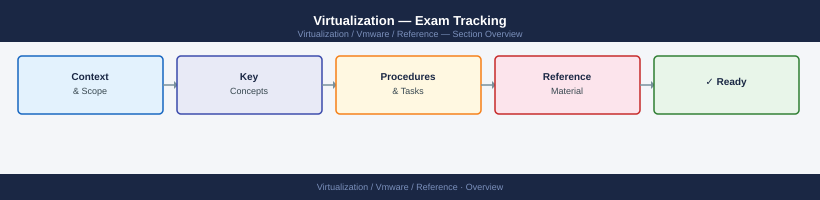

---
tags:
  - reference
---
# Virtualization — Exam Tracking

VMware certification exam tracking — scheduled exams, attempt history, scores, and renewal deadlines for VCP, VCAP, and VCDX tracks.

*Applies to: vSphere 7.x / 8.x*

