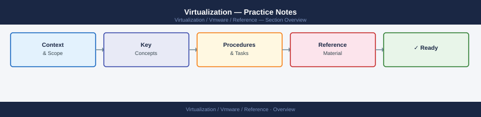

---
tags:
  - reference
---
# Virtualization — Practice Notes

VMware certification practice exam notes — question patterns, topic areas, and worked examples from VCP-DCV and VCAP study sessions.

*Applies to: vSphere 7.x / 8.x*

