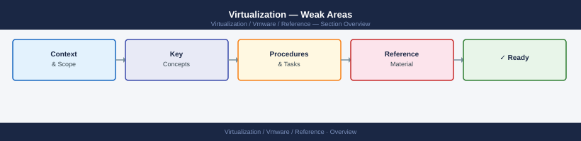

---
tags:
  - reference
---
# Virtualization — Weak Areas

Certification weak areas log — topics that scored below threshold in practice exams, with targeted study notes and reference links.

*Applies to: vSphere 7.x / 8.x*

