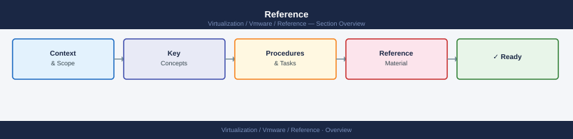

---
tags:
  - reference
---
# Reference

Standards, inventory, upgrade readiness checklists, and quick reference material for the virtualization platform.

*Applies to: vSphere 7.x / 8.x*

<a class="kb-card" href="standards/">
  <strong>Standards</strong>
  Platform standards, naming conventions, and configuration baselines.
</a>

<a class="kb-card" href="inventory/">
  <strong>Inventory</strong>
  Environment inventory, asset registers, and platform documentation.
</a>

<a class="kb-card" href="upgrade-readiness/">
  <strong>Upgrade Readiness</strong>
  Pre-upgrade checklists, compatibility matrices, and readiness assessments.
</a>

<a class="kb-card" href="quick-reference/"><strong>Quick Reference</strong>Command cheat sheets, port references, and quick lookup guides.</a>
<a class="kb-card" href="gotchas/"><strong>Gotchas</strong>Known edge cases, unexpected behaviours, and platform quirks to watch for.</a>
<a class="kb-card" href="design-decisions/"><strong>Design Decisions</strong>Architectural decision records for platform design choices and rationale.</a>
<a class="kb-card" href="licensing/"><strong>Licensing</strong>VMware licensing models, SKU comparison, capacity planning, and compliance.</a>
<a class="kb-card" href="certification/"><strong>Certification</strong>Certification reference materials, paths, and exam notes.</a>
<a class="kb-card" href="high-availability/"><strong>High Availability</strong>HA design patterns, vSphere HA, admission control, redundancy tiers, and multi-site architecture.</a>
<a class="kb-card" href="lifecycle/"><strong>Lifecycle & EOL</strong>Version lifecycle, End of General Support dates, EOL status, and upgrade paths for all VMware products.</a>
<a class="kb-card" href="interoperability/"><strong>Interoperability</strong>Component compatibility matrices for vSphere, NSX, VCF, Aria Suite, and Horizon.</a>

