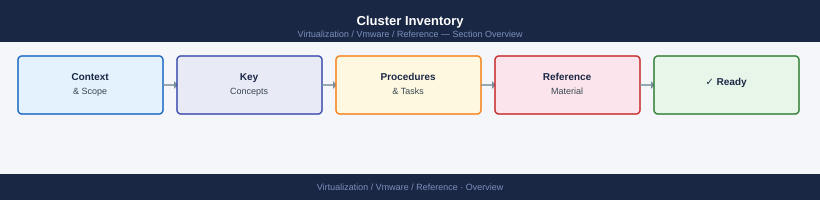

---
tags:
  - reference
---
# Cluster Inventory


<div class="kb-summary">
Cluster Inventory reference covering Overview, Cluster Inventory Table, Fields Reference, Cluster Configuration Checklist.

*Applies to: vSphere 7.x / 8.x*
</div>



> Part of the [Inventory](index.md) reference.

---

```d2
direction: right

center: "Inventory" {shape: rectangle}
cluster_inventory_table: "Cluster Inventory Table" {shape: rectangle}
fields_reference: "Fields Reference" {shape: rectangle}
cluster_configuration_checklist: "Cluster Configuration Checklist" {shape: rectangle}

center -> cluster_inventory_table
center -> fields_reference
center -> cluster_configuration_checklist
```

## Overview

Use this table format to document each vSphere cluster in the environment. Maintain one row per cluster and update after any cluster configuration change or capacity event.

## Cluster Inventory Table

| Cluster Name | Datacenter | Host Count | DRS Mode | HA Enabled | vSAN Enabled | Total CPU (GHz) | Total RAM (TB) | Usable vSAN Capacity | Notes |
|---|---|---|---|---|---|---|---|---|---|
| cl-prod-compute-01 | DC-Primary | 8 | Fully Automated | Yes | Yes | 384 | 12 | 46 TB | Main production compute |
| cl-prod-edge-01 | DC-Primary | 4 | Fully Automated | Yes | No | 96 | 2 | — | NSX edge cluster |
| cl-prod-mgmt-01 | DC-Primary | 3 | Partially Automated | Yes | Yes | 72 | 3 | 14 TB | Management plane cluster |
| cl-dr-compute-01 | DC-Secondary | 4 | Fully Automated | Yes | Yes | 192 | 6 | 23 TB | DR compute cluster |

## Fields Reference

| Field | Description |
|---|---|
| Cluster Name | Follows the naming standard: `<site>-<env>-cluster-<##>` |
| Datacenter | vCenter datacenter object containing the cluster |
| Host Count | Number of ESXi hosts currently in the cluster |
| DRS Mode | Manual / Partially Automated / Fully Automated |
| HA Enabled | Whether vSphere HA is active |
| vSAN Enabled | Whether vSAN is providing storage for the cluster |
| Total CPU (GHz) | Sum of all host CPU capacity in GHz |
| Total RAM (TB) | Sum of all host physical memory |
| Usable vSAN Capacity | Available vSAN capacity accounting for FTT policy overhead |
| Notes | Purpose, owner, or any standing issues |

## Cluster Configuration Checklist

When adding a new cluster, verify:

- [ ] Cluster name follows the naming standard
- [ ] HA is enabled with appropriate admission control settings
- [ ] DRS is set to Fully Automated for production compute clusters
- [ ] EVC is enabled and set to the appropriate CPU baseline
- [ ] vSAN health is green before placing any workloads
- [ ] Cluster is tagged with environment and owner in vCenter
- [ ] Cluster is included in the monitoring platform
