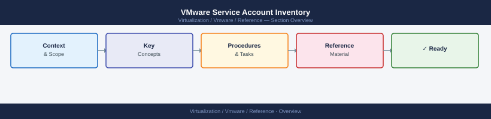

---
tags:
  - reference
---
# VMware Service Account Inventory


<div class="kb-summary">
Service accounts used for VMware platform integrations. All accounts must be vault-managed and reviewed quarterly.

*Applies to: vSphere 7.x / 8.x*
</div>



```d2
direction: right

center: "Inventory" {shape: rectangle}
account_register: "Account Register" {shape: rectangle}
permission_role_definitions: "Permission Role Definitions" {shape: rectangle}
creating_a_service_account_in_ad: "Creating a Service Account in AD" {shape: rectangle}
assigning_a_custom_vcenter_role: "Assigning a Custom vCenter Role" {shape: rectangle}
quarterly_review_checklist: "Quarterly Review Checklist" {shape: rectangle}
detecting_orphaned_accounts: "Detecting Orphaned Accounts" {shape: rectangle}

center -> account_register
center -> permission_role_definitions
center -> creating_a_service_account_in_ad
center -> assigning_a_custom_vcenter_role
center -> quarterly_review_checklist
center -> detecting_orphaned_accounts
```

## Account Register

| Account | Purpose | Target System | Permission Level | Owner | Rotation | Vault Path | Last Reviewed |
|---|---|---|---|---|---|---|---|
| svc-vcenter-backup | Backup job access | vCenter | Backup role (no config) | infra-team | 90 days | kv/infra/vcenter/svc-vcenter-backup | YYYY-MM-DD |
| svc-vcenter-aria | Aria Operations collection | vCenter | Read-only | infra-team | 90 days | kv/infra/vcenter/svc-vcenter-aria | YYYY-MM-DD |
| svc-vcenter-nsx | NSX Manager ↔ vCenter | vCenter + NSX | Administrator | infra-team | 90 days | kv/infra/vcenter/svc-vcenter-nsx | YYYY-MM-DD |
| svc-vcenter-srm | SRM site pair | vCenter (both sites) | SRM-specific role | infra-team | 90 days | kv/infra/vcenter/svc-vcenter-srm | YYYY-MM-DD |
| svc-vcenter-rp | RecoverPoint vCenter plugin | vCenter | RecoverPoint role | infra-team | 90 days | kv/infra/vcenter/svc-vcenter-rp | YYYY-MM-DD |
| svc-vcenter-veeam | Veeam proxy and API | vCenter | Veeam role | infra-team | 90 days | kv/infra/vcenter/svc-vcenter-veeam | YYYY-MM-DD |
| svc-esxi-mgmt | Ansible ESXi host tasks | ESXi hosts | Host admin (restricted) | infra-team | 90 days | kv/infra/esxi/svc-esxi-mgmt | YYYY-MM-DD |
| svc-aria-lcm | LCM deployment account | vCenter + LCM | Administrator | infra-team | 90 days | kv/infra/aria/svc-aria-lcm | YYYY-MM-DD |

## Permission Role Definitions

| Role | Permissions |
|---|---|
| Backup role | Snapshot create/delete, VM power state read, datastore browse |
| Read-only | View-only across all objects; no write access |
| RecoverPoint role | Snapshot, datastore, network — minimum for RP operations |
| Veeam role | Snapshot, power ops, datastore, VIX API for guest interaction |
| SRM-specific role | Protect/recover operations, no infrastructure changes |

## Creating a Service Account in AD

```powershell
# Create service account
New-ADUser -Name "svc-vcenter-backup" `
    -SamAccountName "svc-vcenter-backup" `
    -UserPrincipalName "svc-vcenter-backup@corp.local" `
    -Path "OU=ServiceAccounts,OU=Infra,DC=corp,DC=local" `
    -PasswordNeverExpires $true `
    -AccountPassword (ConvertTo-SecureString "InitialP@ss" -AsPlainText -Force) `
    -Enabled $true

# Then rotate via CyberArk and store in vault
```

## Assigning a Custom vCenter Role

```powershell
# Create a custom role
New-VIRole -Name "Backup-Role" -Privilege (
    Get-VIPrivilege -Id "VirtualMachine.State.CreateSnapshot",
                         "VirtualMachine.State.RemoveSnapshot",
                         "VirtualMachine.State.RenameSnapshot",
                         "Datastore.Browse",
                         "Global.ManageCustomFields"
)

# Assign to account at cluster level
New-VIPermission -Entity (Get-Cluster "Cluster01") `
    -Principal "CORP\svc-vcenter-backup" `
    -Role "Backup-Role" `
    -Propagate $true
```

## Quarterly Review Checklist

- [ ] Confirm all accounts are in the register
- [ ] Verify each account maps to an active integration (remove if tool is decommissioned)
- [ ] Confirm last rotation date — flag if overdue
- [ ] Confirm vault path is accessible and credential is current
- [ ] Verify account permissions have not been elevated beyond required role
- [ ] Check AD account is not locked or expired
- [ ] Update "Last Reviewed" date in this register

## Detecting Orphaned Accounts

```powershell
# List all vCenter local and AD-sourced permissions
Get-VIPermission | Select-Object Entity, Principal, Role, Propagate |
    Where-Object { $_.Principal -match "svc-" } |
    Sort-Object Principal
```

Compare output against the register table — any `svc-` account not in the register is a candidate for removal.
