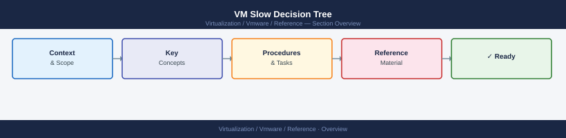

---
tags:
  - reference
---
# VM Slow Decision Tree


<div class="kb-summary">
VM slow decision tree: branching logic covering CPU ready, memory balloon, storage latency, and network saturation — walk through in order for systematic diagnosis.

*Applies to: vSphere 7.x / 8.x*
</div>



```text
                         VM reported slow
                               │
                               ▼
                    ┌───────────────────────────────────────────────────────────────────────────────────────────────────────┐
                    │  CPU Ready > 5%?   │
                    └───────────────────────────────────────────────────────────────────────────────────────────────────────┘
               Yes ▼                    No ▼
     ┌─────────────────────────────────────────────── ┐    ┌ ────────────────────────────────────────────────┐
     │ CPU contention     │    │ Memory balloon/    │
     │ Check host CPU     │    │ swap active?       │
     │ utilisation        │    └────────────────────┘
     │ Check DRS          │    Yes ▼         No ▼
     └────────────────────┘  ┌──────────┐  ┌──────────────────┐
                              │ Add mem  │  │ Storage latency? │
                              │ or move  │  │ DAVG/GAVG high?  │
                              │ workload │  └──────────────────┘
                              └──────────┘  Yes ▼       No ▼
                                         ┌──────────────────────────────────────────────── ┐  ┌ ─────────────────────────────────────────────────┐
                                         │ Storage  │  │ Network drops? │
                                         │ decision │  │ Check NIC/vDS  │
                                         │ tree     │  │ packet stats   │
                                         └───────────────────────────────────────────────────────────────────────────────────────────────────────┘
```

```d2
direction: right

center: "Quick Reference" {shape: rectangle}
first_decision: "First Decision" {shape: rectangle}

center -> first_decision
```

## First Decision


Is CPU high?

Yes → Check CPU Ready

No → Check Memory

Is Memory Ballooning?

Yes → Add memory or move workload

No → Check Storage Latency

If latency high → Investigate storage
