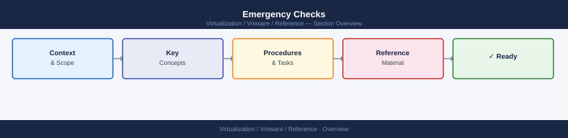

---
tags:
  - reference
---
# Emergency Checks

Emergency checks: vCenter service status, ESXi PSOD scan, vSAN health degradation, storage path loss, and cluster event log review — run first in any major incident.

*Applies to: vSphere 7.x / 8.x*

| Area | Check |
|---|---|
| vCenter | Can you log in? Are services running? |
| Hosts | Are hosts connected or not responding? |
| VMs | Are critical VMs powered on? |
| Storage | Are datastores mounted and not full? |
| vSAN | Are objects healthy? Any resyncs? |
| Network | Are management and VM networks reachable? |
| Hardware | Any failed disks, NICs, PSU, memory? |
| Backups | Are recent backups available? |
## Known Issue Tracking

| Field | Description |
|---|---|
| Issue | Short name of the problem |
| Impact | What it affects |
| Workaround | Temporary fix |
| Permanent Fix | Final fix |
| Owner | Team or person responsible |
| Status | Open, monitoring, fixed |
| Date Found | When it was identified |

## Escalation Quick Reference

| Issue | Escalate To |
|---|---|
| vSAN object inaccessible | VMware support |
| vCenter SSO failure | VMware support |
| VxRail upgrade failure | Dell support |
| Host hardware failure | Dell / hardware support |
| Datastore latency high | Storage team |
| vMotion network failure | Network team |
| Backup snapshot failure | Backup team |
| Certificate outage | VMware / security team |
| NSX control plane failure | VMware / NSX support |

## Fast Troubleshooting Map

| Problem | First Place to Look |
|---|---|
| VM slow | CPU ready, memory, datastore latency |
| VM cannot power on | Datastore space, host resources, locks |
| Host disconnected | Management network, DNS, hostd, vpxa |
| vMotion fails | VMkernel, VLAN, MTU, EVC |
| Datastore full | Snapshots, ISO files, orphaned disks |
| Login fails | SSO, AD/LDAP, locked account, certificates |
| vSAN warning | Skyline Health, disk groups, resyncs |
| VxRail upgrade fails | Pre-check results, VxRail Manager, support bundle |
