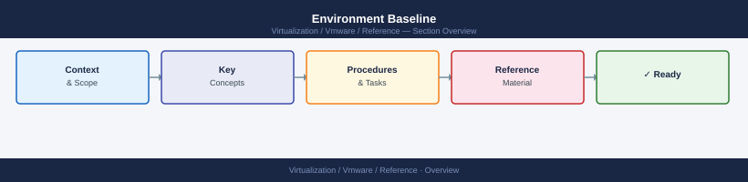

---
tags:
  - reference
---
# Environment Baseline

Environment Baseline reference covering Core Platform, Networking, Storage, Backup, Monitoring.

*Applies to: vSphere 7.x / 8.x*

## Core Platform

vCenter version  
ESXi version  
Cluster count  
Host count  
Datastore count  

## Networking

Management VLAN  
vMotion VLAN  
Storage VLAN  
NSX overlay network  

## Storage

Datastore type  
Capacity  
Redundancy  

## Backup

Backup system  
Backup frequency  
Restore test date  

## Monitoring

Monitoring system  
Alert destination  
Retention period
