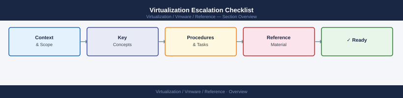

---
tags:
  - reference
---
# Virtualization Escalation Checklist

Before escalation, collect: - Host name - VM name - Cluster name - Datastore name - Timestamp - Timezone - Screenshot of alerts - Recent changes - Error message - Log snippet - Impact description - Current status Escalation should include: Scope Impact Timeline Evidence Next acti

*Applies to: vSphere 7.x / 8.x*

Before escalation, collect:

- Host name
- VM name
- Cluster name
- Datastore name
- Timestamp
- Timezone
- Screenshot of alerts
- Recent changes
- Error message
- Log snippet
- Impact description
- Current status

Escalation should include:

Scope  
Impact  
Timeline  
Evidence  
Next action
