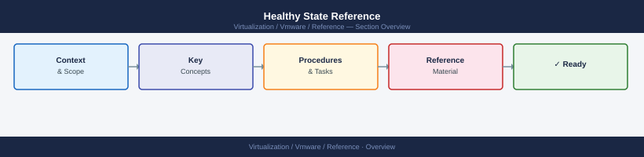

---
tags:
  - reference
---
# Healthy State Reference


<div class="kb-summary">
Healthy State Reference reference covering Cluster, Storage, Network, VMs, Management.

*Applies to: vSphere 7.x / 8.x*
</div>



```d2
direction: right

center: "Quick Reference" {shape: rectangle}
cluster: "Cluster" {shape: rectangle}
storage: "Storage" {shape: rectangle}
network: "Network" {shape: rectangle}
vms: "VMs" {shape: rectangle}
management: "Management" {shape: rectangle}

center -> cluster
center -> storage
center -> network
center -> vms
center -> management
```

## Cluster

All hosts connected  
No alarms  
Capacity healthy  

## Storage

Latency < 10 ms  
No failed paths  
No resync backlog  

## Network

No packet loss  
All uplinks up  

## VMs

No consolidation warnings  
No swap  
CPU ready low  

## Management

vCenter reachable  
Services running  
Backups successful
