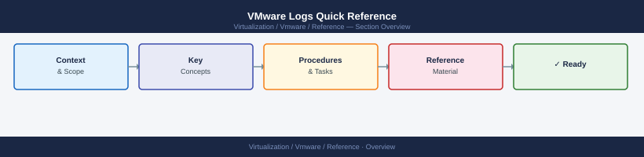

---
tags:
  - reference
---
# VMware Logs Quick Reference


<div class="kb-summary">
VMware Logs Quick Reference reference covering ESXi Log Locations, vCenter Appliance Log Locations, Collecting a vCenter Support Bundle, Collecting an ESXi Support Bundle, Using Aria Operations for Logs.

*Applies to: vSphere 7.x / 8.x*
</div>



```d2
direction: right

center: "Quick Reference" {shape: rectangle}
esxi_log_locations: "ESXi Log Locations" {shape: rectangle}
vcenter_appliance_log_locations: "vCenter Appliance Log Locations" {shape: rectangle}
collecting_a_vcenter_support_bundle: "Collecting a vCenter Support Bundle" {shape: rectangle}
collecting_an_esxi_support_bundle: "Collecting an ESXi Support Bundle" {shape: rectangle}
using_aria_operations_for_logs: "Using Aria Operations for Logs" {shape: rectangle}

center -> esxi_log_locations
center -> vcenter_appliance_log_locations
center -> collecting_a_vcenter_support_bundle
center -> collecting_an_esxi_support_bundle
center -> using_aria_operations_for_logs
```

## ESXi Log Locations

```bash
/var/log/hostd.log       # Host daemon — VM and host operations
/var/log/vpxa.log        # vCenter agent on the host
/var/log/vmkernel.log    # Kernel-level events — storage, network, hardware
/var/log/vobd.log        # Hardware and storage event observer
/var/log/syslog.log      # General system log
/var/log/auth.log        # Authentication events
```

## vCenter Appliance Log Locations

```bash
/var/log/vmware/vpxd/          # vCenter Server daemon logs
/var/log/vmware/sso/           # SSO and identity service logs
/var/log/vmware/vapi/          # vAPI endpoint logs
/var/log/vmware/applmgmt/      # Appliance management logs
```

## Collecting a vCenter Support Bundle

In vSphere Client: **Menu** → **Administration** → **Support** → **Export Support Bundle**

Or from VAMI at `https://<vcenter>:5480` → **Support**

## Collecting an ESXi Support Bundle

Via vSphere Client: Right-click host → **Export System Logs**

Or via SSH:
```bash
vm-support -n <bundle-name>
```

## Using Aria Operations for Logs

- Search by hostname, IP, or keyword
- Set a time range before searching
- Filter by log source (hostd, vpxa, vmkernel)
- Export results as CSV for evidence or support cases
