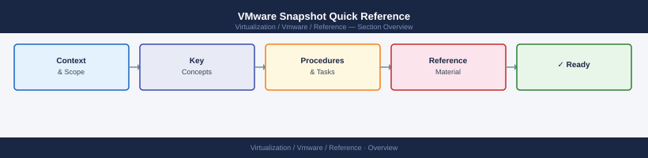

---
tags:
  - reference
---
# VMware Snapshot Quick Reference


<div class="kb-summary">
VMware Snapshot Quick Reference reference covering Find All Snapshots, Check Snapshot Age and Size, Identify Snapshot Owner, Remove a Snapshot Safely, Consolidation Warning and 2 more sections.

*Applies to: vSphere 7.x / 8.x*
</div>



```d2
direction: right

center: "Quick Reference" {shape: rectangle}
find_all_snapshots: "Find All Snapshots" {shape: rectangle}
check_snapshot_age_and_size: "Check Snapshot Age and Size" {shape: rectangle}
identify_snapshot_owner: "Identify Snapshot Owner" {shape: rectangle}
remove_a_snapshot_safely: "Remove a Snapshot Safely" {shape: rectangle}
consolidation_warning: "Consolidation Warning" {shape: rectangle}
check_datastore_free_space_after_cle: "Check Datastore Free Space After Cleanup" {shape: rectangle}

center -> find_all_snapshots
center -> check_snapshot_age_and_size
center -> identify_snapshot_owner
center -> remove_a_snapshot_safely
center -> consolidation_warning
center -> check_datastore_free_space_after_cle
```

## Find All Snapshots

In vCenter: **Menu** → **Global Views** → **VMs and Templates** → Filter by snapshot state

Or use Aria Operations: **Environment** → **VMs** → filter by snapshot count > 0

## Check Snapshot Age and Size

In vSphere Client: Right-click VM → **Snapshots** → **Manage Snapshots**

- Review snapshot creation date
- Review snapshot size on disk

## Identify Snapshot Owner

- Check if the snapshot was created by a backup product (name will include backup job name)
- Check if it was a manual change-related snapshot

## Remove a Snapshot Safely

1. Confirm the VM is healthy and the snapshot is no longer needed
2. Right-click VM → **Snapshots** → **Manage Snapshots**
3. Select the snapshot → **Delete**
4. Monitor the consolidation task — it may take several minutes

## Consolidation Warning

If vCenter shows a consolidation needed warning:
- Right-click VM → **Snapshots** → **Consolidate**
- Monitor the task and confirm completion

## Check Datastore Free Space After Cleanup

- Confirm datastore free space has recovered after snapshot removal

## Escalate Locked or Stuck Snapshots

- Do not force-delete stuck snapshots without VMware support guidance
- Collect the snapshot delta file list and vCenter events before escalating
