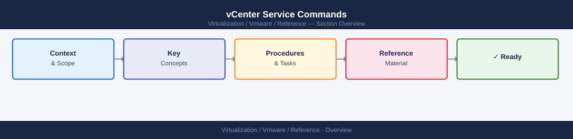

---
tags:
  - reference
  - vcenter
  - vsphere-8
---
# vCenter Service Commands


<div class="kb-summary">
vCenter SSH command reference: `service-control --status/--start/--stop`, `vmon-cli`, appliance health checks, DB vacuum, and certificate status — run from the VCSA shell.

*Applies to: vSphere 7.x / 8.x*
</div>



## Check All Services

```bash
service-control --status
```

## Start All Services

```bash
service-control --start --all
```

## Stop All Services

```bash
service-control --stop --all
```

## Restart All Services

```bash
service-control --stop --all && service-control --start --all
```

## Restart a Single Service

```bash
service-control --restart vmware-vpxd
service-control --restart vmware-sts
service-control --restart vmware-lookupsvc
```

## Check Disk Space

```bash
df -h
```

## Check Uptime

```bash
uptime
```

## Check Certificate Status

Access VAMI at `https://<vcenter>:5480` → **Certificate Management**

## When Not to Restart Services

- If disk partitions are full — free space first
- If a restore is needed — restarting services will not fix a corrupt database
- During active vMotion or vSAN resync operations without change approval

## Escalation

If services do not recover after a restart, collect a support bundle from VAMI and open a VMware support case.
