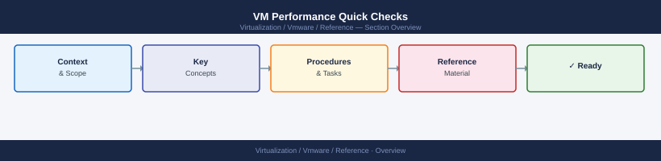

---
tags:
  - reference
---
# VM Performance Quick Checks


<div class="kb-summary">
VM performance quick checks: CPU ready %, memory balloon/swap, storage latency via `esxtop`, network packet drops, and vSAN resync — run in this order for slow VM triage.

*Applies to: vSphere 7.x / 8.x*
</div>



```d2
direction: right

center: "Quick Reference" {shape: rectangle}
cpu: "CPU" {shape: rectangle}
memory: "Memory" {shape: rectangle}
storage: "Storage" {shape: rectangle}
network: "Network" {shape: rectangle}
recent_changes: "Recent Changes" {shape: rectangle}
quick_commands_from_esxi: "Quick Commands from ESXi" {shape: rectangle}

center -> cpu
center -> memory
center -> storage
center -> network
center -> recent_changes
center -> quick_commands_from_esxi
```

## CPU

- **CPU Ready** — time the VM is waiting for a physical CPU. Above 5% is worth investigating.
- **CPU Usage** — high usage may indicate the VM needs more vCPUs or the guest application is busy.

## Memory

- **Memory Ballooning** — VMware is reclaiming memory from this VM. Indicates memory pressure on the host.
- **Memory Swapping** — severe memory pressure. The VM's memory is being swapped to disk.

## Storage

- **Datastore Latency** — above 20ms is worth investigating. Check the storage array and paths.
- **Snapshot Age** — old or large snapshots degrade VM storage performance.
- **Guest Disk Usage** — confirm the guest OS disk is not full.

## Network

- **Packet Drops** — check the VM's NIC stats and the physical switch port.
- **VMware Tools** — confirm Tools is installed and current; outdated Tools can cause NIC performance issues.

## Recent Changes

- Was the VM migrated recently?
- Was the host patched or rebooted?
- Was a snapshot taken?
- Was a storage vMotion performed?

## Quick Commands from ESXi

```bash
# Check VM disk stats (run from the ESXi host)
esxtop
# Press 'u' for storage view, 'd' for disk adapter view
```
