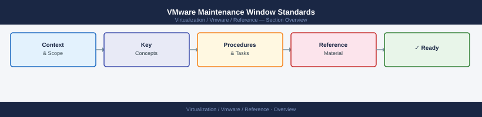

---
tags:
  - reference
---
# VMware Maintenance Window Standards

VMware Maintenance Window Standards reference covering Change Ticket Requirement, Stakeholder Notification, Window Definition, Pre-Change Evidence, Rollback Plan and 4 more sections.

*Applies to: vSphere 7.x / 8.x*

## Change Ticket Requirement

All maintenance windows require an approved change ticket before work begins.

## Stakeholder Notification

- Notify all affected application owners at least 24 hours before the window
- For critical changes, notify 48–72 hours in advance

## Window Definition

- Define a clear start and end time
- Scope the window to the minimum required duration
- Include buffer time for validation and rollback if needed

## Pre-Change Evidence

- Capture health check screenshots before work begins
- Confirm backup status
- Confirm current versions

## Rollback Plan

- Document rollback steps in the change ticket
- Confirm rollback is achievable within the maintenance window

## Communication During the Window

- Notify stakeholders when work starts
- Provide status updates if the window is extended
- Notify stakeholders when work is complete and validated

## Post-Change Validation

- Complete all post-change checks before closing the window
- Confirm with application owners if business validation is required

## Ticket Closure

- Document what was done, how long it took, and the outcome
- Attach pre and post screenshots as evidence
- Close the ticket with a completion note

## Lessons Learned

- Document any issues or unexpected outcomes in the change ticket
- Review with the team if the change did not go as planned
