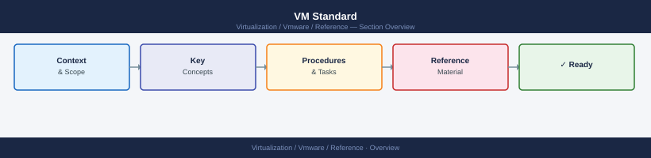

---
tags:
  - reference
---
# VM Standard


<div class="kb-summary">
VM Standard reference covering Overview, Templates, VMware Tools, Hardware Version, CPU and 5 more sections.

*Applies to: vSphere 7.x / 8.x*
</div>



> Part of the [Standards](index.md) reference.

---

```d2
direction: down

templates: "Templates" {shape: rectangle}
vmware_tools: "VMware Tools" {shape: rectangle}
hardware_version: "Hardware Version" {shape: rectangle}
cpu: "CPU" {shape: rectangle}
memory: "Memory" {shape: rectangle}
disk: "Disk" {shape: rectangle}

templates -> vmware_tools: hardens
vmware_tools -> hardware_version: hardens
hardware_version -> cpu: hardens
cpu -> memory: hardens
memory -> disk: hardens
```

## Overview

This standard defines how virtual machines are built, sized, and configured in the vSphere environment. All new VMs deployed from a template or built manually must comply with these requirements.

## Templates

| Setting | Requirement |
|---|---|
| Source | Deploy all VMs from an approved template |
| Template naming | `tmpl-<os>-<version>-<date>` (e.g. `tmpl-win2022-std-20260101`) |
| Template refresh | Templates refreshed quarterly with OS patches and VMware Tools updates |
| Template location | Stored in the designated `Templates` folder and `Templates` content library |

Never deploy from an outdated template. Check the template version date before deploying.

## VMware Tools

| Requirement | Detail |
|---|---|
| VMware Tools installed | Mandatory on all VMs |
| Tools version | Current version shipped with the installed ESXi baseline |
| Update policy | Tools updated automatically with host (Managed) — or updated during application maintenance windows |
| Tools running state | VMware Tools must be running and up to date in vCenter |

A VM with VMware Tools not installed or not running is a compliance failure. Remediate within 7 days of detection.

## Hardware Version

| Setting | Requirement |
|---|---|
| Virtual Hardware Version | Match current vCenter default for new VMs |
| Current approved version | HW Version 21 (vSphere 8.0) |
| Upgrade policy | Upgrade hardware version during scheduled maintenance, not during business hours |
| Legacy VMs | Hardware version upgrades require application owner approval and testing |

## CPU

| Setting | Requirement |
|---|---|
| vCPU sizing | Start small. Match workload profile. |
| CPU Hot Add | Disabled unless explicitly required by the application |
| vCPU count | Do not exceed physical pCPU thread count of a single host (avoid NUMA overhead) |
| CPU limit/reservation | Do not set CPU limits on production VMs. Set reservations for tier-1 workloads only. |

CPU hot add requires VM power-off on some OS types to take effect. Avoid enabling it unless the application requires zero-downtime CPU scaling.

## Memory

| Setting | Requirement |
|---|---|
| Memory sizing | Align to workload requirements + 10% headroom |
| Memory Hot Add | Disabled by default |
| Memory limit | Do not set memory limits on production VMs |
| Memory reservation | Only set for tier-1 workloads requiring guaranteed memory |
| Memory balloon/swap | Keep vSphere memory swap at zero — avoid overcommit in production |

## Disk

| Setting | Requirement |
|---|---|
| Disk Controller | PVSCSI (paravirtual SCSI) for all non-boot disks with I/O workload |
| Boot Disk | LSI Logic or PVSCSI — follow OS vendor guidance |
| Disk Format | Thin or Thick Eager Zeroed. Use Eager Zeroed for databases and high-I/O workloads. |
| Snapshot Policy | No standing snapshots in production. Snapshots older than 72 hours alert. |
| Maximum snapshot age | 7 days hard limit — auto-alerting required |

## Network

| Setting | Requirement |
|---|---|
| NIC Type | VMXNET3 for all VMs |
| NIC count | One NIC unless the application requires NIC separation |
| Port group | Assign to the correct production VM port group for the environment |

Do not use E1000 or E1000e NICs on new VMs. These have higher CPU overhead than VMXNET3.

## Tagging and Documentation

Every VM must have the following tags applied before handover:

| Tag Category | Required? | Example |
|---|---|---|
| Environment | Yes | `prod`, `dev`, `test` |
| Application | Yes | Application or service name |
| Backup Tier | Yes | `backup-gold`, `backup-silver`, `backup-none` |
| Owner | Yes | Team or individual owner |

## VM Build Checklist

- [ ] Deployed from approved template
- [ ] VMware Tools installed and running
- [ ] Hardware version at current approved level
- [ ] CPU hot add disabled (unless required)
- [ ] Memory hot add disabled
- [ ] PVSCSI controller for data disks
- [ ] VMXNET3 NIC
- [ ] OS patched to current approved level
- [ ] VM name follows naming standard
- [ ] Tags applied (environment, application, backup tier, owner)
- [ ] Backup job configured or VM included in tag-based job
- [ ] VM added to monitoring
- [ ] CMDB record created or updated
