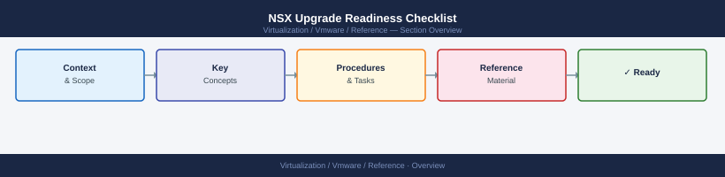

---
tags:
  - nsx
  - nsx-4
  - reference
---
# NSX Upgrade Readiness Checklist

NSX Upgrade Readiness Checklist reference covering Current State, Target Version, Pre-Upgrade Checks, Upgrade Process Overview, Post-Upgrade Validation.

*Applies to: vSphere 7.x / 8.x*

## Current State

- Confirm current NSX Manager version
- Confirm all NSX Manager nodes in the cluster are healthy
- Confirm all Edge nodes are healthy
- Confirm all transport nodes are healthy

## Target Version

- Confirm target NSX version
- Confirm compatibility with current vCenter and ESXi versions
- Review NSX upgrade coordinator compatibility matrix

## Pre-Upgrade Checks

- NSX Manager backup completed
- NSX Manager cluster health confirmed: all nodes active
- Edge nodes healthy: confirmed in NSX Manager
- Transport nodes healthy: confirmed in NSX Manager
- No critical alarms in NSX Manager
- Confirm vCenter is compatible with the target NSX version
- Confirm ESXi hosts are compatible with the target NSX version

## Upgrade Process Overview

1. Run the NSX Upgrade Coordinator
2. Upgrade NSX Managers first
3. Upgrade Edge nodes
4. Upgrade host transport nodes (rolling, one cluster at a time)

## Post-Upgrade Validation

- Confirm NSX Manager UI is accessible
- Confirm all Edge nodes are online
- Confirm all transport nodes show as Up
- Confirm routing and firewall rules are functioning
- Confirm VM networking is working
- Capture new NSX version for records
