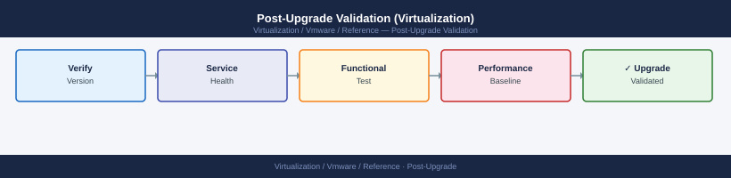

---
tags:
  - reference
description: "Complete all items after every upgrade (vCenter, ESXi, vSAN, NSX, VxRail). Document evidence for the change record."
---
# Post-Upgrade Validation (Virtualization)


<div class="kb-summary">
Complete all items after every upgrade (vCenter, ESXi, vSAN, NSX, VxRail). Document evidence for the change record.

*Applies to: vSphere 7.x / 8.x*
</div>



```d2
direction: right

plan: "Plan" {shape: oval}
immediate_validation_within_15_minut: "Immediate Validation (within 15 minutes of upgrade\ncompletio" {shape: rectangle}
vcenter_health: "vCenter Health" {shape: rectangle}
cluster_ha_and_drs: "Cluster HA and DRS" {shape: rectangle}
vsan_validation_if_applicable: "vSAN Validation (if applicable)" {shape: rectangle}
nsx_validation_if_nsx_was_upgraded_o: "NSX Validation (if NSX was upgraded or touched)" {shape: rectangle}
vxrail_validation_if_applicable: "VxRail Validation (if applicable)" {shape: rectangle}
validate: "Validate" {shape: oval}

plan -> immediate_validation_within_15_minut
immediate_validation_within_15_minut -> vcenter_health
vcenter_health -> cluster_ha_and_drs
cluster_ha_and_drs -> vsan_validation_if_applicable
vsan_validation_if_applicable -> nsx_validation_if_nsx_was_upgraded_o
nsx_validation_if_nsx_was_upgraded_o -> vxrail_validation_if_applicable
vxrail_validation_if_applicable -> validate
```

## Immediate Validation (within 15 minutes of upgrade completion)

```powershell
# 1. Confirm vCenter is reachable and version is correct
(Get-View ServiceInstance).Content.About.Version
(Get-View ServiceInstance).Content.About.Build

# 2. All hosts connected
Get-VMHost | Where-Object {$_.ConnectionState -ne "Connected"} | Select-Object Name, ConnectionState

# 3. No unexpected VM power state changes
Get-VM | Where-Object {$_.PowerState -ne "PoweredOn" -and $_.PowerState -ne "PoweredOff"} | Select-Object Name, PowerState
```

## vCenter Health

- [ ] Login to vCenter with SSO admin credentials: `administrator@vsphere.local`
- [ ] vCenter version shows target build number (Administration → About)
- [ ] vCenter services all running: Administration → Deployments → System Configuration → vCenter Server → Services
- [ ] Identity source connected: Administration → Single Sign On → Configuration → Identity Sources — `Connected`
- [ ] vSphere Client loads without certificate errors

## Cluster HA and DRS

```powershell
Get-Cluster | Select-Object Name, HAEnabled, HAAdmissionControlEnabled, DrsEnabled, DrsAutomationLevel
```

- [ ] HA re-enabled and showing green
- [ ] DRS re-enabled in correct automation level
- [ ] No `HA error` events on any host (check host Events tab)

## vSAN Validation (if applicable)

```bash
# On any cluster host
esxcli vsan health cluster list | grep -v Green    # Should return nothing
esxcli vsan debug resync summary                   # Should show no active resync
esxcli vsan debug object list | grep -v Healthy    # Should return nothing
```


```text title="Expected output"
(no output — command completes silently)
Resync Operations: 0
Object Health Status: All objects healthy
```

!!! warning "Common errors"
    **`VSAN Health: UNKNOWN`** — Ensure vSAN is enabled on the cluster and the host is connected to vCenter with proper licensing.
    **`Error: Unknown command or namespace`** — Verify the host is running ESXi 6.5 or later with vSAN enabled; older versions lack the `vsan debug` command set.
## NSX Validation (if NSX was upgraded or touched)

```bash
# SSH to NSX Manager
get cluster status        # STABLE
get services              # All core services running
get edge-clusters         # All edge clusters healthy

# Verify edge BGP sessions
get bgp neighbor summary  # All peers Established
```


```text title="Expected output"
cluster status: STABLE
  cluster_id: 5a8c2e91-b3f4-4d2a-9e1c-7f3b6a2d8c1e
  node_count: 3
  leader: nsx-mgr-01.lab.local
  health: GREEN

services:
  nsx-manager: running (uptime: 45d 12h)
  policy-engine: running (uptime: 45d 12h)
  messaging: running (uptime: 45d 12h)
  persistence: running (uptime: 45d 12h)

edge-clusters:
  edge-cluster-01: HEALTHY (2/2 nodes active)
  edge-cluster-02: HEALTHY (2/2 nodes active)

bgp neighbor summary:
  Neighbor          State       Uptime
  10.50.1.1         Established 42d 18h
  10.50.1.2         Established 42d 18h
  10.60.1.1         Established 41d 22h
  10.60.1.2         Established 41d 22h
```

!!! warning "Common errors"
    **`command not found: get`** — Ensure you are logged into NSX Manager CLI (ssh admin@<nsx-ip>) and not a standard Linux shell.
    **`cluster status: UNSTABLE`** — Investigate failed nodes with `get cluster nodes detail` and resolve node connectivity or service issues before upgrading.
    **`bgp neighbor summary: State DOWN or Idle`** — Verify BGP peer IP addresses and routing configuration with `get bgp neighbor <peer-ip> detail` before proceeding with upgrade.
## VxRail Validation (if applicable)

```bash
# VxRail Manager
# Log in to VxRail Manager → Cluster → Health
# All nodes should show "Healthy"
# VxRail version should reflect the upgrade target
```

## Aria Suite Validation (if LCM-managed)

- [ ] Log in to LCM: all environments show green health
- [ ] Log in to Aria Operations: collection state `OK` for all adapters
- [ ] Log in to Aria Automation: service health page shows all services running

## Backup Validation

```powershell
# Check if backup jobs can still enumerate VMs (Veeam example)
# Run a "Quick Backup" on a non-critical VM to confirm backup proxy connectivity is intact
```

- [ ] Trigger a test backup of one non-critical VM — confirm it completes successfully
- [ ] Confirm monitoring agents are still collecting from all hosts

## Performance Baseline

Capture post-upgrade versions for CMDB update and future reference:

```powershell
# Capture all component versions
Get-VMHost | Select-Object Name, Version, Build | Sort-Object Name | Export-Csv -Path /tmp/host_versions_$(Get-Date -Format yyyyMMdd).csv

# vCenter version
(Get-View ServiceInstance).Content.About | Select-Object Version, Build

# NSX version (SSH to NSX Manager)
# get version
```

## Change Record Closure

- [ ] All hosts connected: confirmed
- [ ] Target build numbers verified on all components
- [ ] HA/DRS re-enabled and healthy
- [ ] vSAN health green
- [ ] NSX cluster stable
- [ ] Test backup completed successfully
- [ ] Monitoring collecting data
- [ ] Application owner sign-off received
- [ ] Snapshots removed after 48-hour validation period (schedule snapshot deletion reminder)
- [ ] Component version table updated in CMDB
