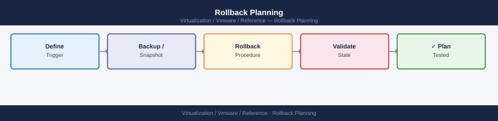

---
tags:
  - reference
---
# Rollback Planning


<div class="kb-summary">
Rollback options differ significantly by component. Establish the rollback path before the maintenance window — not during an incident.

*Applies to: vSphere 7.x / 8.x*
</div>



```d2
direction: right

plan: "Plan" {shape: oval}
rollback_readiness_by_component: "Rollback Readiness by Component" {shape: rectangle}
vcenter_rollback_filebased_backup: "vCenter Rollback (File-Based Backup)" {shape: rectangle}
esxi_bootbank_rollback: "ESXi Bootbank Rollback" {shape: rectangle}
nsx_backup_before_upgrade: "NSX Backup Before Upgrade" {shape: rectangle}
aria_product_rollback_snapshots: "Aria Product Rollback (Snapshots)" {shape: rectangle}
go_nogo_decision_framework: "Go / No-Go Decision Framework" {shape: rectangle}
validate: "Validate" {shape: oval}

plan -> rollback_readiness_by_component
rollback_readiness_by_component -> vcenter_rollback_filebased_backup
vcenter_rollback_filebased_backup -> esxi_bootbank_rollback
esxi_bootbank_rollback -> nsx_backup_before_upgrade
nsx_backup_before_upgrade -> aria_product_rollback_snapshots
aria_product_rollback_snapshots -> go_nogo_decision_framework
go_nogo_decision_framework -> validate
```

## Rollback Readiness by Component

| Component | Rollback Method | Practical Rollback? | Notes |
|---|---|---|---|
| vCenter VCSA | File-based backup restore | Yes | Restore takes 30–60 min; restores to pre-upgrade state |
| ESXi host | Boot from previous bootbank | Yes | `esxcfg-bootcfg --server` or BIOS boot order |
| NSX Manager | NSX backup + restore | Partial | NSX restore is complex; plan for 2–4h |
| vSAN | No direct rollback | No | ESXi rollback covers vSAN; test object health post-upgrade |
| VxRail | VxRail support-assisted | Vendor-only | Dell must be engaged for any VxRail rollback |
| Aria LCM / Products | Snapshot before upgrade | Yes (if snapped) | Requires snapshot taken on appliance before upgrade starts |
| SRM | SRM backup + redeploy | Partial | Site pair must be broken and re-established if SRM is redeployed |
| VMware Tools | Automatic downgrade via vCenter | Yes | Tools version can be pinned |
| VM Hardware | No rollback | No | Hardware version upgrades are permanent |

## vCenter Rollback (File-Based Backup)

```bash
# Verify backup exists (VAMI → Backup → show recent backups)
# Backup location: defined at backup job configuration time

# To restore: boot VCSA installer ISO → choose Restore
# Provide backup file path (FTP/HTTP/SCP/SMB) and SSO admin credentials
# Restoration process: ~45 minutes + replication sync time
```

**Before upgrade:**
1. Confirm a file-based backup completed within 24 hours of the maintenance window.
2. Verify the backup is accessible from the restore location.
3. Document the current vCenter build number: `Get-View ServiceInstance | Select-Object -ExpandProperty ServerVersion`.

## ESXi Bootbank Rollback

ESXi maintains two bootbanks — the active one and the previous version:

```bash
# SSH to ESXi host — check bootbank contents
esxcli system version get
ls /bootbank /altbootbank

# Switch to previous bootbank (requires reboot)
nextbootdir=/altbootbank
# Or via Host Client: Manage → System → Boot Options → select previous
```


```text title="Expected output"
Product: VMware ESXi
Version: 7.0.3
Build: 19482537
Update: 3
Patch: ESXi700-202301001

/bootbank:
total 2847356
-rw-r--r--  1 root root 1073741824 Jan 15 10:23 esx-base.z
-rw-r--r--  1 root root  536870912 Jan 15 10:24 esx-update.z
-rw-r--r--  1 root root    4194304 Jan 15 10:25 boot.cfg
drwxr-xr-x  3 root root       4096 Jan 15 10:20 .

/altbootbank:
total 2847356
-rw-r--r--  1 root root 1073741824 Dec 20 14:12 esx-base.z
-rw-r--r--  1 root root  536870912 Dec 20 14:13 esx-update.z
-rw-r--r--  1 root root    4194304 Dec 20 14:14 boot.cfg
drwxr-xr-x  3 root root       4096 Dec 20 14:10 .
```

!!! warning "Common errors"
    **`bash: nextbootdir=/altbootbank: command not found`** — Remove the leading `#` comment character; this is a shell variable assignment, not a comment.
    **`Permission denied`** — Ensure you are logged in as root or have root privileges via sudo; bootbank modifications require elevated access.
    **`/altbootbank: No such file or directory`** — Verify the ESXi host supports dual bootbanks (ESXi 6.5+); older versions may only have /bootbank.
This works immediately post-upgrade before any configuration changes are made. After hosts are rejoined to vCenter and NSX re-prepared, bootbank rollback becomes impractical.

## NSX Backup Before Upgrade

```bash
# Trigger NSX Manager backup via API
POST https://nsxmanager/api/v1/cluster/backups?action=start

# Verify backup completed
GET https://nsxmanager/api/v1/cluster/backups/history

# Backup stored to external SFTP target (configured in NSX → Backup & Restore)
```


```text title="Expected output"
{
  "backup_id": "backup-20240115-143022",
  "status": "COMPLETED",
  "start_time": "2024-01-15T14:30:22.451Z",
  "end_time": "2024-01-15T14:35:18.923Z",
  "size_bytes": 2147483648,
  "node_id": "node-1"
}

{
  "backups": [
    {
      "backup_id": "backup-20240115-143022",
      "status": "COMPLETED",
      "timestamp": "2024-01-15T14:35:18.923Z",
      "size_bytes": 2147483648
    },
    {
      "backup_id": "backup-20240115-120015",
      "status": "COMPLETED",
      "timestamp": "2024-01-15T12:00:15.441Z",
      "size_bytes": 2147483648
    }
  ]
}

Backup successfully transferred to sftp://backup.corp.local/nsx-backups/backup-20240115-143022.tar.gz
```

!!! warning "Common errors"
    **`{"error_code": 6001, "error_message": "NSX Manager cluster is not stable"}`** — Wait for cluster health to reach 100% via `GET /api/v1/cluster/status` before triggering backup.
    **`{"error_code": 5003, "error_message": "External backup target unreachable"}`** — Verify SFTP credentials and network connectivity to the backup server in NSX Manager UI under Backup & Restore settings.
## Aria Product Rollback (Snapshots)

Snapshot all Aria appliances before upgrade via LCM or directly:

```powershell
# Snapshot all Aria appliances before upgrade
$ariaVMs = @("aria-ops-01","aria-auto-01","aria-li-01","aria-lcm-01")
foreach ($vm in $ariaVMs) {
    New-Snapshot -VM $vm -Name "pre-upgrade-$(Get-Date -Format 'yyyyMMdd')" -Memory $false -Quiesce $false
}

# After upgrade validation — delete snapshots (performance impact)
foreach ($vm in $ariaVMs) {
    Get-VM $vm | Get-Snapshot | Where-Object { $_.Name -match "pre-upgrade" } | Remove-Snapshot -Confirm:$false
}
```

## Go / No-Go Decision Framework

Define a decision point at the end of the upgrade window:

| Condition | Decision |
|---|---|
| All hosts connected, all VMs running, no critical alarms | Go — close window |
| 1–2 non-critical issues, workarounds available | Go with action items |
| Core service degraded (vSAN, NSX DFW, vMotion broken) | No-Go — assess rollback |
| Production VMs inaccessible | No-Go — initiate rollback immediately |

Document decision and rationale in the change record.

## Rollback Communication

1. Declare rollback decision in the change record and notify change bridge.
2. Engage vendor support proactively (VMware/Broadcom, Dell) — have SR open before initiating rollback.
3. Communicate estimated recovery time to application owners.
4. Post-rollback: do not close the change — open a problem record and replan upgrade.
