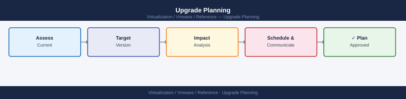

---
tags:
  - reference
description: "Upgrade planning should start before the maintenance window."
---
# Upgrade Planning

Upgrade planning should start before the maintenance window.

*Applies to: vSphere 7.x / 8.x*

## Key Planning Items

- Current version
- Target version
- Supported upgrade path
- Compatibility matrix
- Hardware compatibility
- Firmware and driver requirements
- Backup requirements
- Maintenance window
- Rollback plan
- Support contacts
- Application impact
- Validation checklist
