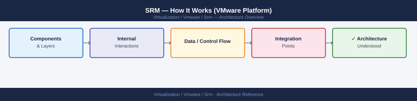
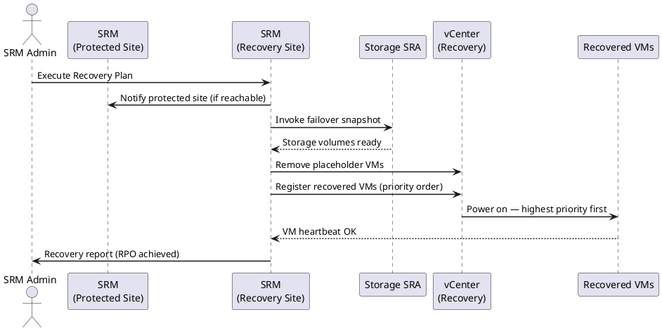
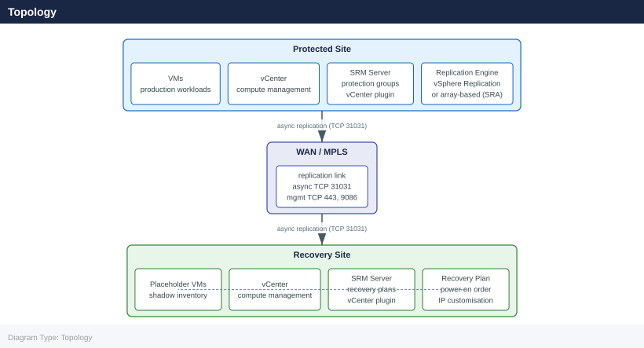

---
tags:
  - architecture
  - srm
  - vmware
---
# SRM — How It Works (VMware Platform)

<div class="kb-summary">
How It Works (VMware Platform) reference covering Site Topology, Test Failover Workflow, Planned Migration, Disaster Recovery Failover, Failback Process and 2 more sections.

*Applies to: SRM 8.x*
</div>


## Site Topology

```d2
direction: right

protected: Protected Site {
  vc_p: vCenter Server {shape: rectangle}
  srm_p: SRM Server {shape: rectangle}
  vms: Protected VMs {shape: rectangle}
  storage_p: Production Storage {shape: cylinder}
  vc_p -> srm_p
  srm_p -> vms: protect
  vms -> storage_p
}

recovery: Recovery Site {
  vc_r: vCenter Server {shape: rectangle}
  srm_r: SRM Server {shape: rectangle}
  placeholders: Placeholder VMs {shape: rectangle}
  storage_r: Recovery Storage {shape: cylinder}
  vc_r -> srm_r
  srm_r -> placeholders
}

protected.srm_p -> recovery.srm_r: SRM pairing (TCP 443)
protected.storage_p -> recovery.storage_r: Replication (SRA / vSphere Replication)
```

SRM operates across two paired sites: a **protected site** (production) and a **recovery site** (DR). Each site requires:

- vCenter Server
- SRM Server (Windows-based installer pre-8.x, OVA appliance from 8.x+)
- SRM Server registers as a vCenter extension and appears under **Site Recovery** in the vSphere Client

The two SRM Servers form a **site pair**. Communication between them uses TCP 443 and TCP 9086. The pairing is authenticated via certificate thumbprint exchange — each site must trust the other's SSL certificate.

Protected Site                        Recovery Site

**Per-VM customization** — define exact IP, netmask, gateway, DNS per NIC per VM. Used when target IPs don't follow a simple subnet mapping.

IP customization is applied using the Guest OS customization engine (VMware Tools required). If the VM does not have VMware Tools running, customization is skipped and the VM retains its protected-site IP (may cause routing issues at recovery site).

### Custom Command Steps

SRM can execute commands before or after powering on a VM:

- **Script (on recovery site)** — runs a command/script on the SRM Server or on a VM (via VMware Tools `RunProgram`).
- **Prompt** — pauses execution and waits for manual confirmation before proceeding. Used to gate critical steps.
- **Call an Alarm** — triggers a vCenter alarm.

---

## Test Failover Workflow

Test failover is non-disruptive: production VMs remain running. SRM powers on placeholder VMs in an isolated **bubble network**.

### Test Failover Steps

1. User initiates **Test** from the Recovery Plan in SRM UI.
2. SRM creates a **snapshot** of the replicated datastore at recovery site (ABR: writable snapshot / VR: point-in-time copy).
3. Placeholder VMs are reconfigured to use this test snapshot datastore (not the live replicated datastore).
4. SRM connects each test VM to an **isolated test network** (port group with no uplink, or a dedicated VLAN).
   - This prevents test VMs from impacting production by sending traffic on production networks.
5. IP customization runs on the test VMs (they get recovery-site IPs but are isolated).
6. VMs power on in priority order.
7. Custom steps (pre/post power-on commands) execute as configured.
8. Test result: pass / warning / error — each step logged with timestamp and outcome.

### Test Cleanup

After verifying the test:

1. Initiate **Cleanup** from the Recovery Plan.
2. SRM powers off test VMs.
3. Snapshots created for the test are deleted.
4. Placeholder VMs return to their pre-test state.
5. Recovery Plan returns to **Ready** state.

Test cleanup must complete before running a real failover or another test.

---

## Planned Migration

Used when both sites are operational (datacenter move, scheduled maintenance).

1. SRM shuts down protected VMs gracefully (respects VM tools shutdown).
2. Waits for final replication sync to complete — ensures RPO = 0.
3. VMs power on at recovery site using the final synced data.
4. IP customization is applied.
5. VMs are now running at recovery site — protected site VMs are removed from inventory.

Planned migration is fully reversible via **Failback** once you have re-protected (reversed replication).

---

## Disaster Recovery Failover



Used when the protected site is unavailable (power failure, network loss, site disaster).

1. Operator initiates **Run** (Recovery) from the Recovery Plan.
2. SRM assumes protected VMs are offline — no graceful shutdown.
3. For ABR: SRA promotes replicated LUN to writable (may involve accepting a crash-consistent snapshot).
4. For VR: VR appliance applies all received data up to the last sync point.
5. VMs power on at recovery site.
6. IP customization is applied.
7. Recovery Plan history logs all steps with outcome.

There is a **Force Recovery** option if SRM cannot reach the protected site SRM Server — this bypasses the normal handshake and proceeds unilaterally.

---

## Failback Process

Failback returns VMs from the recovery site to the protected site after a recovery. Requires:

1. Protected site is back online.
2. **Re-protect** the VMs — reverses replication direction (recovery site → protected site).
   - For VR: configure VR with new source = recovery site, new target = protected site.
   - For ABR: SRA reverses the replication pair on the array.
3. Create a new Recovery Plan (or use the original plan after re-pairing) in the opposite direction.
4. Run **Planned Migration** or **DR** back to the original protected site.
5. Re-protect again in the original direction to restore normal operations.

Full failback cycle: `Recover → Re-protect → Failback → Re-protect`

---

## Placeholder VMs

Placeholder VMs are lightweight VM objects at the recovery site that represent protected VMs. They exist so that:

- The recovery site vCenter knows about the VM before failover.
- Network mappings and IP customization can be pre-configured and validated.
- The Recovery Plan can reference the VMs for power-on ordering and dependencies.
- Alarms and monitoring at the recovery site can be configured.

### What a Placeholder VM Contains

- VM configuration file (`.vmx`) with hardware configuration matching the protected VM.
- No active VMDKs — disks are pointed at the replicated datastore (not yet promoted writable).
- Not powered on — exists only in vCenter inventory in a suspended/unregistered state.
- Network adapters assigned to recovery-site port groups (as per network mappings).

### Placeholder VM Problems

If a placeholder VM is missing or corrupt, SRM re-creates it automatically on the next **Configure All** or protection group reconfigure. If a placeholder VM shows errors, delete it manually from the recovery site vCenter and trigger a reconfigure on the Protection Group.

---

## SRM Inventory Mappings

Before VMs can recover, SRM requires:

| Mapping Type | Description |
|---|---|
| Network mappings | Map protected-site port group/vDS → recovery-site port group/vDS |
| Folder mappings | Map VM folders at protected site → folders at recovery site |
| Resource mappings | Map clusters/resource pools at protected site → at recovery site |
| Storage policy mappings | Map VM storage policies (optional, affects datastore placement at recovery) |

Network and folder mappings are bidirectional — configuring them in one direction auto-populates the reverse. Resource mappings define where recovered VMs are placed in the vCenter hierarchy.

## Overview

VMware Site Recovery Manager (SRM) is a DR orchestration platform deployed as a vCenter plugin on both the protected and recovery sites. It automates VM failover by coordinating storage presentation, VM registration, power-on sequencing, IP customisation, and custom scripts — without manual intervention at the storage or compute layer. SRM supports both array-based replication (via SRAs) and built-in vSphere Replication.

## Topology



## Recovery Plan Modes

| Mode | Description |
|---|---|
| Test | SRM creates a temporary snapshot of R2/replica; powers on VMs in isolated network; production replication continues; test cleanup removes snapshot |
| Planned migration | Orderly shutdown of protected VMs, final sync, then power-on at recovery site |
| Unplanned failover | Protected site unavailable; SRM fails over using most recent replicated state |

## Storage Replication Adapters (SRAs)

| Vendor | SRA | Supported Replication |
|---|---|---|
| Dell EMC | Dell EMC SRA for PowerMax | SRDF/A, SRDF/S |
| Pure Storage | Pure Storage SRA | ActiveCluster (sync), async replication |
| NetApp | NetApp SRA for ONTAP | SnapMirror (async), SnapMirror Synchronous |

SRAs must be installed on both sites and must match the same major version.

## Protection Groups

| Type | Granularity | Replication Backend |
|---|---|---|
| Array-based | Datastore (all VMs on the datastore) | SRA (vendor-specific) |
| vSphere Replication | Per-VM | Built-in vSphere Replication appliance |

## vSphere Replication

- RPO: 5 minutes minimum (no lower)
- Consistency: crash-consistent by default; application-consistent with quiescing enabled
- Bandwidth: compressed and deduplicated; can be throttled per-VM
- No SRA required — replication engine is embedded in the vSphere Replication appliance (one per site)

## See also

- [SRM — Design Standards](../design-standards/)
- [SRM — Deploy](../../deploy/)
- [SRM — Integrations](../integrations/)
