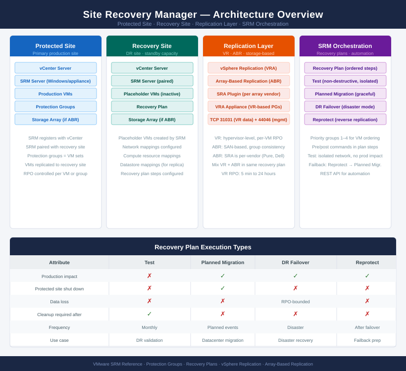

# Site Recovery Manager — Architecture

<div class="kb-summary">
VMware Site Recovery Manager automates DR failover and failback by orchestrating protection groups, recovery plans, and vSphere Replication or SAN-based replication.
</div>

```
┌───────────────────────────────────────── SRM — Architecture ──────────────────────────────────────────┐
│                                                                                                       │
│   ┌───────────────────────────────────────────────────────────────────────────────────────────────┐   │
│   │      Site Recovery Manager = SRM server pair (one per site) + protection groups (VM sets)     │   │
│   │       Recovery plans are ordered runbooks: test / planned migration / failover workflows      │   │
│   │      Uses vSphere Replication or array-based replication for data movement between sites      │   │
│   │        Inventory mappings connect protected site resources to recovery site equivalents       │   │
│   │     NSX network remapping automates IP customization during failover or planned migration     │   │
│   └───────────────────────────────────────────────────────────────────────────────────────────────┘   │
│                                                                                                       │
│    How-it-works defines replication and runbooks · integrations connect vCenter and storage · standard│
│                                                                                                       │
│                  ▼                                ▼                                ▼                  │
│                                                                                                       │
│   ┌─────────────────────────────┐  ┌─────────────────────────────┐  ┌─────────────────────────────┐   │
│   │         How It Works        │  │         Integrations        │  │       Design Standards      │   │
│   │       SRM server pair       │  │      vCenter pair sites     │  │        RTO/RPO per VM       │   │
│   │      Protection groups      │  │        NSX: net remap       │  │        PG granularity       │   │
│   │        Recovery plans       │  │       vSAN+SAN replic       │  │         Net mapping         │   │
│   │        Test failover        │  │           AD auth           │  │          DS mapping         │   │
│   │      Planned migration      │  │       Aria Ops monitor      │  │       IP customization      │   │
│   │        Inventory maps       │  │          Array API          │  │        Test schedule        │   │
│   └─────────────────────────────┘  └─────────────────────────────┘  └─────────────────────────────┘   │
│                                                                                                       │
│    How-it-works covers replication and recovery plans · integrations connect sites · standards enforce│
│                                                                                                       │
│                  ▼                                ▼                                ▼                  │
│                                                                                                       │
│   ┌───────────────────────────────────────────────────────────────────────────────────────────────┐   │
│   │   How It Works   │   Integrations   │    Design Stds    │    Deployment    │     Key Stds     │   │
│   │ SRM server pair  │   vCenter pair   │   RTO/RPO tiers   │   2-site setup   │    PG naming     │   │
│   │ Protection grps  │  NSX net remap   │   PG granularity  │  Bi-directional  │    RPO policy    │   │
│   │  Recovery plans  │ vSAN/SAN replic  │    Net mapping    │  Active-passive  │  IP custom std   │   │
│   │  Test failover   │    Array API     │  IP customization │  Active-active   │  Test schedule   │   │
│   └───────────────────────────────────────────────────────────────────────────────────────────────┘   │
│                                                                                                       │
│  Physical Infrastructure (the hardware everything above runs on):                                     │
│  x86 servers (SRM VMs both sites) · Shared storage or vSAN · Network uplinks · WAN/DCI link           │
│                                                                                                       │
│  Key terms:                                                                                           │
│                                                                                                       │
│  SRM server         = Site Recovery Manager appliance; one per site; paired across protected and recov│
│  Protection group   = Logical set of VMs grouped for replication and recovery together                │
│  Recovery plan      = Ordered runbook of steps executed during test, migration, or failover           │
│  Test failover      = Non-disruptive recovery validation in an isolated network; production unaffected│
│  Planned migration  = Controlled workload move from protected to recovery site; no data loss          │
│  Failover           = Emergency activation of recovery site after protected site failure              │
│  Reprotect          = Reverses replication direction after failover to enable failback                │
│  Inventory mapping  = Maps protected site resource (network, folder, pool) to recovery site equivalent│
│  Network mapping    = SRM mapping of protected site port group to recovery site port group            │
│  Datastore mapping  = Maps protected datastore to recovery site datastore for VM registration         │
│  IP customization   = SRM rules that change VM IP/gateway/DNS during failover to recovery network     │
│  RPO (Recovery Point Objective) = Maximum acceptable data loss; drives replication frequency          │
│                                                                                                       │
└───────────────────────────────────────────────────────────────────────────────────────────────────────┘
```



<div class="kb-grid kb-grid-3">
<a class="kb-card" href="how-it-works/"><strong>How It Works</strong><span>Architecture overview, topology, and how it fits in the stack.</span></a>
<a class="kb-card" href="integrations/"><strong>Integrations</strong><span>Integration with other platforms and services.</span></a>
<a class="kb-card" href="design-standards/"><strong>Design Standards</strong><span>Naming conventions, design rules, and configuration baselines.</span></a>
</div>
