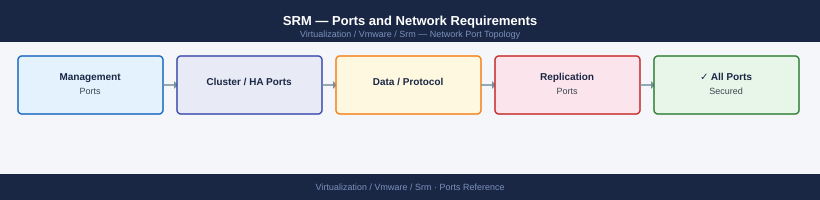

---
tags:
  - srm
  - site-recovery-manager
  - networking
  - firewall
  - ports
  - dr
---
# SRM — Ports and Network Requirements

<div class="kb-summary">
Firewall port reference for VMware Site Recovery Manager (SRM) and vSphere Replication (VR). The most critical firewall boundary is the inter-site link — both SRM server pairs and vSphere Replication appliances must reach each other across the WAN or inter-site firewall.

*Applies to: SRM 8.x / vSphere Replication 8.x*
</div>


## Before you begin

- SRM requires firewall rules at two layers: within each site (SRM to vCenter) and across the inter-site link
- vSphere Replication data (31031 TCP) flows from the source ESXi host to the destination ESXi host — ensure this port is open across the inter-site firewall on the ESXi management VMkernel
- SRM server-to-server pairing (9086 TCP) must be bidirectional between both sites

---

## Inbound — Client to SRM Server (Both Sites)

| Port | Protocol | Source | Purpose |
|---|---|---|---|
| 443 | TCP | Admin workstations, vSphere Client plugin | SRM web API — used by vSphere Client SRM plugin |
| 9085 | TCP | Admin workstations | SRM REST API (SRM 8.3+) |
| 22 | TCP | Jump hosts | SRM Server SSH (appliance-based SRM 8.x) |

---

## SRM Server Within Site

| Port | Protocol | Source | Destination | Purpose |
|---|---|---|---|---|
| 443 | TCP | SRM Server | vCenter Server | SRM ↔ vCenter API (VM inventory, RPO, failover orchestration) |
| 443 | TCP | SRM Server | VR Management Server / VR Appliance | SRM ↔ vSphere Replication coordination |
| 8095 | TCP | SRM Server | VR Management Server | VR Management Server REST API |

---

## SRM Server — Inter-Site (Cross the WAN Firewall)

| Port | Protocol | Between | Purpose |
|---|---|---|---|
| 9086 | TCP | Protected SRM Server ↔ Recovery SRM Server | SRM site pair — control channel (bidirectional) |
| 443 | TCP | Protected SRM Server → Recovery vCenter | SRM → remote vCenter (cross-site inventory, test failover) |
| 443 | TCP | Protected SRM Server → Recovery SRM Server | REST API communication between sites |

---

## vSphere Replication Appliance (VR) — Within Site

| Port | Protocol | Source | Destination | Purpose |
|---|---|---|---|---|
| 8043 | TCP | Admin workstations | VR Management Server | VR web management UI |
| 443 | TCP | Admin workstations | VR Appliance | VR REST API |
| 443 | TCP | VR Appliance | vCenter Server | VR ↔ vCenter (VM registration, replication policy) |
| 31031 | TCP | VR Appliance | ESXi hosts | VR agent communication — appliance initiates connection |

---

## vSphere Replication Appliance (VR) — Inter-Site (Cross the WAN Firewall)

| Port | Protocol | Between | Purpose |
|---|---|---|---|
| 10443 | TCP | Protected VR Appliance ↔ Recovery VR Appliance | VR site pair — management channel |
| 44046 | TCP | Protected VR Appliance ↔ Recovery VR Appliance | VR site pair — alternate management port |

---

## vSphere Replication Data Traffic (ESXi to ESXi — Cross the WAN Firewall)

This is the actual replication data flow — highest bandwidth traffic in SRM.

| Port | Protocol | Between | Purpose |
|---|---|---|---|
| 31031 | TCP | Protected ESXi host (management vmk) → Recovery ESXi host | vSphere Replication data transfer |
| 44046 | TCP | Protected ESXi host → Recovery ESXi host | vSphere Replication fallback data port |

---

## Firewall Zone Summary

| From | To | Ports | Notes |
|---|---|---|---|
| Admin clients | SRM Server (both sites) | 443, 9085 | SRM plugin and REST API |
| SRM Server | Local vCenter | 443 | Required in both sites |
| SRM Server | VR Appliance | 443, 8095 | Replication coordination |
| Protected SRM | Recovery SRM | 9086, 443 | Inter-site pairing — must cross WAN firewall |
| Protected VR | Recovery VR | 10443, 44046 | VR inter-site management |
| Protected ESXi | Recovery ESXi | 31031, 44046 | Replication data — open on WAN firewall; plan for bandwidth |

---

## Verify

```bash
# From admin workstation — test SRM API
curl -sk -o /dev/null -w "%{http_code}" https://<srm-server-ip>/api/rest/vr/v1/info

# From SRM server — test inter-site SRM connectivity
nc -zv <remote-srm-ip> 9086

# From SRM server — test remote vCenter API
nc -zv <remote-vcenter-ip> 443

# From protected site ESXi — test replication data port to recovery ESXi
nc -zv <recovery-esxi-ip> 31031

# From VR Appliance — test inter-site VR pair
nc -zv <remote-vr-appliance-ip> 10443

# From vSphere Client — Validate SRM site pair
# SRM → Configure → Site Pair — status should show "Connected"
```


```text title="Expected output"
200
Connection to 192.168.50.42 port 9086 [tcp/*] succeeded!
Connection to 192.168.51.10 port 443 [tcp/https] succeeded!
Connection to 192.168.52.15 port 31031 [tcp/*] succeeded!
Connection to 192.168.51.20 port 10443 [tcp/*] succeeded!
```

!!! warning "Common errors"
    **`Connection to 192.168.50.42 port 9086 [tcp/*] failed: Connection refused`** — Verify SRM service is running on the remote site with `systemctl status vmware-srm` and check firewall rules allow port 9086.
    **`curl: (60) SSL certificate problem: self signed certificate`** — Add the `-k` flag to curl to skip certificate verification, or import the SRM server's certificate into your admin workstation's certificate store.
    **`nc: getaddrinfo for host "192.168.51.10": Name or service not known`** — Verify the IP address is correct and the remote host is reachable by testing with `ping` first, then confirm DNS resolution if using hostnames.
---

## See also

- [SRM — Architecture](../how-it-works/)
- [SRM — Deploy](../../deploy/)
- [SRM — Operations](../../operations/)
- [vCenter — Ports](../../vcenter/architecture/ports.md)
- [ESXi — Ports](../../esxi/architecture/ports.md)
