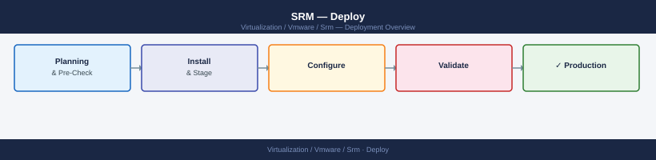

---
tags:
  - deployment
  - srm
  - vmware
search:
  boost: 1.5
---
# SRM — Deploy

<div class="kb-summary">
End-to-end deployment guide for VMware Site Recovery Manager DR orchestration. Phases 1–2 establish prerequisites and deploy SRM at both the protected and recovery sites; Phases 3–4 cover site pairing, inventory mappings, and replication (vSphere Replication or SRA); Phases 5–6 build protection groups, recovery plans, and validate with a test failover.

*Applies to: SRM 8.x / 9.x*
</div>



---

## Before you begin

- **Access:** vCenter Administrator and SRM Administrator at both the protected and recovery sites
- **Timing:** plan a maintenance window; SRM deployment touches production networking at both sites
- **Dependencies:** vCenter deployed at both sites; DNS resolves across sites; network ports open (TCP 443, 8043, 9086); replication mechanism (vSphere Replication or SRA) ready
- **Logging:** capture appliance deployment wizard output and any certificate warnings; record IP addresses and FQDNs assigned during deployment

---

## Phase 1 — Prerequisites

**Exit criterion:** Both sites operational; network ports confirmed open; DNS resolves; replication mechanism in place.

### Infrastructure Readiness

| Check | Required | Notes |
|---|---|---|
| Protected site vCenter | Operational | Must be reachable from SRM VM |
| Recovery site vCenter | Operational | Must be reachable from SRM VM |
| Network ports between sites | 443, 8095, 9086 TCP | SRM Server ↔ SRM Server |
| vSphere Replication ports | 80, 443, 902, 31031 TCP | VRA ↔ VRA |
| DNS forward + reverse | SRM FQDN resolves from both sites | Required for certificate pairing |
| NTP | Both sites same source, < 500 ms drift | Certificate and log correlation |
| vCenter version match | Both sites same major version | Pairing requirement |

### Firewall Rules

```text
Protected SRM (srm-protected.example.local: 10.10.1.50)
  → Recovery SRM (srm-recovery.dr.example.local: 10.20.1.50)
  → TCP 443:  SRM management and vCenter plugin
  → TCP 9086: SRM inter-site replication and recovery coordination
  → TCP 8095: SRM internal API

Recovery SRM → Protected SRM: same ports (bidirectional)

vSphere Replication (VRA protected: 10.10.1.60 → VRA recovery: 10.20.1.60)
  → TCP 443, 80:   VRA management
  → TCP 902, 31031: replication data channel
```

### Replication Mechanism Decision

Choose before deployment:

| Type | Components | RPO | Use case |
|---|---|---|---|
| vSphere Replication | VRA OVA at each site | 5 min – 24 h | General VM-level replication |
| Array-Based (SRA) | Storage array + SRA plugin | Near-zero (sync) | Mission-critical workloads on SAN |

---

## Phase 2 — SRM Appliance Deployment

**Exit criterion:** SRM appliance deployed and registered with vCenter at both sites; SRM plugin visible in vSphere Client at both sites.

### Deploy SRM OVA — Protected Site

In vCenter (protected site): **Actions → Deploy OVF Template**

```text
SRM OVA: VMware-srm-<version>.ova
Deployment size: Medium (up to 2,000 VMs)
Datastore: management datastore (not the replicated datastore)
Network: management port group

Customise template:
  Hostname:       srm-protected.example.local
  IPv4 address:   10.10.1.50
  Netmask:        255.255.255.0
  Gateway:        10.10.1.1
  DNS:            10.10.0.5, 10.10.0.6
  NTP:            ntp1.example.local
  Admin password: <admin password>
```

### Register SRM with Protected Site vCenter

After VM powers on, access the SRM setup UI at `https://srm-protected.example.local:9086/`:

```text
Setup → Configure vCenter Server connection:
  vCenter FQDN:  vcenter-protected.example.local
  Username:      administrator@vsphere.local
  Password:      <password>
  Accept SSL thumbprint

Apply licence key when prompted.
```

Verify: vSphere Client → Site Recovery — SRM plugin loads without errors.

### Deploy SRM OVA — Recovery Site

Repeat the identical OVA deployment procedure on the recovery site vCenter:

```text
Hostname:     srm-recovery.dr.example.local
IPv4 address: 10.20.1.50
vCenter:      vcenter-recovery.dr.example.local
```

---

## Phase 3 — Site Pairing and Inventory Mappings

**Exit criterion:** Site pair shows `Connected` status; all four mapping types configured; placeholder datastore configured at recovery site.

### Pair the Sites

From the **protected site vCenter** → Site Recovery → New Site Pair:

```text
Remote vCenter:           vcenter-recovery.dr.example.local
Remote SRM Server FQDN:   srm-recovery.dr.example.local
Credentials:              administrator@vsphere.local (recovery site)
Accept certificate thumbprints from both SRM servers
```

Verify: Site Recovery → Summary → Status = **Connected** on both sites.

### Configure Inventory Mappings

All four mapping types must be configured before creating protection groups:

**Network Mappings:**
```text
Site Recovery → Site Pair → Configure → Network Mappings
Protected: PG-Production-App (VLAN 100)  →  Recovery: PG-DR-App (VLAN 200)
Protected: PG-Production-DB  (VLAN 110)  →  Recovery: PG-DR-DB  (VLAN 210)
Test network: PG-DR-Test-Bubble (isolated, no uplink — for test failover)
```

**Folder Mappings:**
```text
Protected: VM-Folder-Production  →  Recovery: VM-Folder-DR-Recovered
```

**Resource Mappings:**
```text
Protected: cluster-protected / RP-Production  →  Recovery: cluster-recovery / RP-DR
```

**Placeholder Datastore:**
```text
Site Recovery → Site Pair → Placeholder Datastores
Select a small datastore at the recovery site for VM config files (2–5 GB sufficient)
```

### IP Customisation Rules

Configure IP re-mapping rules so VMs acquire the correct recovery-site IPs at failover:

```text
Site Recovery → Site Pair → Configure → IP Customisation → Add Mapping
  Source network:      10.10.1.0/24  (protected site)
  Destination network: 10.20.1.0/24  (recovery site)
  Gateway:             10.20.1.1
  DNS primary:         10.20.0.5
  DNS secondary:       10.20.0.6
```

For VMs that need a per-NIC override (different IP, not just subnet mapping):
```text
VM-level customisation → Add per-VM rule
  VM: db-server-01
  NIC: Network adapter 1
  Recovery IP: 10.20.1.101/24
  Gateway:     10.20.1.1
```

---

## Phase 4 — Replication Configuration

**Exit criterion:** Replication active for all target VMs; no lag exceeding RPO targets; placeholder VMs visible at recovery site.

### vSphere Replication — VRA Deployment

If using vSphere Replication, deploy the VRA OVA at each site first:

```text
vCenter (protected) → Actions → Deploy OVF Template
  OVA: VMware-vSphere-Replication-<version>.ova
  Hostname:     vra-protected.example.local
  IPv4:         10.10.1.60/24
  vCenter:      vcenter-protected.example.local

  Repeat at recovery site:
  Hostname:     vra-recovery.dr.example.local
  IPv4:         10.20.1.60/24
```

Pair VRAs via the protected site vCenter → Site Recovery → New Site Pair (VRA pairing follows after SRM pairing completes).

### Configure vSphere Replication for VMs

```text
VM → Configure → vSphere Replication → Configure Replication
  Target site:        recovery site
  Target datastore:   dr-datastore (at recovery site)
  RPO:                15 minutes   (5 min minimum; lower RPO = more replication I/O)
  Multiple point in time (MPIT): Enable (keep 3 instances for point-in-time recovery)
```

```powershell
# Verify replication status via PowerCLI
$vrServer = Connect-VIServer vcenter-protected.example.local
Get-VM | Get-VRReplication | Where-Object { $_.State -ne "Active" }
# Expected: no output (all replications Active)
```

### SRA — Array-Based Replication

If using SRA (e.g., Pure Storage FlashArray, Dell SRDF), install the SRA on **both** SRM Servers:

```powershell
# Example: Pure Storage SRA — install on protected SRM Server
Pure_Storage_SRA_<version>.exe /silent

# Install on recovery SRM Server (same version)
Pure_Storage_SRA_<version>.exe /silent

# Register SRA in SRM (protected site):
# Site Recovery → Storage → Storage Adapters → Configure Adapter
#   Adapter: Pure Storage FlashArray
#   Array manager: fa-protected.example.local
#   API token: <FlashArray API token>
```

---

## Phase 5 — Protection Groups

**Exit criterion:** All target VMs assigned to protection groups; every VM shows `Protected` status; placeholders exist at recovery site.

### Create a vSphere Replication Protection Group

```text
Site Recovery → Protection Groups → New Protection Group
  Site: protected site
  Type: vSphere Replication
  Name: PG-AppTier-vSR
  Select VMs:
    web-server-01, web-server-02, app-server-01, app-server-02
  Replication: confirm each VM has active vSphere Replication configured
```

### Create an Array-Based Replication Protection Group

```text
Site Recovery → Protection Groups → New Protection Group
  Type: Array Based Replication
  Name: PG-DBTier-ABR
  SRA: Pure Storage FlashArray
  Consistency group / datastore group: select the replicated datastore
  VMs auto-discovered from the replicated datastore
```

### Verify Protection Status

```powershell
# PowerCLI — list all VMs and their SRM protection status
$srm = Connect-SrmServer -SrmServerAddress srm-protected.example.local
$protectedVMs = $srm.ExtensionData.Protection.QueryVms()
$protectedVMs | Where-Object { $_.ProtectionState -ne "protected" } |
    Select-Object Name, ProtectionState
# Expected: no output (all VMs show protected)
```

Verify at recovery site: vSphere Client → Site Recovery → Protection Groups → [PG] — all VMs show **Protected**; placeholder VMs exist in the recovery site inventory.

---

## Phase 6 — Recovery Plans and Test Failover

**Exit criterion:** Recovery plan test passes; RTO measured and documented; test cleanup completes; plan in `Ready` state.

### Create a Recovery Plan

```text
Site Recovery → Recovery Plans → New Recovery Plan
  Name:              RP-AppTier-Failover
  Recovery site:     recovery site
  Protection groups: PG-AppTier-vSR, PG-DBTier-ABR

  VM startup groups:
    Priority 1: db-server-01, db-server-02   (databases first)
    Priority 2: app-server-01, app-server-02  (app tier waits for DB)
    Priority 3: web-server-01, web-server-02  (frontend last)

  Custom steps:
    Before Priority 1 power-on:
      Script: "C:\Scripts\pre-failover-notify.ps1 -site recovery"
    After Priority 3 power-on:
      Prompt: "Verify application health before continuing"
```

### Run Test Failover

```text
Site Recovery → Recovery Plans → RP-AppTier-Failover → Test
  Confirm: production VMs remain running during test
  SRM creates snapshot of replicated datastores at recovery site
  VMs power on in isolated bubble network (PG-DR-Test-Bubble)
  IP customisation applies recovery-site IPs
  Record start time → measure per-priority-group boot time
```

```powershell
# Monitor test via PowerCLI
$srm = Connect-SrmServer -SrmServerAddress srm-protected.example.local
$plan = $srm.ExtensionData.Recovery.ListPlans() |
    Where-Object { $_.Name -eq "RP-AppTier-Failover" }
$srm.ExtensionData.Recovery.GetHistory($plan.MoRef) |
    Select-Object StartTime, EndTime, ResultState, Error
```

### Verify Recovery Plan Test Results

```powershell
# Run a pre-check only (no actual power-on) at any time
$srm.ExtensionData.Recovery.Start($plan.MoRef, "PRECHECK_ONLY")

# Check plan history for last test outcome
$history = $srm.ExtensionData.Recovery.GetHistory($plan.MoRef)
$history | Select-Object StartTime, ResultState
# Expected: ResultState = Success (or Warning with acceptable warnings)
```

Measure RTO from test records: time from plan start to last VM in Priority 3 booted. Document against agreed RTO target.

### Test Cleanup

```text
Site Recovery → Recovery Plans → RP-AppTier-Failover → Cleanup
  SRM powers off test VMs
  Test snapshots deleted
  Placeholder VMs restored to pre-test state
  Plan returns to Ready state
```

### Post-Deployment Checklist

| Check | Location / Command | Pass Criterion |
|---|---|---|
| Site pair status | Site Recovery → Summary | Connected (both sites) |
| SRM plugin loaded | vSphere Client → Site Recovery | Loads without errors |
| Inventory mappings | Site Pair → Configure → Mappings | All 4 types configured |
| VM protection status | Protection Groups → [PG] | All VMs: Protected |
| Placeholder VMs | Recovery site vCenter inventory | Present for all protected VMs |
| Replication health | vSphere Replication or array console | No lag > RPO target |
| Recovery plan pre-check | `Recovery.Start(plan, "PRECHECK_ONLY")` | No critical errors |
| Test failover | Recovery Plan → Test | ResultState: Success |
| RTO measurement | Recovery Plan history | Within agreed RTO target |
| Test cleanup | Recovery Plan → Cleanup | Plan back to Ready state |
| IP customisation | Post-test VM IP in bubble network | Recovery-site IPs applied |
| Recurring test schedule | Site Recovery → Reporting | Schedule set (quarterly minimum) |

## Prerequisites

Confirm the following before starting the deployment:

**Infrastructure:**

- vCenter Server deployed and operational at both the protected site and the recovery site (linked-mode optional but not required)
- vSphere version and SRM version compatibility verified against the VMware Interoperability Matrix
- Sufficient compute and storage at the recovery site to run protected workloads under DR conditions
- Shared storage (for ABR) or vSphere Replication capability at both sites

**Replication choice — decide before installing:**

- **vSphere Replication (VR):** Built-in, hypervisor-based, no storage vendor dependency. Suitable for RPO 15 minutes or greater.
- **Array-Based Replication (ABR):** Storage array replicates LUNs/volumes. Requires a Storage Replication Adapter (SRA) from the array vendor (e.g., Dell PowerStore SRA, NetApp SRA). RPO limited only by array capability.

**SRM appliance form factor (version-dependent):**

- SRM 8.x and later: Linux OVA (recommended)
- SRM pre-8.x: Windows Server installer (Windows Server 2016/2019)

**Networking:**

- TCP 443 open between SRM at protected site and SRM at recovery site
- TCP 9086 open between SRM appliances (inter-site SRM communication)
- TCP 443 open from each SRM to its local vCenter
- DNS resolvable FQDNs for both vCenters and both SRM appliances from either site

---


## Deploy SRM at Protected Site

**For OVA (SRM 8.x+):**

1. Download the SRM OVA from the VMware Customer Connect portal.
2. Log in to the protected-site vCenter → **Actions → Deploy OVF Template** → select the SRM OVA.
3. Assign to a management cluster and datastore — do not place SRM on a datastore that is itself replicated (SRM cannot protect itself).
4. Complete OVF properties:
   - Hostname (FQDN), IP address, subnet mask, default gateway, DNS, NTP
   - Admin password (record in credentials store)
5. Power on and wait for first-boot (~5 minutes).
6. Open `https://<srm-appliance-ip>:5480` → SRM Appliance Management Interface → complete configuration wizard:
   - Set NTP sync
   - Connect to vCenter: enter protected-site vCenter FQDN, SSO credentials → **Save and Restart Services**
7. Open vCenter → **Menu → Site Recovery** → confirm SRM appears with status **OK** and site name displayed.

**For Windows installer (pre-8.x):**

1. Install SRM on a Windows Server VM joined to domain.
2. Run `VMware-srm-<version>.exe` → accept defaults → provide vCenter FQDN and credentials when prompted.
3. SRM registers as a vCenter extension — verify in vCenter → **Menu → Site Recovery**.

---


## Deploy SRM at Recovery Site

1. Repeat the identical deployment process at the recovery-site vCenter (OVA or Windows, matching version exactly).
2. Connect the recovery-site SRM to the recovery-site vCenter using the same procedure.
3. In both vCenters, navigate to **Menu → Site Recovery** → confirm SRM shows status **OK** at each site independently before proceeding to pairing.

Key check: both SRM instances must run the same version. Version mismatch blocks pairing.

---


## Pair the Sites

Site pairing establishes the trust relationship between the two SRM instances.

1. Log in to the **protected-site vCenter** → **Menu → Site Recovery → Sites → New Site Pair**.
2. Enter the recovery-site vCenter FQDN and SSO administrator credentials → **Next**.
3. SRM presents the SSL certificate thumbprint of the recovery-site vCenter — review and **Accept**.
4. SRM presents the SSL certificate thumbprint of the recovery-site SRM appliance — review and **Accept**.
5. Pairing completes → both sites now appear in the Site Recovery UI with status **Connected**.
6. Verify from the recovery site: open recovery-site vCenter → **Menu → Site Recovery → Sites** → protected site listed as the peer with status **Connected**.

---


## Configure Replication

**vSphere Replication path:**

1. Download the VR appliance OVA from VMware Customer Connect.
2. Deploy VR appliance at the protected site → connect to protected-site vCenter (same OVA deploy procedure as SRM).
3. Deploy VR appliance at the recovery site → connect to recovery-site vCenter.
4. Pair VR appliances: protected-site vCenter → **Menu → Site Recovery → Replication → Configure Replication** → enter recovery-site VR FQDN → authenticate → **Pair**.
5. Configure per-VM replication:
   - Select a VM → right-click → **All Site Recovery Actions → Configure Replication**
   - Choose target site, target datastore, RPO (minimum 15 minutes for VR)
   - Enable **Guest OS quiescing** for application-consistent copies (requires VMware Tools)
   - Confirm replication status shows **OK** in the VR inventory

**Array-Based Replication path:**

1. Obtain the SRA package from the storage vendor (must match array firmware and SRM version).
2. Install SRA on the SRM appliance:
   - SRM 8.x OVA: SRM Appliance Management Interface → **Storage Replication Adapters → Upload SRA** → upload the vendor-provided SRA tar.gz
   - Windows SRM: run the SRA installer on the Windows Server hosting SRM
3. Install SRA at the recovery site using the same process.
4. Configure array credentials: SRM UI → **Configure → Array Managers → Add** → enter array management IP, username, password for both protected and recovery arrays → **Discover Arrays**.
5. Verify SRM discovers replicated datastore pairs under **Configure → Array Pairs**.

---


## Configure Mappings

Mappings define how protected-site objects translate to recovery-site equivalents when a recovery plan executes.

**Network Mappings:**

1. SRM UI (protected site) → **Configure → Network Mappings → Add Mapping**.
2. Map each production port group to the corresponding DR port group at the recovery site.
3. Add a **Test Network** mapping: each production port group → isolated bubble network (used during test runs only — prevents test VMs from reaching production).

**Resource Mappings:**

1. SRM UI → **Configure → Resource Mappings → Add Mapping**.
2. Map protected-site cluster or resource pool → recovery-site cluster or resource pool.

**Folder Mappings:**

1. SRM UI → **Configure → Folder Mappings → Add Mapping**.
2. Map protected-site VM folders to recovery-site VM folders (controls where recovered VMs appear in the vCenter inventory).

**Placeholder Datastore:**

1. SRM UI → **Configure → Placeholder Datastores → Add**.
2. Select a small datastore at the recovery site — SRM uses this to register placeholder VMs that represent protected workloads.

---


## Create a Protection Group

A protection group defines which VMs are protected together and how they replicate.

1. SRM UI → **Protection Groups → New Protection Group**.
2. Name the group (e.g., `PG-Tier1-VMs`).
3. Select replication type:
   - **vSphere Replication:** select VMs individually from the list of configured VR replicas
   - **Array-Based Replication:** select a replicated datastore — SRM automatically includes all VMs on that datastore
4. Review detected VMs and confirm.
5. Click **Next → Finish** → SRM runs validation.
6. Resolve any validation warnings (common: missing placeholder datastore assignment, missing folder mapping for a VM).
7. Confirm protection group status shows **OK** (green) with all VMs listed as **Protected**.

---


## Create a Recovery Plan

A recovery plan defines the ordered sequence of steps to recover a set of protection groups.

1. SRM UI → **Recovery Plans → New Recovery Plan**.
2. Name the plan (e.g., `RP-Tier1-Failover`).
3. Add one or more protection groups to the plan.
4. Configure priority groups:
   - **Priority 1:** infrastructure VMs (DNS, AD, database servers) — these power on first
   - **Priority 2:** application-tier VMs
   - **Priority 3:** non-critical workloads
   - Within each priority, set per-VM startup delay and IP customisation if performing real failover (not required for test)
5. Add custom recovery steps as needed:
   - Pre-power-on scripts (e.g., mount NFS exports, update DNS)
   - Post-power-on scripts (e.g., notify monitoring, send alert)
6. Configure IP property mappings if VMs need different IPs at the recovery site (SRM → **Configure → IP Address Mappings**).
7. Click **Finish** → SRM validates the plan.
8. Resolve all validation errors before proceeding. Warnings should be reviewed but do not block testing.

---


## Test the Recovery Plan

Testing runs recovery in an isolated bubble network and is non-disruptive to production. It is the only way to confirm the plan works.

1. SRM UI → **Recovery Plans** → select the plan.
2. Click **Test** → confirm the test network mappings are in place → **Next → Finish**.
3. Monitor execution in the **Steps** panel:
   - Storage: test snapshots created from replicated data
   - VMs: powered on at recovery site on isolated test networks
   - Custom steps: scripts execute in configured order
4. Verify each VM powers on and the OS boots correctly:
   - Check vCenter at recovery site → confirm VMs visible in test state
   - RDP or SSH into test VMs if accessible from the isolated network to verify application health
5. Review the SRM test report: **Recovery Plans → History → view last run** — check for step failures or warnings.
6. Click **Cleanup** when testing is complete — SRM powers off test VMs, removes test snapshots, and resets protection group state to **Protected**.
7. Document the test result: date, plan name, steps executed, any failures and resolution, tester sign-off.

Regular testing cadence recommendation: full test every 90 days, partial validation monthly.

---

## See also

- [SRM — How It Works (VMware Platform)](../architecture/how-it-works/)
- [SRM — Health Checks](../operations/health-checks/)
- [VMware SRM — Common Issues](../troubleshooting/common-issues/)

## Verify

- **vSphere Client:** confirm the component is visible and shows a healthy status
- **Alarms:** Home → Alarms — no new critical alarms after deployment
- **Logs:** review vmware.log / recent events for any errors in the first 5 minutes
