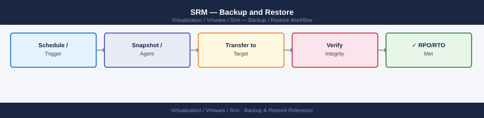

---
tags:
  - operations
  - srm
  - vmware
---
# SRM — Backup and Restore


<div class="kb-summary">
Backup and Restore reference covering Backup Schedule Recommendation, SRM Configuration Export (Migration / Documentation), vSphere Replication Appliance Backup, Recovery Plan PDF Export, SRM Database Considerations and 2 more sections.

*Applies to: SRM 8.x / 9.x*
</div>



  SRM Backup Sources


```d2
direction: right

hub: "Site Recovery Manager\nOperations" {shape: hexagon}
srm_configuration_export: "SRM Configuration Export" {shape: rectangle}
vsphere_replication_appliance_backup: "vSphere Replication Appliance Backup" {shape: rectangle}
recovery_plan_pdf_export: "Recovery Plan PDF Export" {shape: rectangle}
srm_database_considerations: "SRM Database Considerations" {shape: rectangle}
protection_group_inventory_backup: "Protection Group Inventory Backup" {shape: rectangle}
restore_srm_after_vcenter_restore: "Restore SRM After vCenter Restore" {shape: rectangle}

hub -> srm_configuration_export
hub -> vsphere_replication_appliance_backup
hub -> recovery_plan_pdf_export
hub -> srm_database_considerations
hub -> protection_group_inventory_backup
hub -> restore_srm_after_vcenter_restore
```

## SRM Configuration Export

The exported XML contains:
- Site pairing information.
- SRA configuration (array manager entries — credentials are encrypted and may not be re-importable directly).
- General SRM settings.

Recovery Plans and Protection Groups are **not** in this export — they live in vCenter DB and are recovered with vCenter.

### Export via SRM REST API

```bash
# Authenticate to get session token
SRM_TOKEN=$(curl -sk -X POST \
  "https://srm-appliance.example.com/api/session" \
  -H "Content-Type: application/json" \
  -d '{"username":"administrator@vsphere.local","password":"VMware1!"}' | \
  python3 -c "import sys,json; print(json.load(sys.stdin)['token'])")

# List Recovery Plans (for documentation)
curl -sk -X GET \
  "https://srm-appliance.example.com/api/recovery-plans" \
  -H "Authorization: Bearer $SRM_TOKEN" | python3 -m json.tool > \
  /backup/srm/recovery-plans-$(date +%Y%m%d).json
```

---

## Before you begin

- **Access:** vCenter read-only minimum; Administrator role for remediation steps
- **Timing:** safe to run during business hours unless a step is marked ⚠ (causes interruption)
- **Dependencies:** no active upgrades or migrations on the same infrastructure
- **Logging:** capture command output — paste into the change record on completion

---

## vSphere Replication Appliance Backup

### Snapshot-Based Backup

```bash
# Take a snapshot of the VR appliance via govc (do during low-change-rate window)
govc snapshot.create -vm "vr-appliance-01" \
  "VR-Backup-$(date +%Y%m%d)" \
  -d "Scheduled VR appliance backup"

# List existing snapshots
govc snapshot.tree -vm "vr-appliance-01"

# Remove old snapshots (keep only last 2)
govc snapshot.remove -vm "vr-appliance-01" "VR-Backup-20260401"
```

**Note:** Do not leave snapshots on the VR Appliance indefinitely. The VR Appliance receives replication data continuously — snapshot growth can fill the datastore.

### OVF Export (for cold backups or migration)

```bash
# Power off the VR Appliance (during maintenance window)
govc vm.power -off vr-appliance-01

# Export to OVF
govc export.ovf \
  -vm "vr-appliance-01" \
  -o /backup/vrm/vr-appliance-01-$(date +%Y%m%d).ovf

# Power on
govc vm.power -on vr-appliance-01
```

### VR VAMI Config Backup

The VAMI provides a configuration export that captures network settings, registration info, and certificates:

```text
https://<vr-appliance>:5480 → Administration → Backup
```

Download the backup tar file and store with the OVF export.

---

## Recovery Plan PDF Export

SRM can generate a PDF summary of a Recovery Plan from the UI. This is useful for:
- Change management documentation.
- Audit evidence.
- Offline reference during a DR event when vCenter may be unavailable.

Export path: SRM UI → Recovery Plan → **Export** → Export as PDF

Contents include:
- All steps in priority group order.
- Per-VM IP customization rules.
- Pre/post power-on commands.
- Network and resource mappings applied.

Export after every change to a Recovery Plan and store in your documentation system or DR runbook.

---

## SRM Database Considerations

### Embedded Database (Default)

SRM Server (Windows, pre-8.x) uses an embedded SQL Server Express database by default.

- Max size: 4 GB (SQL Express limit).
- Suitable for: ≤ 250 protected VMs.
- Location: `C:\Program Files\VMware\VMware vCenter Site Recovery Manager\db\`

Backup:

```powershell
# Backup SRM embedded database (Windows)
$backupPath = "C:\SRMBackup\srm-db-$(Get-Date -Format yyyyMMdd).bak"
Invoke-Sqlcmd -Query "BACKUP DATABASE [VMware DR] TO DISK = '$backupPath'" `
  -ServerInstance "localhost\VIMSERVICESRM"
```

### External Database (Enterprise deployments)

For > 250 VMs, use an external SQL Server or Oracle database. Configure during SRM Server installation.

Backup is handled by your standard SQL Server backup policy — include the SRM database (`VMware DR`) in your backup jobs.

### SRM Appliance (8.x+)

The SRM appliance uses an embedded vPostgres database. All configuration is stored in vCenter's DB (for Recovery Plans/Protection Groups) and the appliance's local config. The appliance has no separate DB backup procedure — use snapshot + vCenter VCSA backup.

---

## Protection Group Inventory Backup

Protection Group definitions live in vCenter, but the list of protected VMs and their configuration should also be documented externally for use during recovery when vCenter may be unavailable.

```powershell
# PowerCLI: Export all Protection Groups and their protected VMs
Import-Module VMware.VimAutomation.Srm

Connect-VIServer -Server vcenter-protected.example.com
$srm = Connect-SrmServer -SrmServerAddress srm-protected.example.com

$srmApi = $srm.ExtensionData

$output = @()
$pgs = $srmApi.Protection.ListProtectionGroups()
foreach ($pgRef in $pgs) {
    $pg = $pgRef.GetInfo()
    $vms = $pgRef.ListProtectedVms()
    foreach ($vm in $vms) {
        $output += [PSCustomObject]@{
            ProtectionGroup = $pg.Name
            VMName          = $vm.Vm.MoRef.Value
            State           = $vm.State
            PeerState       = $vm.PeerState
        }
    }
}

$output | Export-Csv -Path "C:\Backup\srm-protection-groups-$(Get-Date -Format yyyyMMdd).csv" -NoTypeInformation
Write-Host "Exported $($output.Count) protected VM entries"
```

---

## Restore SRM After vCenter Restore

When vCenter is restored from backup, SRM configuration (Recovery Plans, Protection Groups) is restored with it automatically — it lives in the vCenter database.

### Post-Restore Steps

1. **Verify site pairing** — if vCenter was restored to a point before pairing, re-pair the sites.
2. **Re-register SRA** — if SRM Server was also reinstalled, re-add Array Manager entries (credentials must be re-entered manually).
3. **Verify placeholder VMs** — run a **Configure All** on each Protection Group to ensure placeholder VMs exist at recovery site.
4. **Verify network mappings** — check that mappings are still valid (recovery site port groups may have changed).
5. **Run a test failover** — confirm Recovery Plans execute correctly post-restore.

### SRM Appliance Re-Deploy and Re-Register

If the SRM appliance itself must be re-deployed (not just restored):

```bash
# 1. Deploy new SRM OVA
# 2. During setup wizard, register with vCenter
# 3. If vCenter still has SRM extension from old appliance, unregister first:
#    vCenter → Administration → Solutions → Client Plugins
#    Remove old SRM plugin entries

# 4. After new registration, re-pair sites:
#    SRM UI → Site Recovery → New Site Pair

# 5. SRM reads Protection Groups and Recovery Plans from vCenter DB automatically
#    after pairing is established

# 6. Re-add Array Managers (SRA credentials not recovered from vCenter backup)
# 7. Scan arrays to re-discover replicated devices
# 8. Run Configure All on all Protection Groups
```

### Verify Recovery After Restore

```powershell
# PowerCLI: Check Protection Group health post-restore
$pgs = $srmApi.Protection.ListProtectionGroups()
foreach ($pgRef in $pgs) {
    $pg = $pgRef.GetInfo()
    Write-Host "PG: $($pg.Name) | State: $($pg.State)"
}

# Check placeholder VMs exist
$vms = $pgRef.ListProtectedVms()
foreach ($vm in $vms) {
    if ($vm.PeerState -ne "OK") {
        Write-Warning "Placeholder issue for VM: $($vm.Vm.MoRef.Value) — PeerState: $($vm.PeerState)"
    }
}
```

---

## See also

- [SRM — Procedures](procedures/)
- [VMware SRM — Common Issues](../troubleshooting/common-issues/)
- [SRM — Health Checks](health-checks/)

## Verify

- **Alarms:** vSphere Client → Home → Alarms — no new critical alarms after the operation
- **Events:** monitor the vCenter Events view for the affected object for 5 minutes
- **Health check:** run the morning health-check sequence for the affected product tier
