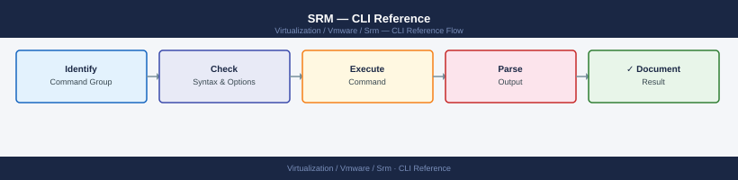

---
tags:
  - operations
  - srm
  - vmware
---
# SRM — CLI Reference

<div class="kb-summary">
CLI Reference reference covering SRM REST API — Recovery Plans, PowerCLI for SRM, Get Protected VM List, Get Recovery Plan History, Disconnect SRM Session.

*Applies to: SRM 8.x / 9.x*
</div>


  SRM CLI / API Access

```text
                         │
│    Ports: 443 (SRM HTTPS) · 9086 (SRM-SRM pairing) · 443 (vCenter)                                    │
│                                                                                                       │
│   ┌───────────────────────────────────────────────────────────────────────────────────────────────┐   │
│   │                                       Command Categories                                      │   │
│   │                  Status / Query  — check current state, list jobs, show config                │   │
│   │                  Operations      — start, stop, failover, restore, sync, expire               │   │
│   │                Configuration   — add/modify policies, schedules, storage targets              │   │
│   │               Diagnostics     — collect logs, run health checks, test connectivity            │   │
│   │                  Scripting       — REST API or CLI for automation and reporting               │   │
│   └───────────────────────────────────────────────────────────────────────────────────────────────┘   │
│                                                                                                       │
│  Physical Infrastructure:                                                                             │
│  Two vCenter instances (protected + recovery) · SRA on SRM server · Array replication link            │
│  Key terms:                                                                                           │
│                                                                                                       │
│  SRM           = Site Recovery Manager; VMware product for DR orchestration and testing               │
│  SRA           = Storage Replication Adapter; plugin linking SRM to specific array replication        │
│  Protection Group= logical grouping of VMs covered by a single replication consistency group          │
│  Recovery Plan = automated DR runbook: power-off order, datastore failover, IP customization          │
│  IP Customization= per-VM network settings applied at recovery site (different subnet/gateway)        │
│  Test Failover = non-disruptive plan validation using snapshot; production unaffected                 │
│  Planned Migration= graceful workload movement; VMs shutdown at protected, started at recovery        │
│  Emergency Failover= disaster scenario; VMs powered on from latest available replica                  │
│  Failback      = after recovery, re-protect VMs and migrate back to production site                   │
│  Re-protect    = reverses replication direction; DR site becomes new protected site                   │
│  Recovery Point= specific replication snapshot used for VM recovery; RPO = interval                   │
│  vCenter Pair  = SRM connection between two vCenter instances enables cross-site orchestration        │
│  Startup Priority= ordering within recovery plan; lower number = powers on first                      │
│  Site Pair     = trust relationship between protected and recovery SRM servers                        │
│                                                                                                       │
└───────────────────────────────────────────────────────────────────────────────────────────────────────┘
```
---

## Before you begin

- **Access:** vCenter read-only minimum; Administrator role for remediation steps
- **Timing:** safe to run during business hours unless a step is marked ⚠ (causes interruption)
- **Dependencies:** no active upgrades or migrations on the same infrastructure
- **Logging:** capture command output — paste into the change record on completion

---

## Test Failover

Test failover runs in an isolated network bubble and does not affect production. Always run a test before a real recovery.

```powershell
## Start a test failover
$plan = Get-SRMRecoveryPlan -Name <plan_name>
$plan.RecoveryPlanService.Start($plan.MoRef, (New-Object VMware.VimAutomation.Srm.Types.V1.RecoveryPlanRecoveryMode))

## Check test status
Get-SRMRecoveryPlan -Name <plan_name> | Select State, ActiveHistoryTask

## Clean up (remove test snapshot, restore network)
$plan.RecoveryPlanService.Cancel($plan.MoRef)
```

---

## Recovery (Planned Migration / Failover)

Real recovery — run only during a DR event or planned migration.

```powershell
## Execute planned migration (graceful, bidirectional)
Start-SRMRecoveryPlan -RecoveryPlan (Get-SRMRecoveryPlan -Name <plan_name>) -RecoveryMode Planned

## Execute emergency failover (one-way, no replication cleanup)
Start-SRMRecoveryPlan -RecoveryPlan (Get-SRMRecoveryPlan -Name <plan_name>) -RecoveryMode Failover

## Stop an in-progress plan
Stop-SRMRecoveryPlan -RecoveryPlan (Get-SRMRecoveryPlan -Name <plan_name>)
```

---

## REST API

SRM 8.3+ exposes a REST API at `https://<srm_fqdn>/api`.

```bash
## Authenticate
curl -k -X POST https://<srm_fqdn>/api/sessions   -H "Content-Type: application/json"   -d '{"username":"administrator@vsphere.local","password":"<pass>"}'

## List protection groups
curl -k -X GET https://<srm_fqdn>/api/groups   -H "Authorization: <token>"

## List recovery plans
curl -k -X GET https://<srm_fqdn>/api/plans   -H "Authorization: <token>"

## Trigger test failover
curl -k -X POST "https://<srm_fqdn>/api/plans/<plan_id>/actions/test"   -H "Authorization: <token>"
```


```text title="Expected output"
{"sessionId":"52a8f3c1-7e9a-4b2d-9c1f-8e6d5a4b3c2d","user":"administrator@vsphere.local"}
[{"id":"pg-001","name":"Production-VMs","protectionStatus":"Protected","lastSyncTime":"2024-01-15T14:32:18Z"},{"id":"pg-002","name":"Database-Tier","protectionStatus":"Protected","lastSyncTime":"2024-01-15T14:28:45Z"},{"id":"pg-003","name":"Web-Tier","protectionStatus":"ProtectionError","lastSyncTime":"2024-01-15T13:55:22Z"}]
[{"id":"plan-42","name":"DR-Failover-Primary","protectionGroups":["pg-001","pg-002"],"status":"Ready"},{"id":"plan-43","name":"DR-Failover-Secondary","protectionGroups":["pg-003"],"status":"Ready"},{"id":"plan-44","name":"Maintenance-Window","protectionGroups":["pg-001"],"status":"Suspended"}]
{"taskId":"task-8847","status":"InProgress","action":"TestFailover","planId":"plan-42","startTime":"2024-01-15T15:47:22Z","estimatedTimeRemaining":180}
```

!!! warning "Common errors"
    **`curl: (60) SSL certificate problem: self signed certificate`** — Add `-k` flag to skip certificate verification, or import the SRM server's CA certificate into your system trust store.
    **`{"error":"Invalid token","code":401}`** — Re-authenticate with the POST /api/sessions endpoint and use the returned sessionId in the Authorization header as `Authorization: <sessionId>`.
    **`{"error":"Plan not found","code":404}`** — Verify the plan_id exists by listing all plans with GET /api/plans and confirm the ID matches exactly.
---

## See also

- [SRM — Procedures](../procedures/)
- [SRM — Scripts](../scripts/)
- [SRM — Health Checks](../health-checks/)

## Verify

- **Alarms:** vSphere Client → Home → Alarms — no new critical alarms after the operation
- **Events:** monitor the vCenter Events view for the affected object for 5 minutes
- **Health check:** run the morning health-check sequence for the affected product tier
