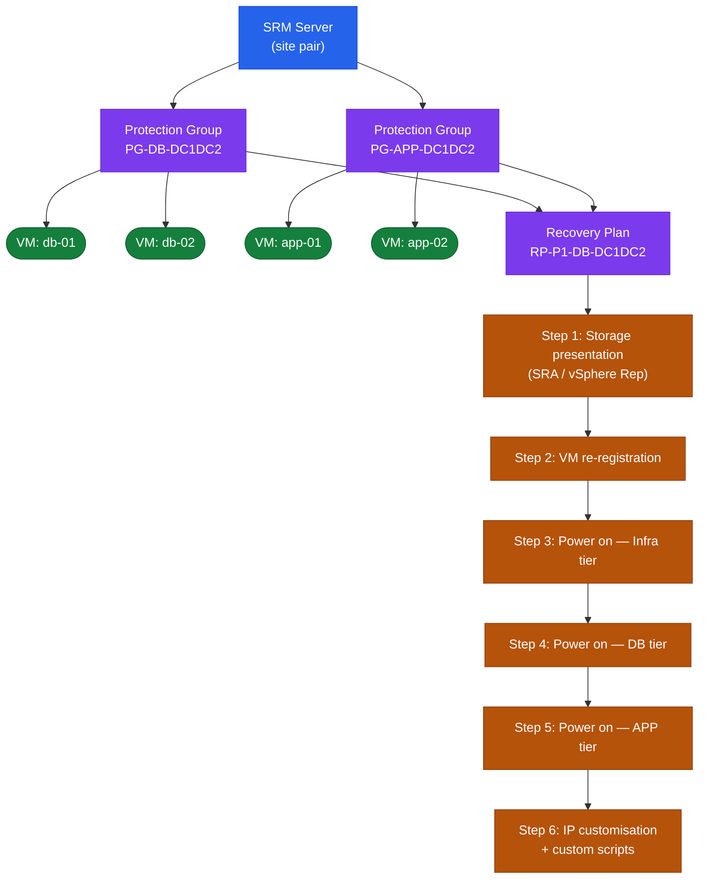

# SRM — CLI Reference


<div class="kb-summary">
CLI Reference reference covering SRM REST API — Recovery Plans, PowerCLI for SRM, Get Protected VM List, Get Recovery Plan History, Disconnect SRM Session.
</div>

  SRM CLI / API Access
```text
┌───────────────────────────────────── VMware SRM — CLI Reference ──────────────────────────────────────┐
│                                                                                                       │
│  SRM is managed primarily via the vSphere Client plugin; srm-util.exe and the SRM                     │
│  REST API provide CLI automation for plan management and testing.                                     │
│                                                                                                       │
│   ┌──────────────────────────────────────────────┐  ┌─────────────────────────────────────────────┐   │
│   │              srm-util Commands               │  │                 SRM REST API                │   │
│   │          srm-util srmcli list-plans          │  │             POST /api/rest/login            │   │
│   │          srm-util srmcli test-plan           │  │             GET /api/rest/plans             │   │
│   │           srm-util srmcli run-plan           │  │         POST /api/rest/plans/{}/run         │   │
│   │               srm-util showvms               │  │        GET /api/rest/plans/{}/status        │   │
│   └──────────────────────────────────────────────┘  └─────────────────────────────────────────────┘   │
│                                                                                                       │
│  srm-util.exe runs on SRM Server; REST API is accessible from any host on port 443.                   │
│                                                                                                       │
│                          ▼                                                 ▼                          │
│                                                                                                       │
│   ┌──────────────────────────────────────────────┐  ┌─────────────────────────────────────────────┐   │
│   │             PowerCLI SRM Module              │  │             Diagnostic Commands             │   │
│   │              Connect-SrmServer               │  │             Get-SrmRecoveryPlan             │   │
│   │            Get-SrmProtectionGroup            │  │               srm-util history              │   │
│   │            Start-SrmRecoveryPlan             │  │                srm-util plans               │   │
│   │           Get-SrmReplicationGroup            │  │            Check replication lag            │   │
│   └──────────────────────────────────────────────┘  └─────────────────────────────────────────────┘   │
│                                                                                                       │
│  Physical Infrastructure (the hardware everything above runs on):                                     │
│  srm-util.exe runs on Windows SRM Server; PowerCLI module connects from jump host;                    │
│  REST API on port 443 of SRM Server FQDN.                                                             │
│                                                                                                       │
│  Key terms:                                                                                           │
│                                                                                                       │
│  srm-util      = SRM command-line utility on the SRM Server VM                                        │
│  srmcli        = sub-command for recovery plan operations                                             │
│  list-plans    = show all configured recovery plans                                                   │
│  test-plan     = run plan in test mode (bubble network)                                               │
│  run-plan      = trigger actual failover (use with caution)                                           │
│  showvms       = list VMs in protection group with replication status                                 │
│  history       = show previous plan run results and timestamps                                        │
│  Connect-SrmServer= PowerCLI; authenticate to SRM                                                     │
│  Start-SrmRecoveryPlan= PowerCLI; trigger plan test or failover                                       │
│  GET /api/rest/plans= list all recovery plans via REST                                                │
│  POST /api/rest/plans/{}/run= trigger plan execution via REST                                         │
│  Replication lag= time delta between protected and recovery replica                                   │
│                                                                                                       │
└───────────────────────────────────────────────────────────────────────────────────────────────────────┘
```
```text
┌───────────────────────────────────── VMware SRM — CLI Reference ──────────────────────────────────────┐
│                                                                                                       │
│  SRM is managed primarily via the vSphere Client plugin; srm-util.exe and the SRM                     │
│  REST API provide CLI automation for plan management and testing.                                     │
│                                                                                                       │
│   ┌──────────────────────────────────────────────┐  ┌─────────────────────────────────────────────┐   │
│   │              srm-util Commands               │  │                 SRM REST API                │   │
│   │          srm-util srmcli list-plans          │  │             POST /api/rest/login            │   │
│   │          srm-util srmcli test-plan           │  │             GET /api/rest/plans             │   │
│   │           srm-util srmcli run-plan           │  │         POST /api/rest/plans/{}/run         │   │
│   │               srm-util showvms               │  │        GET /api/rest/plans/{}/status        │   │
│   └──────────────────────────────────────────────┘  └─────────────────────────────────────────────┘   │
│                                                                                                       │
│  srm-util.exe runs on SRM Server; REST API is accessible from any host on port 443.                   │
│                                                                                                       │
│                          ▼                                                 ▼                          │
│                                                                                                       │
│   ┌──────────────────────────────────────────────┐  ┌─────────────────────────────────────────────┐   │
│   │             PowerCLI SRM Module              │  │             Diagnostic Commands             │   │
│   │              Connect-SrmServer               │  │             Get-SrmRecoveryPlan             │   │
│   │            Get-SrmProtectionGroup            │  │               srm-util history              │   │
│   │            Start-SrmRecoveryPlan             │  │                srm-util plans               │   │
│   │           Get-SrmReplicationGroup            │  │            Check replication lag            │   │
│   └──────────────────────────────────────────────┘  └─────────────────────────────────────────────┘   │
│                                                                                                       │
│  Physical Infrastructure (the hardware everything above runs on):                                     │
│  srm-util.exe runs on Windows SRM Server; PowerCLI module connects from jump host;                    │
│  REST API on port 443 of SRM Server FQDN.                                                             │
│                                                                                                       │
│  Key terms:                                                                                           │
│                                                                                                       │
│  srm-util      = SRM command-line utility on the SRM Server VM                                        │
│  srmcli        = sub-command for recovery plan operations                                             │
│  list-plans    = show all configured recovery plans                                                   │
│  test-plan     = run plan in test mode (bubble network)                                               │
│  run-plan      = trigger actual failover (use with caution)                                           │
│  showvms       = list VMs in protection group with replication status                                 │
│  history       = show previous plan run results and timestamps                                        │
│  Connect-SrmServer= PowerCLI; authenticate to SRM                                                     │
│  Start-SrmRecoveryPlan= PowerCLI; trigger plan test or failover                                       │
│  GET /api/rest/plans= list all recovery plans via REST                                                │
│  POST /api/rest/plans/{}/run= trigger plan execution via REST                                         │
│  Replication lag= time delta between protected and recovery replica                                   │
│                                                                                                       │
└───────────────────────────────────────────────────────────────────────────────────────────────────────┘
```
```text
┌───────────────────────────────────── VMware SRM — CLI Reference ──────────────────────────────────────┐
│                                                                                                       │
│  SRM is managed primarily via the vSphere Client plugin; srm-util.exe and the SRM                     │
│  REST API provide CLI automation for plan management and testing.                                     │
│                                                                                                       │
│   ┌──────────────────────────────────────────────┐  ┌─────────────────────────────────────────────┐   │
│   │              srm-util Commands               │  │                 SRM REST API                │   │
│   │          srm-util srmcli list-plans          │  │             POST /api/rest/login            │   │
│   │          srm-util srmcli test-plan           │  │             GET /api/rest/plans             │   │
│   │           srm-util srmcli run-plan           │  │         POST /api/rest/plans/{}/run         │   │
│   │               srm-util showvms               │  │        GET /api/rest/plans/{}/status        │   │
│   └──────────────────────────────────────────────┘  └─────────────────────────────────────────────┘   │
│                                                                                                       │
│  srm-util.exe runs on SRM Server; REST API is accessible from any host on port 443.                   │
│                                                                                                       │
│                          ▼                                                 ▼                          │
│                                                                                                       │
│   ┌──────────────────────────────────────────────┐  ┌─────────────────────────────────────────────┐   │
│   │             PowerCLI SRM Module              │  │             Diagnostic Commands             │   │
│   │              Connect-SrmServer               │  │             Get-SrmRecoveryPlan             │   │
│   │            Get-SrmProtectionGroup            │  │               srm-util history              │   │
│   │            Start-SrmRecoveryPlan             │  │                srm-util plans               │   │
│   │           Get-SrmReplicationGroup            │  │            Check replication lag            │   │
│   └──────────────────────────────────────────────┘  └─────────────────────────────────────────────┘   │
│                                                                                                       │
│  Physical Infrastructure (the hardware everything above runs on):                                     │
│  srm-util.exe runs on Windows SRM Server; PowerCLI module connects from jump host;                    │
│  REST API on port 443 of SRM Server FQDN.                                                             │
│                                                                                                       │
│  Key terms:                                                                                           │
│                                                                                                       │
│  srm-util      = SRM command-line utility on the SRM Server VM                                        │
│  srmcli        = sub-command for recovery plan operations                                             │
│  list-plans    = show all configured recovery plans                                                   │
│  test-plan     = run plan in test mode (bubble network)                                               │
│  run-plan      = trigger actual failover (use with caution)                                           │
│  showvms       = list VMs in protection group with replication status                                 │
│  history       = show previous plan run results and timestamps                                        │
│  Connect-SrmServer= PowerCLI; authenticate to SRM                                                     │
│  Start-SrmRecoveryPlan= PowerCLI; trigger plan test or failover                                       │
│  GET /api/rest/plans= list all recovery plans via REST                                                │
│  POST /api/rest/plans/{}/run= trigger plan execution via REST                                         │
│  Replication lag= time delta between protected and recovery replica                                   │
│                                                                                                       │
└───────────────────────────────────────────────────────────────────────────────────────────────────────┘
```

---

## PowerCLI for SRM

```powershell
# Connect to vCenter (SRM operations run through vCenter)
Connect-VIServer -Server vcenter-protected.example.local
$srm = Connect-SrmServer -SrmServerAddress srm-protected.example.local `
  -Credential (Get-Credential)

# List all Recovery Plans
$plans = $srm.ExtensionData.Recovery.ListPlans()
$plans | Select-Object MoRef, Name

# Get Recovery Plan details
$plan = $plans | Where-Object { $_.Name -eq "SQL-DR-Plan" }
$planDetails = $srm.ExtensionData.Recovery.GetPlan($plan)

# Get Protection Groups
$pgs = $srm.ExtensionData.Protection.ListProtectionGroups()
$pgs | Select-Object MoRef, Name

# Get VMs in a Protection Group
$pg = $pgs | Where-Object { $_.Name -eq "SQL-PG" }
$pgInfo = $srm.ExtensionData.Protection.QueryReplicationState($pg)

# Run a test recovery
$planRef = $plan.MoRef
$srm.ExtensionData.Recovery.Start($planRef, "TEST")

# Monitor recovery task status
$history = $srm.ExtensionData.Recovery.GetHistory($planRef)
$history | Select-Object StartTime, EndTime, ResultState, Percent

# Clean up after test
$srm.ExtensionData.Recovery.Start($planRef, "CLEANUP")
```

---

## Get Protected VM List

```powershell
# List all protected VMs and their replication state
$pgs = $srm.ExtensionData.Protection.ListProtectionGroups()

foreach ($pg in $pgs) {
    $pgInfo = $srm.ExtensionData.Protection.ListProtectedVms($pg)
    foreach ($vm in $pgInfo) {
        [PSCustomObject]@{
            ProtectionGroup = $pg.Name
            VM              = $vm.Vm.Name
            State           = $vm.State
            ReplicationState = $vm.ReplicationState
        }
    }
} | Format-Table -AutoSize
```

---

## Get Recovery Plan History

```powershell
$plans = $srm.ExtensionData.Recovery.ListPlans()

foreach ($plan in $plans) {
    $history = $srm.ExtensionData.Recovery.GetHistory($plan)
    foreach ($h in $history) {
        [PSCustomObject]@{
            Plan        = $plan.Name
            StartTime   = $h.StartTime
            EndTime     = $h.EndTime
            Type        = $h.RecoveryType
            Result      = $h.ResultState
        }
    }
} | Sort-Object StartTime | Format-Table -AutoSize
```

---

## Disconnect SRM Session

```powershell
Disconnect-SrmServer -SrmServer $srm -Confirm:$false
Disconnect-VIServer -Server * -Confirm:$false
```

## SRM Object Hierarchy

Protection Groups, Recovery Plans, and the steps that execute during failover form a strict containment hierarchy.


```text
┌───────────────────────────────────────── SRM — CLI Reference ─────────────────────────────────────────┐
│                                                                                                       │
│   ┌───────────────────────────────────────────────────────────────────────────────────────────────┐   │
│   │                                    SRM — Command Reference                                    │   │
│   │           Use these commands for routine operations, scripting, and troubleshooting           │   │
│   │                                         srm-cli vm list                                       │   │
│   │                                       srm-cli recovery run                                    │   │
│   │                                        srm-cli plan test                                      │   │
│   │                                         srm-cli pg list                                       │   │
│   │                                         srm-cli history                                       │   │
│   └───────────────────────────────────────────────────────────────────────────────────────────────┘   │
│                                                                                                       │
│    Ports: 443 (SRM HTTPS) · 9086 (SRM-SRM pairing) · 443 (vCenter)                                    │
│                                                                                                       │
│   ┌───────────────────────────────────────────────────────────────────────────────────────────────┐   │
│   │                                       Command Categories                                      │   │
│   │                  Status / Query  — check current state, list jobs, show config                │   │
│   │                  Operations      — start, stop, failover, restore, sync, expire               │   │
│   │                Configuration   — add/modify policies, schedules, storage targets              │   │
│   │               Diagnostics     — collect logs, run health checks, test connectivity            │   │
│   │                  Scripting       — REST API or CLI for automation and reporting               │   │
│   └───────────────────────────────────────────────────────────────────────────────────────────────┘   │
│                                                                                                       │
│  Physical Infrastructure:                                                                             │
│  Two vCenter instances (protected + recovery) · SRA on SRM server · Array replication link            │
│  Key terms:                                                                                           │
│                                                                                                       │
│  SRM           = Site Recovery Manager; VMware product for DR orchestration and testing               │
│  SRA           = Storage Replication Adapter; plugin linking SRM to specific array replication        │
│  Protection Group= logical grouping of VMs covered by a single replication consistency group          │
│  Recovery Plan = automated DR runbook: power-off order, datastore failover, IP customization          │
│  IP Customization= per-VM network settings applied at recovery site (different subnet/gateway)        │
│  Test Failover = non-disruptive plan validation using snapshot; production unaffected                 │
│  Planned Migration= graceful workload movement; VMs shutdown at protected, started at recovery        │
│  Emergency Failover= disaster scenario; VMs powered on from latest available replica                  │
│  Failback      = after recovery, re-protect VMs and migrate back to production site                   │
│  Re-protect    = reverses replication direction; DR site becomes new protected site                   │
│  Recovery Point= specific replication snapshot used for VM recovery; RPO = interval                   │
│  vCenter Pair  = SRM connection between two vCenter instances enables cross-site orchestration        │
│  Startup Priority= ordering within recovery plan; lower number = powers on first                      │
│  Site Pair     = trust relationship between protected and recovery SRM servers                        │
│                                                                                                       │
└───────────────────────────────────────────────────────────────────────────────────────────────────────┘
```

---


## Test Failover

Test failover runs in an isolated network bubble and does not affect production. Always run a test before a real recovery.

```powershell
# Start a test failover
$plan = Get-SRMRecoveryPlan -Name <plan_name>
$plan.RecoveryPlanService.Start($plan.MoRef, (New-Object VMware.VimAutomation.Srm.Types.V1.RecoveryPlanRecoveryMode))

# Check test status
Get-SRMRecoveryPlan -Name <plan_name> | Select State, ActiveHistoryTask

# Clean up (remove test snapshot, restore network)
$plan.RecoveryPlanService.Cancel($plan.MoRef)
```

---


## Recovery (Planned Migration / Failover)

Real recovery — run only during a DR event or planned migration.

```powershell
# Execute planned migration (graceful, bidirectional)
Start-SRMRecoveryPlan -RecoveryPlan (Get-SRMRecoveryPlan -Name <plan_name>) -RecoveryMode Planned

# Execute emergency failover (one-way, no replication cleanup)
Start-SRMRecoveryPlan -RecoveryPlan (Get-SRMRecoveryPlan -Name <plan_name>) -RecoveryMode Failover

# Stop an in-progress plan
Stop-SRMRecoveryPlan -RecoveryPlan (Get-SRMRecoveryPlan -Name <plan_name>)
```

---


## REST API

SRM 8.3+ exposes a REST API at `https://<srm_fqdn>/api`.

```bash
# Authenticate
curl -k -X POST https://<srm_fqdn>/api/sessions   -H "Content-Type: application/json"   -d '{"username":"administrator@vsphere.local","password":"<pass>"}'

# List protection groups
curl -k -X GET https://<srm_fqdn>/api/groups   -H "Authorization: <token>"

# List recovery plans
curl -k -X GET https://<srm_fqdn>/api/plans   -H "Authorization: <token>"

# Trigger test failover
curl -k -X POST "https://<srm_fqdn>/api/plans/<plan_id>/actions/test"   -H "Authorization: <token>"
```
