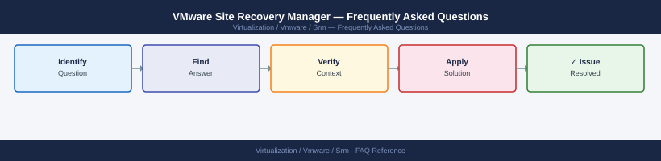

---
tags:
  - srm
  - faq
  - operations
---
# VMware Site Recovery Manager — Frequently Asked Questions

Common questions about VMware Site Recovery Manager operations, configuration, and troubleshooting. For step-by-step procedures, see the <a href="index.md">Operations</a> section.

## General

**Q: What SRM version is recommended?**
A: SRM 8.8.x is the current recommendation. Check: SRM UI → Help → About. SRM version must be compatible with the paired vCenter versions. Check the VMware Product Interoperability Matrix.

**Q: How do I check the current VMware Site Recovery Manager version?**
A: `SRM UI → Help → About`

## Configuration

**Q: What are the protection group types and when to use each?**
A: Two types: vSphere Replication (RPO: 5 minutes to 24 hours, no shared storage needed) and Array-Based Replication (RPO depends on array, requires supported storage array). Use array-based for zero or near-zero RPO; vSphere Replication for cost-effective DR.

**Q: How do I enable IP customisation rules for network reconfiguration during failover?**
A: In SRM, go to Recovery Plans → select plan → IP Customization Rules. Map source-site IP ranges to recovery-site ranges. SRM applies these rules automatically during failover to update guest IP addresses using VMware Tools.

## Operations

**Q: How do I upgrade SRM without breaking existing protection groups?**
A: Upgrade the recovery site SRM first, then the protected site. Protection groups and recovery plans persist through upgrades. After upgrade, verify all protection groups show 'OK' status in SRM UI.

**Q: What is the correct procedure to add a new VM to an SRM protection group?**
A: In SRM → Protection Groups → select group → VMs → Add VMs. Select the VM. SRM begins replication (vSphere Replication) or verifies array replication is active. Run a test failover after adding the VM to validate.

## Troubleshooting

**Q: SRM shows 'RPO Violation' for a protected VM. What does it mean?**
A: Replication has fallen behind the configured RPO target. For vSphere Replication: check network bandwidth between sites. For array-based: check array replication status. Resolve the underlying replication issue before the next planned or test failover.

**Q: SRM test failover is taking longer than expected — where do I start?**
A: Review recovery plan step timing in the SRM recovery history. Long times are usually due to: VM power-on ordering, IP customisation scripts, or storage snapshot presentation. Optimise recovery plan step sequencing.

## Backup and Recovery

**Q: How often should I test SRM recovery plans?**
A: Test failover quarterly minimum. Use SRM's 'Test' mode — it creates isolated snapshots and does not affect production. Document test results and resolve any errors before the next test. Full planned failover test annually.

**Q: What is the difference between Test Failover, Planned Failover, and Disaster Recovery failover in SRM?**
A: Test: isolated test (production unaffected). Planned Failover: orderly migration to recovery site (both sites available). Disaster Recovery: emergency failover when protected site is unavailable. Only DR failover is one-way without automatic failback.

## See Also

- [VMware Site Recovery Manager Operations](index.md)
- [VMware Site Recovery Manager Troubleshooting](../troubleshooting/index.md)
