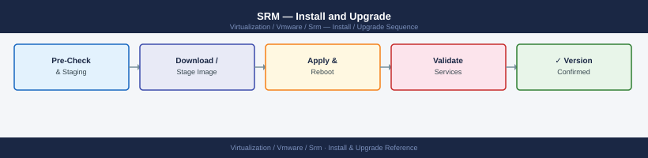

---
tags:
  - operations
  - srm
  - vmware
---
# SRM — Install and Upgrade

<div class="kb-summary">
Install and Upgrade reference covering vSphere Replication Appliance Deployment, SRA Installation, Site Pairing, Upgrade Order, Post-Install Verification.

*Applies to: SRM 8.x / 9.x*
</div>


  SRM Upgrade Sequence (strictly ordered)

Pair VRA appliances:
```text
vCenter (Protected) → Site Recovery → New Site Pair
  Remote vCenter: vcenter-recovery.example.local
  Remote VRA: vra-recovery.example.local
  Accept certificate thumbprint
```

---

## Before you begin

- **Access:** vCenter read-only minimum; Administrator role for remediation steps
- **Timing:** safe to run during business hours unless a step is marked ⚠ (causes interruption)
- **Dependencies:** no active upgrades or migrations on the same infrastructure
- **Logging:** capture command output — paste into the change record on completion

---

!!! warning "Host enters maintenance mode"
    ESXi remediation puts hosts into maintenance mode, triggering DRS evacuation. Confirm DRS is Fully Automated and HA admission control is satisfied before starting.

## SRA Installation

Storage Replication Adapters (SRAs) are provided by storage array vendors:

```powershell
# Example: Pure Storage SRA
# Download from: support.purestorage.com → Downloads → SRA for SRM
# Copy installer to SRM Server

# Install SRA on BOTH SRM Servers (protected AND recovery):
Pure_Storage_SRA_<version>.exe /silent

# After install, register SRA in SRM:
# Site Recovery → Storage → Storage Adapters → Configure Adapter
# Select: Pure Storage FlashArray
# Credentials: FlashArray management IP + API token
```

---

## Site Pairing

After SRM is installed on both sites and VRA/SRA is deployed:

```text
vCenter (Protected Site) → Site Recovery → New Site Pair
  Remote vCenter: vcenter-recovery.example.local
  Site Recovery Manager: srm-recovery.example.local
  Credentials: administrator@vsphere.local on remote vCenter
  Accept certificate thumbprints from both SRM servers
```

After pairing, configure inventory mappings:
```text
Site Recovery → Site Pair → Configure → Inventory Mappings
  Network mappings: protected networks → recovery networks
  Resource mappings: protected cluster/RP → recovery cluster/RP
  Folder mappings: protected VM folders → recovery VM folders
  Storage policy mappings (if applicable)
```

---

## Upgrade Order

Strict order — do not deviate:

1. **vCenter** — upgrade both sites' vCenters first
2. **SRM Server** — upgrade protected site first, then recovery site
   - After each upgrade, verify site pairing is still healthy before proceeding
3. **SRA** — upgrade on both SRM Servers (check vendor release notes for SRA/SRM compat)
4. **vSphere Replication Appliance** — upgrade both VRAs (upgrade protected site VRA first)

```powershell
# Take a snapshot of SRM Server VM before upgrade
New-Snapshot -VM "srm-protected" -Name "Pre-Upgrade-SRM-8.x" -Memory $false

# Run new SRM installer (in-place upgrade)
VMware-srm-<new-version>.exe /silent

# Verify service after upgrade:
Get-Service "VMware vCenter Site Recovery Manager"

# Check site pairing health:
# vCenter → Site Recovery → Summary → both sites Connected
```

---

## Post-Install Verification

```powershell
# Connect to SRM via PowerCLI
$srm = Connect-SrmServer -SrmServerAddress srm-protected.example.local
$plans = $srm.ExtensionData.Recovery.ListPlans()
Write-Host "Recovery Plans found: $($plans.Count)"

# Run a pre-check on each Recovery Plan
foreach ($plan in $plans) {
    $srm.ExtensionData.Recovery.Start($plan.MoRef, "PRECHECK_ONLY")
}
```

## Version Compatibility

SRM version must match vCenter version. Always check the Broadcom Product Interoperability Matrix before any upgrade.

| SRM Version | vCenter Version | vSphere Replication | Notes |
|---|---|---|---|
| SRM 8.8 | vCenter 8.0 U3 | VR 8.8 | Current |
| SRM 8.7 | vCenter 8.0 U2 | VR 8.7 | Supported |
| SRM 8.6 | vCenter 8.0 U1 | VR 8.6 | Check EOS |
| SRM 8.4 | vCenter 7.0 U3 | VR 8.4 | vSphere 7 era |

## Upgrade Sequence

### Upgrade Order Dependency Chain

```d2
direction: right

start: "Start upgrade\nmaintenance window" {shape: oval}
vc: "1. Upgrade vCenter\nboth protected + recovery sites" {shape: rectangle}
srmCheck: "Plugins load\ncorrectly?" {shape: rectangle}
fixVC: "Fix vCenter issues\nbefore proceeding" {shape: rectangle}
srmUpgrade: "2. Upgrade SRM Server\nprotected site first, then recovery" {shape: rectangle}
vrUpgrade: "3. Upgrade vSphere\nReplication Appliance\n(VAMI upgrade" {shape: rectangle}
sraUpdate: "4. Update SRA plugins\n(Dell, Pure, NetApp" {shape: rectangle}
validate: "5. Validate — all PGs show OK\nall VMs show Protected" {shape: rectangle}
done: "Upgrade complete" {shape: rectangle}

start -> vc
vc -> srmCheck
srmCheck -> fixVC
fixVC -> srmCheck
srmCheck -> srmUpgrade
srmUpgrade -> vrUpgrade
vrUpgrade -> sraUpdate
sraUpdate -> validate
validate -> done
```

---

## See also

- [SRM — Health Checks](../health-checks/)
- [VMware SRM — Common Issues](../../troubleshooting/common-issues/)
- [SRM — Procedures](../procedures/)

## Verify

- **Alarms:** vSphere Client → Home → Alarms — no new critical alarms after the operation
- **Events:** monitor the vCenter Events view for the affected object for 5 minutes
- **Health check:** run the morning health-check sequence for the affected product tier
