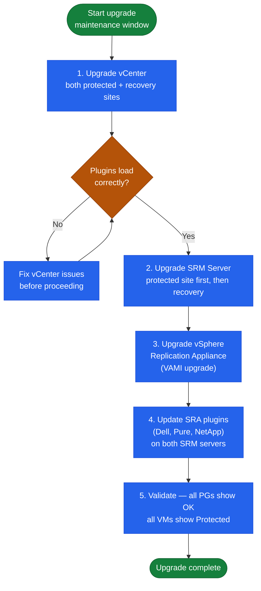

---
tags:
  - operations
  - srm
  - vmware
---
# SRM — Install and Upgrade


<div class="kb-summary">
Install and Upgrade reference covering vSphere Replication Appliance Deployment, SRA Installation, Site Pairing, Upgrade Order, Post-Install Verification.
</div>

  SRM Upgrade Sequence (strictly ordered)
```text
┌─────────────────────────────────── VMware SRM — Install & Upgrade ────────────────────────────────────┐
│                                                                                                       │
│  SRM is installed on Windows Server VMs with SQL Server; both sites must have                         │
│  compatible versions before pairing; upgrade both sites together.                                     │
│                                                                                                       │
│   ┌──────────────────────────────────────────────┐  ┌─────────────────────────────────────────────┐   │
│   │           Pre-Install Requirements           │  │                Install Steps                │   │
│   │           Windows Server 2019/2022           │  │           Install SQL Server first          │   │
│   │          SQL Server: 2016/2019/2022          │  │              Install SRM Server             │   │
│   │        vCenter registered: both sites        │  │            Register with vCenter            │   │
│   │          Certs: valid on both sites          │  │           Pair the two SRM Servers          │   │
│   └──────────────────────────────────────────────┘  └─────────────────────────────────────────────┘   │
│                                                                                                       │
│  Both sites must be installed and registered with vCenter before pairing.                             │
│                                                                                                       │
│                          ▼                                                 ▼                          │
│                                                                                                       │
│   ┌──────────────────────────────────────────────┐  ┌─────────────────────────────────────────────┐   │
│   │              Upgrade Procedure               │  │              Post-Upgrade Steps             │   │
│   │         Snapshot SRM VMs both sites          │  │         Verify site pair: Connected         │   │
│   │         Upgrade protected site first         │  │           Check replication status          │   │
│   │          Upgrade recovery site next          │  │            Test one recovery plan           │   │
│   │          Upgrade SRA if applicable           │  │               Delete snapshots              │   │
│   └──────────────────────────────────────────────┘  └─────────────────────────────────────────────┘   │
│                                                                                                       │
│  Physical Infrastructure (the hardware everything above runs on):                                     │
│  SRM Server VMs need 4 vCPU / 16GB RAM; SQL Server needs 8 vCPU / 32GB RAM;                           │
│  SQL can be local or remote; dedicated SQL recommended for large deployments.                         │
│                                                                                                       │
│  Key terms:                                                                                           │
│                                                                                                       │
│  SRM Server    = Windows VM; hosts SRM application and vSphere Client plugin                          │
│  SQL Server    = SRM configuration database; must be 2016 or newer                                    │
│  vCenter registration= SRM registered as extension in vCenter                                         │
│  Site pair     = bidirectional trust; established after both sides installed                          │
│  SRA           = Storage Replication Adapter; upgrade matches SRM version                             │
│  Protected site= upgrade first; recovery site must match version                                      │
│  Version match = both SRM Servers must be same version to pair                                        │
│  Snapshot      = pre-upgrade safety net; remove after success                                         │
│  SQL AlwaysOn  = SQL HA; SRM DB fails over automatically                                              │
│  vCenter plugin= SRM UI embedded in vSphere Client; updates with SRM                                  │
│  Local SQL     = SQL on same VM; small deployments; simpler backup                                    │
│  Remote SQL    = dedicated SQL Server; supports AlwaysOn HA                                           │
│                                                                                                       │
└───────────────────────────────────────────────────────────────────────────────────────────────────────┘
```
Pair VRA appliances:
```text
vCenter (Protected) → Site Recovery → New Site Pair
  Remote vCenter: vcenter-recovery.example.local
  Remote VRA: vra-recovery.example.local
  Accept certificate thumbprint
```

---

## SRA Installation

Storage Replication Adapters (SRAs) are provided by storage array vendors:

```powershell
# Example: Pure Storage SRA
# Download from: support.purestorage.com → Downloads → SRA for SRM
# Copy installer to SRM Server

# Install SRA on BOTH SRM Servers (protected AND recovery):
Pure_Storage_SRA_<version>.exe /silent

# After install, register SRA in SRM:
# Site Recovery → Storage → Storage Adapters → Configure Adapter
# Select: Pure Storage FlashArray
# Credentials: FlashArray management IP + API token
```

---

## Site Pairing

After SRM is installed on both sites and VRA/SRA is deployed:

```text
vCenter (Protected Site) → Site Recovery → New Site Pair
  Remote vCenter: vcenter-recovery.example.local
  Site Recovery Manager: srm-recovery.example.local
  Credentials: administrator@vsphere.local on remote vCenter
  Accept certificate thumbprints from both SRM servers
```

After pairing, configure inventory mappings:
```text
Site Recovery → Site Pair → Configure → Inventory Mappings
  Network mappings: protected networks → recovery networks
  Resource mappings: protected cluster/RP → recovery cluster/RP
  Folder mappings: protected VM folders → recovery VM folders
  Storage policy mappings (if applicable)
```

---

## Upgrade Order

Strict order — do not deviate:

1. **vCenter** — upgrade both sites' vCenters first
2. **SRM Server** — upgrade protected site first, then recovery site
   - After each upgrade, verify site pairing is still healthy before proceeding
3. **SRA** — upgrade on both SRM Servers (check vendor release notes for SRA/SRM compat)
4. **vSphere Replication Appliance** — upgrade both VRAs (upgrade protected site VRA first)

```powershell
# Take a snapshot of SRM Server VM before upgrade
New-Snapshot -VM "srm-protected" -Name "Pre-Upgrade-SRM-8.x" -Memory $false

# Run new SRM installer (in-place upgrade)
VMware-srm-<new-version>.exe /silent

# Verify service after upgrade:
Get-Service "VMware vCenter Site Recovery Manager"

# Check site pairing health:
# vCenter → Site Recovery → Summary → both sites Connected
```

---

## Post-Install Verification

```powershell
# Connect to SRM via PowerCLI
$srm = Connect-SrmServer -SrmServerAddress srm-protected.example.local
$plans = $srm.ExtensionData.Recovery.ListPlans()
Write-Host "Recovery Plans found: $($plans.Count)"

# Run a pre-check on each Recovery Plan
foreach ($plan in $plans) {
    $srm.ExtensionData.Recovery.Start($plan.MoRef, "PRECHECK_ONLY")
}
```

## Version Compatibility

SRM version must match vCenter version. Always check the Broadcom Product Interoperability Matrix before any upgrade.

| SRM Version | vCenter Version | vSphere Replication | Notes |
|---|---|---|---|
| SRM 8.8 | vCenter 8.0 U3 | VR 8.8 | Current |
| SRM 8.7 | vCenter 8.0 U2 | VR 8.7 | Supported |
| SRM 8.6 | vCenter 8.0 U1 | VR 8.6 | Check EOS |
| SRM 8.4 | vCenter 7.0 U3 | VR 8.4 | vSphere 7 era |


## Upgrade Sequence

### Upgrade Order Dependency Chain


```text
┌─────────────────────────────────────── SRM — Install & Upgrade ───────────────────────────────────────┐
│                                                                                                       │
│   ┌───────────────────────────────────────────────────────────────────────────────────────────────┐   │
│   │                                SRM — Installation Prerequisites                               │   │
│   │             OS: supported Linux or Windows Server (see vendor compatibility matrix)           │   │
│   │         Network: 443 (SRM HTTPS) · 9086 (SRM-SRM pairing) — ensure firewall allows these      │   │
│   │      Auth: vCenter SSO / AD integration; SRM admin role; site-pairing certificate exchange    │   │
│   │  Storage: Two vCenter instances (protected + recovery) · SRA on SRM server · Array replication│   │
│   └───────────────────────────────────────────────────────────────────────────────────────────────┘   │
│                                                                                                       │
│                                                   ▼                                                   │
│                                                                                                       │
│   ┌───────────────────────────────────────────────────────────────────────────────────────────────┐   │
│   │                                        Install Sequence                                       │   │
│   │                  1  Deploy control plane component and configure network access               │   │
│   │                          2  Configure storage and network connectivity                        │   │
│   │                        3  Install agent/proxy/splitter on protected hosts                     │   │
│   │                      4  Register sources and configure protection policies                    │   │
│   │                        5  Run first job; verify completion; test restore                      │   │
│   └───────────────────────────────────────────────────────────────────────────────────────────────┘   │
│                                                                                                       │
│   ┌───────────────────────────────────────────────────────────────────────────────────────────────┐   │
│   │                                        Upgrade Sequence                                       │   │
│   │                 1  Review release notes and compatibility matrix before upgrade               │   │
│   │                   2  Snapshot or backup the control plane VM before upgrading                 │   │
│   │                  3  Upgrade control plane first, then proxies/agents/appliances               │   │
│   │                       4  Validate jobs resume automatically after upgrade                     │   │
│   │                        5  Document version change and update CMDB record                      │   │
│   └───────────────────────────────────────────────────────────────────────────────────────────────┘   │
│                                                                                                       │
│  Physical Infrastructure:                                                                             │
│  Two vCenter instances (protected + recovery) · SRA on SRM server · Array replication link            │
│  Key terms:                                                                                           │
│                                                                                                       │
│  SRM           = Site Recovery Manager; VMware product for DR orchestration and testing               │
│  SRA           = Storage Replication Adapter; plugin linking SRM to specific array replication        │
│  Protection Group= logical grouping of VMs covered by a single replication consistency group          │
│  Recovery Plan = automated DR runbook: power-off order, datastore failover, IP customization          │
│  IP Customization= per-VM network settings applied at recovery site (different subnet/gateway)        │
│  Test Failover = non-disruptive plan validation using snapshot; production unaffected                 │
│  Planned Migration= graceful workload movement; VMs shutdown at protected, started at recovery        │
│  Emergency Failover= disaster scenario; VMs powered on from latest available replica                  │
│  Failback      = after recovery, re-protect VMs and migrate back to production site                   │
│  Re-protect    = reverses replication direction; DR site becomes new protected site                   │
│  Recovery Point= specific replication snapshot used for VM recovery; RPO = interval                   │
│  vCenter Pair  = SRM connection between two vCenter instances enables cross-site orchestration        │
│  Startup Priority= ordering within recovery plan; lower number = powers on first                      │
│  Site Pair     = trust relationship between protected and recovery SRM servers                        │
│                                                                                                       │
└───────────────────────────────────────────────────────────────────────────────────────────────────────┘
```
