---
tags:
  - operations
  - srm
  - vmware
---
# SRM — Procedures

<div class="kb-summary">
Site Recovery Manager procedures — planned migration, emergency failover, reprotect, failback, quarterly DR drills, protection groups, recovery plans, network/resource mapping updates, SRM upgrade, and VM lifecycle management.

*Applies to: SRM 8.x / 9.x*
</div>

```text
Procedures ───────────────────────────────────────────┐
│                                                                                                       │
│   ┌──────────────────────────────────────────────┐  ┌─────────────────────────────────────────────┐   │
│   │              Routine Procedures              │  │                DR Procedures                │   │
│   │          Add new protection source           │  │              Initiate failover              │   │
│   │           Modify retention policy            │  │               Validate replica              │   │
│   │          Expire old recover points           │  │              Redirect host I/O              │   │
│   │             Add storage capacity             │  │         Test failover (non-disrupt)         │   │
│   │           Service account rotation           │  │            Failback to production           │   │
│   └──────────────────────────────────────────────┘  └─────────────────────────────────────────────┘   │
│                                                                                                       │
│   ┌───────────────────────────────────────────────────────────────────────────────────────────────┐   │
│   │                              Change Control Requirements for SRM                              │   │
│   │           All changes to protection policies require change ticket with rollback plan         │   │
│   │                      Failover tests must be scheduled in maintenance window                   │   │
│   │              Firmware/software upgrades need 48 h pre-approval and backup snapshot            │   │
│   │                  Post-change: verify jobs run successfully for 2 backup cycles                │   │
│   └───────────────────────────────────────────────────────────────────────────────────────────────┘   │
│                                                                                                       │
│  Physical Infrastructure:                                                                             │
│  Two vCenter instances (protected + recovery) · SRA on SRM server · Array replication link            │
│  Key terms:                                                                                           │
│                                                                                                       │
│  SRM           = Site Recovery Manager; VMware product for DR orchestration and testing               │
│  SRA           = Storage Replication Adapter; plugin linking SRM to specific array replication        │
│  Protection Group= logical grouping of VMs covered by a single replication consistency group          │
│  Recovery Plan = automated DR runbook: power-off order, datastore failover, IP customization          │
│  IP Customization= per-VM network settings applied at recovery site (different subnet/gateway)        │
│  Test Failover = non-disruptive plan validation using snapshot; production unaffected                 │
│  Planned Migration= graceful workload movement; VMs shutdown at protected, started at recovery        │
│  Emergency Failover= disaster scenario; VMs powered on from latest available replica                  │
│  Failback      = after recovery, re-protect VMs and migrate back to production site                   │
│  Re-protect    = reverses replication direction; DR site becomes new protected site                   │
│  Recovery Point= specific replication snapshot used for VM recovery; RPO = interval                   │
│  vCenter Pair  = SRM connection between two vCenter instances enables cross-site orchestration        │
│  Startup Priority= ordering within recovery plan; lower number = powers on first                      │
│  Site Pair     = trust relationship between protected and recovery SRM servers                        │
│                                                                                                       │
└───────────────────────────────────────────────────────────────────────────────────────────────────────┘
```

## Before you begin

- **Access:** vCenter read-only minimum; Administrator role for remediation steps
- **Timing:** safe to run during business hours unless a step is marked ⚠ (causes interruption)
- **Dependencies:** no active upgrades or migrations on the same infrastructure
- **Logging:** capture command output — paste into the change record on completion

---

## Planned Migration

A planned migration gracefully shuts down VMs at the protected site, performs a final replication sync, then powers them on at the recovery site. Both sites must be operational.

### Pre-Migration Checklist

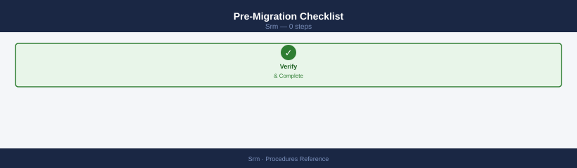

- [ ] Both sites and SRM servers are reachable and healthy
- [ ] Replication is healthy with zero or acceptable backlog (RPO at target)
- [ ] Recovery plan has been tested successfully within the last quarter
- [ ] Change record approved; maintenance window scheduled
- [ ] Application owners notified; application shutdown pre-steps completed if required
- [ ] DNS/load balancer changes prepared (or scripted in recovery plan)

### Planned Migration Procedure

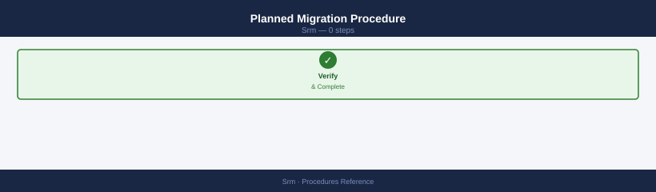

1. Navigate to **Recovery Plans** > select plan > **Run** > **Planned Migration**.
2. SRM confirms both sites are connected — if the protected site is unreachable, it refuses to run Planned Migration (use Emergency Failover instead).
3. SRM executes pre-power-off scripts (if configured).
4. SRM quiesces and powers off protected-site VMs in reverse boot order (web → app → DB → infra).
5. A final replication sync is triggered and completed — ensuring zero data loss.
6. SRM presents replica datastores at the recovery site.
7. VMs are registered and powered on at the recovery site in the defined boot sequence.
8. Post-power-on scripts execute (DNS updates, load balancer re-point, etc.).
9. Validate services, then close the change record.

!!! warning "No Rollback After Planned Migration"
    Once VMs are powered on at the recovery site, the original protected site is unpowered. To return to the original site, run **Reprotect** followed by a reverse failover.

---

```text
## Emergency Failover (Disaster Recovery)

Used when the protected site is unavailable. VMs are powered on from the most recent replica image. Some data loss is expected depending on RPO at the time of failure.

### Emergency Failover Procedure

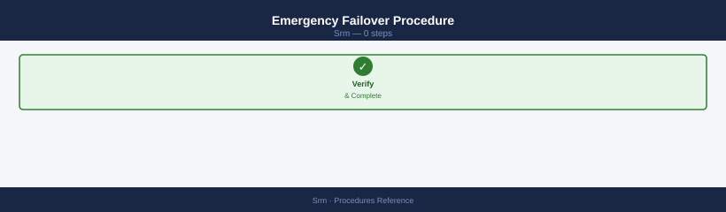

1. Declare disaster and invoke the DR change record.
2. Navigate to **Recovery Plans** > select plan > **Run** > **Disaster Recovery**.
3. SRM will warn that the protected site is not reachable and that data loss may occur — confirm.
4. SRM presents the last-good replica datastores at the recovery site.
5. VMs are registered and powered on in the defined boot sequence.
6. No pre-power-off or final sync steps are performed (protected site is down).
7. Post-power-on scripts execute.
8. Validate services and notify stakeholders.
9. Document the actual RPO: check the replication lag or journal timestamp at the time of failure.

```
```bash
# After failover, check SRDF or RecoverPoint state for data loss assessment
# PowerMax SRDF example
symrdf -sid <SYMID> -rdfg <RDFG> query

# RecoverPoint — check journal recovery point timestamp
boxmgmt cg check_all
```

---

## Reprotect

After any failover (planned or emergency), the recovered VMs are now running at the recovery site without replication. Reprotect reverses the replication direction so the recovery site becomes the new protected site.

### Reprotect Procedure

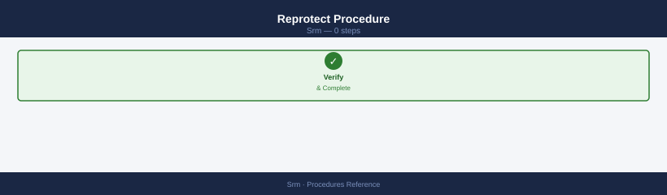

1. Ensure the original protected site infrastructure (storage, network, vCenter) is restored and reachable.
2. Navigate to **Recovery Plans** > select plan > **Reprotect**.
3. SRM coordinates with the SRA or vSphere Replication to establish reverse replication:
   - For SRDF: SRDF pairs are re-established with the original R2 becoming R1.
   - For vSphere Replication: new replication sessions are created from recovery site back to original site.
   - For RecoverPoint: replication direction is reversed via the RecoverPoint API.
4. Initial sync (full or delta) from recovery site back to original site begins.
5. Monitor sync progress in vSphere Replication or the array management UI.
6. Once sync completes and RPO is at target, the environment is ready for failback.

!!! note "Reprotect Does Not Move VMs"
    Reprotect only reverses replication — VMs continue running at the recovery site. The original site datastores now receive replicated writes from the recovery site.

---

## Failback

Failback returns VMs to the original protected site. Mechanically, it is a planned migration in the reverse direction, using the reprotected recovery plan.

### Failback Procedure

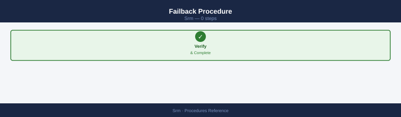

1. Confirm replication from recovery site → original site is healthy and RPO is at target.
2. Navigate to **Recovery Plans** > select the **reverse/failback recovery plan** (SRM creates this automatically during Reprotect, or you create a new plan in the reverse direction).
3. Run as **Planned Migration**.
4. VMs are quiesced at the recovery site, a final sync is performed to the original site, and VMs are powered on at the original site.
5. After failback, run **Reprotect** again to restore the original replication direction (original site → recovery site).
6. Validate the environment; close the DR incident record.

### Failback Go/No-Go Criteria

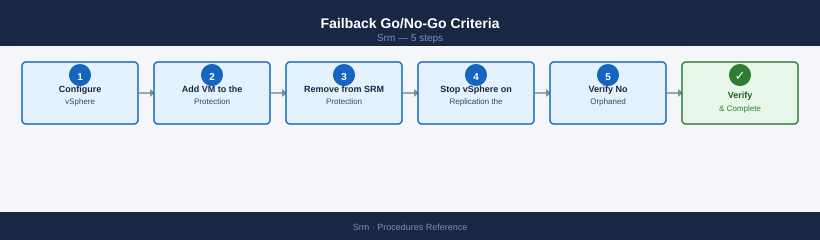

| Criteria | Required State |
|---|---|
| Original site vCenter reachable | Yes |
| Original site storage presenting correctly to hosts | Yes |
| Reverse replication RPO at target | Yes — zero or within tier RPO |
| Application owner sign-off on recovery-site validation | Yes |
| Change record approved for failback window | Yes |

---

## SRM Alarms and Monitoring

SRM generates vCenter alarms for key events. Monitor these in the vCenter Alarms view or your external monitoring system.

| Alarm | Trigger | Action |
|---|---|---|
| Protection group error | One or more VMs in error state | Check vSphere Replication or SRA; resolve replication issue |
| Recovery plan cannot be tested | Validation failure (mapping issue, etc.) | Run recovery plan validation; fix errors listed |
| RPO violation | Replication lag exceeds RPO target | Check WAN bandwidth; check storage performance; resolve blocking errors |
| SRM server unreachable | SRM service down or certificate issue | Restart SRM service; check certificate expiry |
| Array manager communication failure | SRA cannot reach array | Check SRA service; verify array credentials and network |

```powershell
# Check SRM service status on Windows SRM server
Get-Service -Name vmware-dr

# Restart SRM service if needed
Restart-Service -Name vmware-dr

# Review SRM logs
# Default log path: C:\ProgramData\VMware\VMware vCenter Site Recovery Manager\Logs\
Get-Content "C:\ProgramData\VMware\VMware vCenter Site Recovery Manager\Logs\vmware-dr.log" -Tail 100
```

---

## Quarterly DR Drill Process

| Step | Owner | Timing |
|---|---|---|
| Schedule maintenance window | Change Manager | T-4 weeks |
| Notify application owners | Infra Lead | T-2 weeks |
| Pre-test validation (run SRM validation wizard) | SRM Admin | T-1 day |
| Execute test failover | SRM Admin | During window |
| Application validation | App owners | During window |
| Record RTO achieved vs. target | SRM Admin | During window |
| Cleanup test environment | SRM Admin | End of window |
| Produce test report (RTO, issues, actions) | SRM Admin | T+2 days |
| Update action items in JIRA/ticketing | Infra Lead | T+5 days |

---

## Update Network and Resource Mappings

Network and resource mappings must be kept current when protected-site or recovery-site infrastructure changes.

1. In SRM, navigate to **Site Recovery → Configure → Network Mappings**
2. Click **Edit** on any mapping that requires updating — remap source port groups to the correct recovery-site port groups
3. Navigate to **Site Recovery → Configure → Resource Mappings**
4. Update cluster and resource pool assignments to reflect any changes to recovery-site compute infrastructure
5. Run the SRM recovery plan **Validate** wizard to confirm all mappings resolve correctly and no VMs report mapping errors
6. Resolve any validation warnings before the next scheduled DR test or production use

---

## Upgrade SRM Appliance (8.x+)

SRM 8.x ships as an appliance (OVA/VAMI managed). Follow this procedure for patch and minor version upgrades.

1. Download the new SRM OVA or upgrade ISO from the VMware Customer Connect portal — verify the SHA-256 checksum
2. Log in to the SRM appliance management UI at `https://<srm-appliance-ip>:5480`
3. Navigate to **Appliance Management → Upgrade**
4. Provide the path to the downloaded OVA or upgrade package
5. Click **Run Precheck** — resolve any pre-upgrade warnings (certificate validity, disk space, vCenter connectivity) before proceeding
6. Click **Upgrade** and monitor progress in the VAMI UI — the SRM services will restart during the upgrade
7. After the upgrade completes, log back in to vCenter and confirm the SRM site pair reconnects and shows both protected and recovery sites as **Connected**
8. Run a recovery plan validation to confirm all protection groups and recovery plans are intact post-upgrade

---

## Create a Protection Group

A protection group is a logical collection of VMs that are replicated and failed over together. This procedure covers creating a vSphere Replication-based protection group.

1. In vCenter, navigate to **Site Recovery → Protection Groups → New Protection Group**.
2. Enter a name and select the **Site Pair** (protected site → recovery site).
3. Select **Protection group type: vSphere Replication** (choose "Array Based Replication" if using SRA-managed replication).
4. Select the VMs to include — only VMs with an active vSphere Replication session are listed. If a VM is not shown, configure replication on the VM first before adding it to the group.
5. Set the **RPO** target (5 minutes to 24 hours) — this is the maximum acceptable data loss window for the group.
6. Click **Next**, review the summary, then click **Finish**.
7. Monitor the protection group status — it should transition to **OK** within one replication cycle.
8. If any VM shows **Not Configured** or **Error** state, click the VM and review the replication health details to identify the blocking issue.

```powershell
# PowerCLI — list all protection groups and their status
$srm = $global:DefaultSrmServers[0]
$pgs = $srm.ExtensionData.Protection.ListProtectionGroups()
foreach ($pg in $pgs) {
    $info = $pg.GetInfo()
    Write-Host "$($info.Name) — State: $($pg.GetProtectionState())"
}
```

---

## Create a Recovery Plan

A recovery plan is an automated runbook that defines how VMs are brought online at the recovery site. It can span one or more protection groups.

1. In vCenter, navigate to **Site Recovery → Recovery Plans → New Recovery Plan**.
2. Enter a name and select the **recovery site** (the site where VMs will be powered on during failover).
3. On the **Protection Groups** page, add one or more protection groups that this plan will recover.
4. On the **Test Networks** page, assign bubble network port groups for test failover — these are isolated VLANs used only during test mode and must not route to production.
5. On the **Recovery Settings** page:
   - Configure **Network Mappings** to map source port groups to recovery-site port groups.
   - Add **IP Customisation** rules for any VMs that require a different IP address at the recovery site.
   - Set **Startup Priority** — Priority 1 VMs power on first (infrastructure/database tier); priority 3 last (web/application tier).
   - Add any custom recovery steps (scripts, manual checkpoints) at the appropriate position in the plan.
6. Click **Next**, review, then click **Finish**.
7. Once created, click **Validate** to run the plan validation wizard — resolve all errors and warnings before the plan is used in a test or actual failover.

```powershell
# PowerCLI — list recovery plans and current state
$srm = $global:DefaultSrmServers[0]
$plans = $srm.ExtensionData.Recovery.ListPlans()
foreach ($plan in $plans) {
    $info = $plan.GetInfo()
    Write-Host "$($info.Name) — State: $($info.State)"
}
```

---

## Run a Test Failover (Non-Disruptive)

A test failover validates a recovery plan using isolated bubble networks. Production VMs at the protected site remain fully operational throughout the test.

1. In vCenter, navigate to **Site Recovery → Recovery Plans → [plan name]**.
2. Click **Test** — do not click Run; Test mode is the non-disruptive option.
3. When prompted, choose **Synchronize recent changes before test** (recommended) to use the most current replica point.
4. SRM creates isolated snapshot datastores at the recovery site and registers test VMs on the assigned bubble networks.
5. Monitor progress in the **Recovery Steps** tab — each step shows status (running / success / error), elapsed time, and any error messages.
6. Once all VMs are powered on, validate within the bubble network:
   - VMs boot successfully and guest OS is healthy.
   - Application services start and respond on expected ports.
   - Record the total elapsed time as your measured RTO for the plan.
7. When validation is complete, click **Cleanup** — SRM powers off test VMs, deletes snapshot copies, and removes the temporary datastore mounts.
8. Document results: RTO achieved, any failed steps, and remediation actions required before the next test.

!!! warning "Always Run Cleanup"
    Never leave a test failover running longer than necessary. Stale test snapshots consume replication journal space and can cause RPO violations on production replication sessions.

---

## Run a Disaster Recovery (Protected Site Down)

Use this procedure when the protected site is confirmed unreachable and a forced failover is required. Some data loss from the replication lag at the time of failure is expected.

1. Confirm the protected site is unreachable via out-of-band means (DCIM console, physical access, ISP circuit status) — rule out a transient network issue before declaring a site failure.
2. Invoke the DR change record and notify all stakeholders per the incident response process.
3. At the recovery site vCenter, navigate to **Site Recovery → Recovery Plans → [plan name]**.
4. Click **Run** → select **Disaster Recovery** mode.
5. SRM warns that the protected site is unreachable and that data loss may occur — acknowledge and confirm to proceed.
6. SRM begins the recovery sequence using the last available replica:
   - No pre-power-off steps execute (protected site is unavailable).
   - No final replication sync is possible — recovery uses the last committed replica point.
   - VMs are registered and powered on in the defined startup priority order.
7. Monitor recovery step progress in the **Recovery Steps** tab — resolve any per-VM errors manually if needed.
8. Once VMs are online, validate applications and services at the recovery site and notify stakeholders of recovery status.
9. Document the actual RPO: check the replication journal or array snapshot timestamp to determine the last successful replication point before the failure.

```bash
# Check last RecoverPoint journal timestamp (run on RecoverPoint appliance)
boxmgmt cg check_all

# PowerMax SRDF — query replication state and last sync time
symrdf -sid <SYMID> -rdfg <RDFG> query
```

---

## Add a VM to an Existing Protection Group

When a new VM requires DR coverage, add it to an existing vSphere Replication protection group. Replication must be fully configured and in an active replicating state before the VM can join a protection group.

**Step 1 — Configure vSphere Replication on the VM**

1. In vCenter, right-click the VM → **All vSphere Replication Actions → Configure Replication**.
2. Select the target recovery site vCenter as the replication target.
3. Select the target datastore at the recovery site for the replica files.
4. Set the RPO to match or be lower than the protection group's RPO target.
5. Click **Finish** and wait for the initial full sync to complete — the VM must show **Replicating** status (not **Initial sync**) before proceeding.

**Step 2 — Add VM to the Protection Group**

1. Navigate to **Site Recovery → Protection Groups → [group name]**.
2. Click **Edit** on the protection group, then select **Add VMs**.
3. Select the VM from the list of eligible replicated VMs — only VMs with active replication sessions appear.
4. Click **OK** — SRM validates that replication is active and RPO is within the group's tolerance.
5. Confirm the protection group status returns to **OK** and the new VM shows no errors in the VM list.

```powershell
# PowerCLI — check vSphere Replication state for a specific VM
$vm = Get-VM -Name "web-prod-01"
$hbr = Get-SpbmReplicationGroup -VM $vm
$hbr | Select-Object Name, State, Rpo, LatestRpo
```

---

## Change RPO on a vSphere Replication VM

Adjust the recovery point objective for a VM already enrolled in vSphere Replication. The change is made at the vSphere Replication layer; SRM reflects the updated value automatically.

1. In vCenter, navigate to the VM → **Configure** tab → **vSphere Replication** → **Replication** section.
2. Click **Edit** (pencil icon) on the active replication session.
3. On the **Replication Settings** page, adjust the **RPO slider** to the new target value (range: 5 minutes to 24 hours).
4. Click **Next** through any remaining wizard pages without changing other settings, then click **Finish**.
5. vSphere Replication applies the new RPO immediately; the replication schedule adjusts to meet the new interval.
6. In SRM, navigate to **Protection Groups → [group name]** and confirm the VM now reflects the updated RPO value in the VM list.
7. If the new RPO is tighter than the group's target, verify the VM is achieving it — check the **Latest RPO** column and ensure it is at or below the configured target after the next replication cycle completes.

```powershell
# PowerCLI — report configured and latest RPO for all replicated VMs
Connect-VIServer -Server <vCenter-FQDN>
$vms = Get-VM
foreach ($vm in $vms) {
    $hbr = Get-SpbmReplicationGroup -VM $vm -ErrorAction SilentlyContinue
    if ($hbr) {
        Write-Host "$($vm.Name) — Configured RPO: $($hbr.Rpo) min — Latest RPO: $($hbr.LatestRpo) min"
    }
}
```

---

## Remove VM from Protection (Decommission)

When a VM is decommissioned or no longer requires DR coverage, remove it cleanly from SRM to avoid orphaned replication jobs and replica files consuming storage at the recovery site.

**Step 1 — Remove from SRM Protection Group**

1. Navigate to **Site Recovery → Protection Groups → [group name]**.
2. Select the VM in the group's VM list.
3. Click **Remove from Protection Group** — SRM removes the VM from the group but does not stop the underlying replication session.
4. Confirm the protection group status returns to **OK** with the remaining VMs intact.

**Step 2 — Stop vSphere Replication on the VM**

1. In vCenter, right-click the VM → **All vSphere Replication Actions → Remove Replication**.
2. Confirm the removal — this stops the replication session and removes the replica VMDK files at the recovery site datastore.

**Step 3 — Verify No Orphaned Replication Jobs**

1. At the recovery site vCenter, navigate to **vSphere Replication → Incoming Replications**.
2. Confirm no incoming replication entry exists for the decommissioned VM.
3. Browse the recovery-site datastore to confirm no orphaned replica VMDK files remain from the removed VM.

```powershell
# PowerCLI — list all incoming replication sessions at the recovery site
# Run against the recovery site vCenter
Connect-VIServer -Server <recovery-vcenter-FQDN>
$incoming = Get-SpbmReplicationGroup
$incoming | Where-Object { $_.State -ne "Replicating" } | Select-Object Name, State, LatestRpo
```

---

## Add Custom Steps to a Recovery Plan

Custom steps let you insert pre/post scripts, manual prompt pauses, and notification steps into SRM recovery plans. Common uses: trigger a database application-consistent quiesce before failover, update firewall rules after VMs come online, or page on-call teams at key points.

### Step 1 — Edit the Recovery Plan


SRM → **Recovery Plans** → select the plan → **Edit**

### Step 2 — Add a Custom Step


In the recovery plan editor, click **Add Step** at the appropriate point (before VM power-on, between groups, or after all VMs are online):

**Message step (manual pause with acknowledgement):**

```text
Step type: Message
Title: Notify DBA team that database failover is starting
Message: Contact DBA on-call at +1-555-0100. Wait for acknowledgement before continuing.
Timeout: 3600 seconds (1 hour)
```

This pauses the recovery plan and displays the message — a human must click **Resume** to continue.

**Call local command (pre/post script on SRM server):**

```text
Step type: Call local command
Path: C:\SRM-Scripts\update-firewall.ps1
Arguments: -site Recovery -action enable
Timeout: 120 seconds
Run as: svc-srm@example.local
```

The script runs on the SRM Server appliance. Use this for tasks that cannot run inside VMs (firewall API calls, CMDB updates, DNS changes).

**Call remote command (script inside a VM):**

```text
Step type: Call remote command
VM: jump-host-recovery
Path: /opt/scripts/notify-teams.sh
Credentials: (SRM uses VMware Tools guest auth)
```

The script runs inside the specified VM using VMware Tools. The VM must be powered on and have Tools installed. This is suitable for application-layer tasks.

### Step 3 — Order Steps Correctly

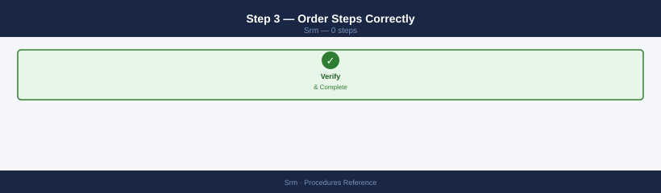

Review the step execution order — SRM executes steps sequentially within each priority group:

- **Pre-power-on steps**: DNS updates, storage mapping verification, firewall pre-staging
- **Between VM groups**: database primary promotion, application config updates
- **Post-recovery steps**: ITSM incident creation, monitoring re-baseline, end-user notification

### Step 4 — Test the Custom Steps


Run a test failover (see [Run a Test Failover](#run-a-test-failover-non-disruptive)) — SRM executes custom steps in test mode too. Review the test report to confirm each custom step ran and returned success. Fix any script errors before relying on them in a real DR event.

---

## Resolve a Failed Recovery Plan Step

When a recovery plan run fails mid-execution (a VM fails to power on, a script returns non-zero, or a manual step times out), SRM halts the plan and requires operator intervention.

### Step 1 — Identify the Failed Step

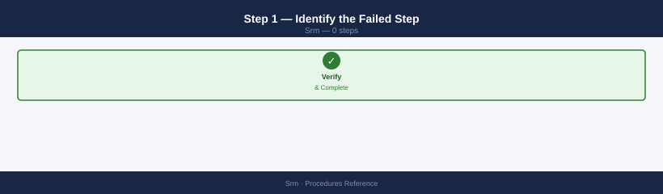

SRM → **Recovery Plans → History** → select the failed run → expand the step tree to find the first red (failed) step. Note the step type, the VM or script involved, and the error message.

### Step 2 — Diagnose the Root Cause

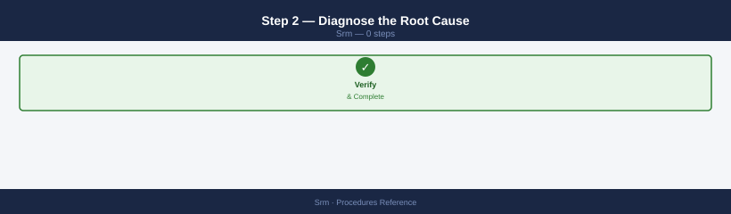

| Failure Type | Common Cause | Resolution |
|---|---|---|
| VM power-on timeout | Network mapping missing or wrong | Check SRM → **Site Pair → Inventory Mappings → Network** |
| VM power-on timeout | Datastore mapping missing | Check SRM → **Site Pair → Inventory Mappings → Datastore** |
| Script step failed | Script returned non-zero exit code | RDP to SRM server, run the script manually, check output |
| Script step timed out | Script ran longer than the configured timeout | Increase timeout in the custom step, or fix the script to run faster |
| Manual step timed out | No operator responded within the timeout | Review who should acknowledge; increase timeout or lower it |
| VM stays in "Waiting for heartbeat" | VMware Tools not responding | Connect to VM console; check OS boot; check Tools service |

### Step 3 — Fix the Root Cause

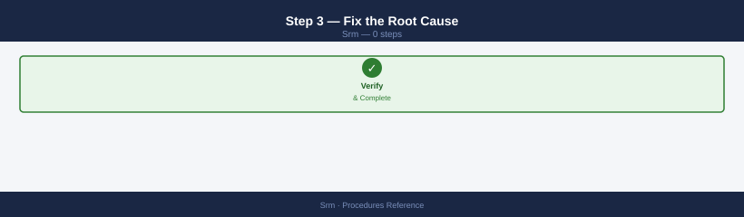

Resolve the underlying issue (fix the network mapping, fix the script, etc.) before resuming or retrying.

### Step 4 — Resume or Restart the Plan

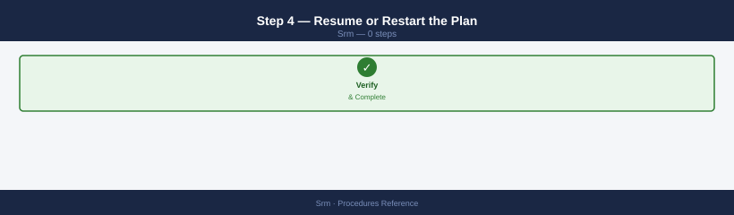

Once the root cause is resolved:

- **Resume from failure point**: SRM → running plan → **Resume** — SRM retries the failed step and continues from where it stopped (only available if the plan is still in a "paused" state)
- **Re-run from beginning**: if too much time has passed or the plan state is inconsistent, cancel the current run → start a fresh recovery plan run

After any mid-plan failure during a real DR event, document what happened in the incident record and update the recovery plan's custom steps to prevent recurrence.

---

## Configure SRM Email Notifications

SRM can send email notifications at recovery plan milestones (start, completion, failure). Requires SMTP relay access from the SRM Server.

### Step 1 — Configure SMTP in SRM

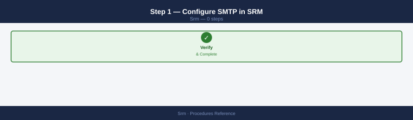

SRM → **Site Recovery → Configuration → Email** (this option may be under the SRM Server's VAMI at `https://<srm-ip>:5480` for appliance-based SRM):

- **SMTP server**: FQDN or IP of the mail relay (e.g., `smtp.example.local`)
- **Port**: 25 (unauthenticated) or 587 (STARTTLS)
- **From address**: `srm-alerts@example.local`
- Click **Test** — verify a test email is received

### Step 2 — Add Email Recipients to a Recovery Plan

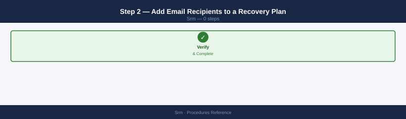

SRM → **Recovery Plans** → select the plan → **Edit** → navigate to **Notifications**:

1. Click **Add Recipient**
2. Enter the recipient email (e.g., DR team distribution list: `dr-team@example.local`)
3. Select notification events: **Plan started** / **Plan completed** / **Plan failed** / **Custom step failed**
4. Save

### Step 3 — Add an Email Step Inline (Alternative)

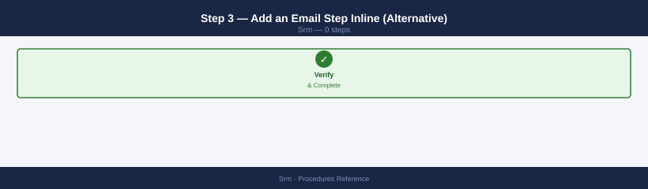

Instead of notifications, add a **Message** step with instructions for operators — this keeps all DR communication as part of the recovery plan audit trail and does not depend on SMTP.

---

## See also

- [SRM — Health Checks](health-checks/)
- [VMware SRM — Common Issues](../troubleshooting/common-issues/)
- [SRM — CLI Reference](cli-reference/)

## Verify

- **Alarms:** vSphere Client → Home → Alarms — no new critical alarms after the operation
- **Events:** monitor the vCenter Events view for the affected object for 5 minutes
- **Health check:** run the morning health-check sequence for the affected product tier
