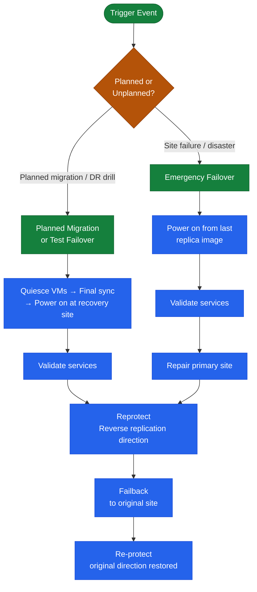

# SRM — Procedures


<div class="kb-summary">
Procedures reference covering Create a Protection Group (vSphere Replication), Create a Recovery Plan, Run a Test Failover (Non-Disruptive), Run a Planned Migration, Run a Disaster Recovery (Protected Site Down) and 4 more sections.
</div>

  Test Failover vs Actual Failover
```text
┌─────────────────────────────────── VMware SRM — Common Procedures ────────────────────────────────────┐
│                                                                                                       │
│  Routine SRM procedures: add VM to protection group, run DR test, perform planned                     │
│  failover, reprotect after failover, and update recovery plan steps.                                  │
│                                                                                                       │
│   ┌──────────────────────────────────────────────┐  ┌─────────────────────────────────────────────┐   │
│   │              DR Test Procedure               │  │               Planned Failover              │   │
│   │          Test: bubble network only           │  │          Notify stakeholders first          │   │
│   │           Select plan: Test option           │  │           Replication sync: verify          │   │
│   │            Monitor: plan progress            │  │            Run: Planned migration           │   │
│   │           Cleanup: remove test VMs           │  │           Failback: Reprotect+run           │   │
│   └──────────────────────────────────────────────┘  └─────────────────────────────────────────────┘   │
│                                                                                                       │
│  DR test must always use Test mode; run actual failover only with explicit approval.                  │
│                                                                                                       │
│                          ▼                                                 ▼                          │
│                                                                                                       │
│   ┌──────────────────────────────────────────────┐  ┌─────────────────────────────────────────────┐   │
│   │            Protection Group Mgmt             │  │               Plan Maintenance              │   │
│   │               Add VM to group                │  │             Update startup order            │   │
│   │          Configure IP customisation          │  │           Add custom recovery step          │   │
│   │          Verify replication running          │  │           Update network mappings           │   │
│   │           Remove decommissioned VM           │  │             Document RTO target             │   │
│   └──────────────────────────────────────────────┘  └─────────────────────────────────────────────┘   │
│                                                                                                       │
│  Physical Infrastructure (the hardware everything above runs on):                                     │
│  Test failover uses isolated network on recovery site; cleanup deletes test VMs;                      │
│  planned failover powers off protected site VMs before starting.                                      │
│                                                                                                       │
│  Key terms:                                                                                           │
│                                                                                                       │
│  Test mode     = failover to bubble network; no production impact                                     │
│  Planned migration= graceful failover; quiesce source then fail over                                  │
│  Disaster recovery= forced failover; uses last available replica                                      │
│  Reprotect     = reverses replication; recovery becomes protected                                     │
│  Failback      = reprotect then planned migration back to original                                    │
│  Bubble network= isolated VLAN; test VMs not routable to production                                   │
│  IP customisation= re-IP VMs with recovery-site addresses on failover                                 │
│  Startup order = priority sequence; lower number powers on first                                      │
│  Custom step   = script or manual step in recovery plan                                               │
│  Cleanup       = SRM removes test VMs and associated snapshots                                        │
│  Protection group= collection of VMs replicated and failed over together                              │
│  Network mapping= maps source portgroup to recovery portgroup                                         │
│                                                                                                       │
└───────────────────────────────────────────────────────────────────────────────────────────────────────┘
```
```text
┌─────────────────────────────────── VMware SRM — Common Procedures ────────────────────────────────────┐
│                                                                                                       │
│  Routine SRM procedures: add VM to protection group, run DR test, perform planned                     │
│  failover, reprotect after failover, and update recovery plan steps.                                  │
│                                                                                                       │
│   ┌──────────────────────────────────────────────┐  ┌─────────────────────────────────────────────┐   │
│   │              DR Test Procedure               │  │               Planned Failover              │   │
│   │          Test: bubble network only           │  │          Notify stakeholders first          │   │
│   │           Select plan: Test option           │  │           Replication sync: verify          │   │
│   │            Monitor: plan progress            │  │            Run: Planned migration           │   │
│   │           Cleanup: remove test VMs           │  │           Failback: Reprotect+run           │   │
│   └──────────────────────────────────────────────┘  └─────────────────────────────────────────────┘   │
│                                                                                                       │
│  DR test must always use Test mode; run actual failover only with explicit approval.                  │
│                                                                                                       │
│                          ▼                                                 ▼                          │
│                                                                                                       │
│   ┌──────────────────────────────────────────────┐  ┌─────────────────────────────────────────────┐   │
│   │            Protection Group Mgmt             │  │               Plan Maintenance              │   │
│   │               Add VM to group                │  │             Update startup order            │   │
│   │          Configure IP customisation          │  │           Add custom recovery step          │   │
│   │          Verify replication running          │  │           Update network mappings           │   │
│   │           Remove decommissioned VM           │  │             Document RTO target             │   │
│   └──────────────────────────────────────────────┘  └─────────────────────────────────────────────┘   │
│                                                                                                       │
│  Physical Infrastructure (the hardware everything above runs on):                                     │
│  Test failover uses isolated network on recovery site; cleanup deletes test VMs;                      │
│  planned failover powers off protected site VMs before starting.                                      │
│                                                                                                       │
│  Key terms:                                                                                           │
│                                                                                                       │
│  Test mode     = failover to bubble network; no production impact                                     │
│  Planned migration= graceful failover; quiesce source then fail over                                  │
│  Disaster recovery= forced failover; uses last available replica                                      │
│  Reprotect     = reverses replication; recovery becomes protected                                     │
│  Failback      = reprotect then planned migration back to original                                    │
│  Bubble network= isolated VLAN; test VMs not routable to production                                   │
│  IP customisation= re-IP VMs with recovery-site addresses on failover                                 │
│  Startup order = priority sequence; lower number powers on first                                      │
│  Custom step   = script or manual step in recovery plan                                               │
│  Cleanup       = SRM removes test VMs and associated snapshots                                        │
│  Protection group= collection of VMs replicated and failed over together                              │
│  Network mapping= maps source portgroup to recovery portgroup                                         │
│                                                                                                       │
└───────────────────────────────────────────────────────────────────────────────────────────────────────┘
```
```text
┌─────────────────────────────────── VMware SRM — Common Procedures ────────────────────────────────────┐
│                                                                                                       │
│  Routine SRM procedures: add VM to protection group, run DR test, perform planned                     │
│  failover, reprotect after failover, and update recovery plan steps.                                  │
│                                                                                                       │
│   ┌──────────────────────────────────────────────┐  ┌─────────────────────────────────────────────┐   │
│   │              DR Test Procedure               │  │               Planned Failover              │   │
│   │          Test: bubble network only           │  │          Notify stakeholders first          │   │
│   │           Select plan: Test option           │  │           Replication sync: verify          │   │
│   │            Monitor: plan progress            │  │            Run: Planned migration           │   │
│   │           Cleanup: remove test VMs           │  │           Failback: Reprotect+run           │   │
│   └──────────────────────────────────────────────┘  └─────────────────────────────────────────────┘   │
│                                                                                                       │
│  DR test must always use Test mode; run actual failover only with explicit approval.                  │
│                                                                                                       │
│                          ▼                                                 ▼                          │
│                                                                                                       │
│   ┌──────────────────────────────────────────────┐  ┌─────────────────────────────────────────────┐   │
│   │            Protection Group Mgmt             │  │               Plan Maintenance              │   │
│   │               Add VM to group                │  │             Update startup order            │   │
│   │          Configure IP customisation          │  │           Add custom recovery step          │   │
│   │          Verify replication running          │  │           Update network mappings           │   │
│   │           Remove decommissioned VM           │  │             Document RTO target             │   │
│   └──────────────────────────────────────────────┘  └─────────────────────────────────────────────┘   │
│                                                                                                       │
│  Physical Infrastructure (the hardware everything above runs on):                                     │
│  Test failover uses isolated network on recovery site; cleanup deletes test VMs;                      │
│  planned failover powers off protected site VMs before starting.                                      │
│                                                                                                       │
│  Key terms:                                                                                           │
│                                                                                                       │
│  Test mode     = failover to bubble network; no production impact                                     │
│  Planned migration= graceful failover; quiesce source then fail over                                  │
│  Disaster recovery= forced failover; uses last available replica                                      │
│  Reprotect     = reverses replication; recovery becomes protected                                     │
│  Failback      = reprotect then planned migration back to original                                    │
│  Bubble network= isolated VLAN; test VMs not routable to production                                   │
│  IP customisation= re-IP VMs with recovery-site addresses on failover                                 │
│  Startup order = priority sequence; lower number powers on first                                      │
│  Custom step   = script or manual step in recovery plan                                               │
│  Cleanup       = SRM removes test VMs and associated snapshots                                        │
│  Protection group= collection of VMs replicated and failed over together                              │
│  Network mapping= maps source portgroup to recovery portgroup                                         │
│                                                                                                       │
└───────────────────────────────────────────────────────────────────────────────────────────────────────┘
```

---

## Create a Recovery Plan

```text
Site Recovery → Recovery → Recovery Plans → New

  Name: SQL-DR-Plan
  Protection Groups: add SQL-PG
  Recovery Site: Recovery-Site

  Configure steps:
    Priority 1 — Infrastructure VMs (DNS, DC)
    Priority 2 — Database servers (SQL)
    Priority 3 — Application servers
    Priority 4 — Web servers

  Network Mappings: verify mapped (inherited from site pair or add per-plan)
  IP Customization: for static-IP VMs:
    Site Recovery → Recovery Plans → [plan] → IP Customization
    Add rule: source IP → recovery IP mapping (per-VM or per-subnet)
```

---

## Run a Test Failover (Non-Disruptive)

Test failover powers on VMs in an isolated bubble network — production is unaffected.

```text
Site Recovery → Recovery Plans → [plan] → Test
  Confirm: Test
  Monitor progress: Site Recovery → Recovery Plans → [plan] → History → [current run]
  
After test completes:
  Verify VMs powered on at recovery site (vCenter recovery site → VMs)
  Verify IP customization applied correctly
  Verify application-level health in isolated network

Cleanup (mandatory — must clean up before running another test or real recovery):
  Site Recovery → Recovery Plans → [plan] → Cleanup
  Cleanup removes powered-on test VMs from recovery site
```

---

## Run a Planned Migration

Both sites are available. VMs are gracefully shut down at protected site, replicated, and powered on at recovery site.

```yaml
Site Recovery → Recovery Plans → [plan] → Run
  Type: Planned Migration
  Confirm: check "I understand this will shut down VMs at the protected site"
  Monitor: watch each step complete

Post-migration:
  Verify VMs running at recovery site
  Update DNS records for moved VMs (if not handled by IP customization)
  Notify application teams
```

---

## Run a Disaster Recovery (Protected Site Down)

```yaml
Site Recovery → Recovery Plans → [plan] → Run
  Type: Disaster Recovery
  Confirm: acknowledge data loss risk (last sync point used)
  Monitor: watch recovery progress

Note: VMs at protected site must be considered "lost" — do NOT try to power them on
```

---

## Perform Failback After Recovery

After the protected site is restored and ready:

```text
1. Re-protect VMs at recovery site (reverse replication direction):
   Site Recovery → Protection → Protection Groups → [group] → Reprotect
   This configures replication from recovery site back to protected site

2. Wait for initial replication to complete (RPO achieved)

3. Run Planned Migration back to protected site:
   Site Recovery → Recovery Plans → [original plan] → Run → Planned Migration
```

---

## Add a VM to an Existing Protection Group

For ABR protection groups: add the VM to the storage replication group on the array, then rediscover:
```text
Site Recovery → Protection → [PG] → Discover Devices
```
The new VM appears automatically if it is on a replicated datastore.

For vSphere Replication groups: configure VR on the VM first, then:
```text
Site Recovery → Protection → [PG] → Add VMs
```

---

## Change RPO on a vSphere Replication VM

```text
vCenter (Protected Site) → [VM] → right-click → Configure Replication → Edit
  RPO: change from current value (minimum 5 minutes, maximum 24 hours)
  Save → replication schedule updates immediately
```

---

## Remove VM from Protection (Decommission)

```text
1. Remove VM from Protection Group:
   Site Recovery → Protection → [PG] → VMs → [VM] → Remove

2. If VR-replicated: stop replication on the VM:
   vCenter → [VM] → right-click → Remove Replication

3. Clean up placeholder VM at recovery site:
   vCenter (Recovery) → delete placeholder VM
```

## Operational Flow Overview


```text
┌────────────────────────────────────────── SRM — Procedures ───────────────────────────────────────────┐
│                                                                                                       │
│   ┌──────────────────────────────────────────────┐  ┌─────────────────────────────────────────────┐   │
│   │              Routine Procedures              │  │                DR Procedures                │   │
│   │          Add new protection source           │  │              Initiate failover              │   │
│   │           Modify retention policy            │  │               Validate replica              │   │
│   │          Expire old recover points           │  │              Redirect host I/O              │   │
│   │             Add storage capacity             │  │         Test failover (non-disrupt)         │   │
│   │           Service account rotation           │  │            Failback to production           │   │
│   └──────────────────────────────────────────────┘  └─────────────────────────────────────────────┘   │
│                                                                                                       │
│   ┌───────────────────────────────────────────────────────────────────────────────────────────────┐   │
│   │                              Change Control Requirements for SRM                              │   │
│   │           All changes to protection policies require change ticket with rollback plan         │   │
│   │                      Failover tests must be scheduled in maintenance window                   │   │
│   │              Firmware/software upgrades need 48 h pre-approval and backup snapshot            │   │
│   │                  Post-change: verify jobs run successfully for 2 backup cycles                │   │
│   └───────────────────────────────────────────────────────────────────────────────────────────────┘   │
│                                                                                                       │
│  Physical Infrastructure:                                                                             │
│  Two vCenter instances (protected + recovery) · SRA on SRM server · Array replication link            │
│  Key terms:                                                                                           │
│                                                                                                       │
│  SRM           = Site Recovery Manager; VMware product for DR orchestration and testing               │
│  SRA           = Storage Replication Adapter; plugin linking SRM to specific array replication        │
│  Protection Group= logical grouping of VMs covered by a single replication consistency group          │
│  Recovery Plan = automated DR runbook: power-off order, datastore failover, IP customization          │
│  IP Customization= per-VM network settings applied at recovery site (different subnet/gateway)        │
│  Test Failover = non-disruptive plan validation using snapshot; production unaffected                 │
│  Planned Migration= graceful workload movement; VMs shutdown at protected, started at recovery        │
│  Emergency Failover= disaster scenario; VMs powered on from latest available replica                  │
│  Failback      = after recovery, re-protect VMs and migrate back to production site                   │
│  Re-protect    = reverses replication direction; DR site becomes new protected site                   │
│  Recovery Point= specific replication snapshot used for VM recovery; RPO = interval                   │
│  vCenter Pair  = SRM connection between two vCenter instances enables cross-site orchestration        │
│  Startup Priority= ordering within recovery plan; lower number = powers on first                      │
│  Site Pair     = trust relationship between protected and recovery SRM servers                        │
│                                                                                                       │
└───────────────────────────────────────────────────────────────────────────────────────────────────────┘
```

### Test Failover Procedure

1. Navigate to **Recovery Plans** > select plan > **Test**.
2. When prompted, choose whether to sync recent changes before test (recommended).
3. SRM creates isolated snapshot datastores at the recovery site.
4. Monitor the recovery steps in the **Recovery Steps** tab — each step shows status, duration, and any errors.
5. Once all VMs are powered on, validate application functionality within the bubble network.
6. Click **Cleanup** to tear down the test environment. Do not leave test environments running longer than needed — stale snapshots can fill journal/snapshot space.

!!! tip "RTO Measurement"
    Record the elapsed time shown in the **Recovery Steps** pane at the point when the last application health check passes. This is your actual RTO — compare against the tier target RTO in the standards document.

### Common Test Failover Issues

| Symptom | Likely Cause | Resolution |
|---|---|---|
| VM fails to power on — datastore inaccessible | Snapshot not created by SRA | Check SRA logs; verify array replication is healthy |
| IP customisation not applied | Missing IP customisation rule for VM | Add rule in Recovery Plan > IP Customisation |
| Post-power-on script fails | Script path not accessible from SRM service account | Fix UNC path; verify service account permissions |
| VM registers on wrong datastore | Datastore mapping misconfigured | Update datastore mapping in Site Recovery > Array Managers |
| Test cleanup hangs | Snapshot deletion failed at array | Manually delete snapshot at array; then retry cleanup |

---


## Planned Migration

A planned migration gracefully shuts down VMs at the protected site, performs a final replication sync, then powers them on at the recovery site. Both sites must be operational.

### Pre-Migration Checklist

- [ ] Both sites and SRM servers are reachable and healthy
- [ ] Replication is healthy with zero or acceptable backlog (RPO at target)
- [ ] Recovery plan has been tested successfully within the last quarter
- [ ] Change record approved; maintenance window scheduled
- [ ] Application owners notified; application shutdown pre-steps completed if required
- [ ] DNS/load balancer changes prepared (or scripted in recovery plan)

### Planned Migration Procedure

1. Navigate to **Recovery Plans** > select plan > **Run** > **Planned Migration**.
2. SRM confirms both sites are connected — if the protected site is unreachable, it refuses to run Planned Migration (use Emergency Failover instead).
3. SRM executes pre-power-off scripts (if configured).
4. SRM quiesces and powers off protected-site VMs in reverse boot order (web → app → DB → infra).
5. A final replication sync is triggered and completed — ensuring zero data loss.
6. SRM presents replica datastores at the recovery site.
7. VMs are registered and powered on at the recovery site in the defined boot sequence.
8. Post-power-on scripts execute (DNS updates, load balancer re-point, etc.).
9. Validate services, then close the change record.

!!! warning "No Rollback After Planned Migration"
    Once VMs are powered on at the recovery site, the original protected site is unpowered. To return to the original site, run **Reprotect** followed by a reverse failover.

---


## Emergency Failover (Disaster Recovery)

Used when the protected site is unavailable. VMs are powered on from the most recent replica image. Some data loss is expected depending on RPO at the time of failure.

### Emergency Failover Procedure

1. Declare disaster and invoke the DR change record.
2. Navigate to **Recovery Plans** > select plan > **Run** > **Disaster Recovery**.
3. SRM will warn that the protected site is not reachable and that data loss may occur — confirm.
4. SRM presents the last-good replica datastores at the recovery site.
5. VMs are registered and powered on in the defined boot sequence.
6. No pre-power-off or final sync steps are performed (protected site is down).
7. Post-power-on scripts execute.
8. Validate services and notify stakeholders.
9. Document the actual RPO: check the replication lag or journal timestamp at the time of failure.

```bash
# After failover, check SRDF or RecoverPoint state for data loss assessment
# PowerMax SRDF example
symrdf -sid <SYMID> -rdfg <RDFG> query

# RecoverPoint — check journal recovery point timestamp
boxmgmt cg check_all
```

---


## Reprotect

After any failover (planned or emergency), the recovered VMs are now running at the recovery site without replication. Reprotect reverses the replication direction so the recovery site becomes the new protected site.

### Reprotect Procedure

1. Ensure the original protected site infrastructure (storage, network, vCenter) is restored and reachable.
2. Navigate to **Recovery Plans** > select plan > **Reprotect**.
3. SRM coordinates with the SRA or vSphere Replication to establish reverse replication:
   - For SRDF: SRDF pairs are re-established with the original R2 becoming R1.
   - For vSphere Replication: new replication sessions are created from recovery site back to original site.
   - For RecoverPoint: replication direction is reversed via the RecoverPoint API.
4. Initial sync (full or delta) from recovery site back to original site begins.
5. Monitor sync progress in vSphere Replication or the array management UI.
6. Once sync completes and RPO is at target, the environment is ready for failback.

!!! note "Reprotect Does Not Move VMs"
    Reprotect only reverses replication — VMs continue running at the recovery site. The original site datastores now receive replicated writes from the recovery site.

---


## Failback

Failback returns VMs to the original protected site. Mechanically, it is a planned migration in the reverse direction, using the reprotected recovery plan.

### Failback Procedure

1. Confirm replication from recovery site → original site is healthy and RPO is at target.
2. Navigate to **Recovery Plans** > select the **reverse/failback recovery plan** (SRM creates this automatically during Reprotect, or you create a new plan in the reverse direction).
3. Run as **Planned Migration**.
4. VMs are quiesced at the recovery site, a final sync is performed to the original site, and VMs are powered on at the original site.
5. After failback, run **Reprotect** again to restore the original replication direction (original site → recovery site).
6. Validate the environment; close the DR incident record.

### Failback Go/No-Go Criteria

| Criteria | Required State |
|---|---|
| Original site vCenter reachable | Yes |
| Original site storage presenting correctly to hosts | Yes |
| Reverse replication RPO at target | Yes — zero or within tier RPO |
| Application owner sign-off on recovery-site validation | Yes |
| Change record approved for failback window | Yes |

---


## SRM Alarms and Monitoring

SRM generates vCenter alarms for key events. Monitor these in the vCenter Alarms view or your external monitoring system.

| Alarm | Trigger | Action |
|---|---|---|
| Protection group error | One or more VMs in error state | Check vSphere Replication or SRA; resolve replication issue |
| Recovery plan cannot be tested | Validation failure (mapping issue, etc.) | Run recovery plan validation; fix errors listed |
| RPO violation | Replication lag exceeds RPO target | Check WAN bandwidth; check storage performance; resolve blocking errors |
| SRM server unreachable | SRM service down or certificate issue | Restart SRM service; check certificate expiry |
| Array manager communication failure | SRA cannot reach array | Check SRA service; verify array credentials and network |

```powershell
# Check SRM service status on Windows SRM server
Get-Service -Name vmware-dr

# Restart SRM service if needed
Restart-Service -Name vmware-dr

# Review SRM logs
# Default log path: C:\ProgramData\VMware\VMware vCenter Site Recovery Manager\Logs\
Get-Content "C:\ProgramData\VMware\VMware vCenter Site Recovery Manager\Logs\vmware-dr.log" -Tail 100
```

---


## Quarterly DR Drill Process

| Step | Owner | Timing |
|---|---|---|
| Schedule maintenance window | Change Manager | T-4 weeks |
| Notify application owners | Infra Lead | T-2 weeks |
| Pre-test validation (run SRM validation wizard) | SRM Admin | T-1 day |
| Execute test failover | SRM Admin | During window |
| Application validation | App owners | During window |
| Record RTO achieved vs. target | SRM Admin | During window |
| Cleanup test environment | SRM Admin | End of window |
| Produce test report (RTO, issues, actions) | SRM Admin | T+2 days |
| Update action items in JIRA/ticketing | Infra Lead | T+5 days |

---


## Update Network and Resource Mappings

Network and resource mappings must be kept current when protected-site or recovery-site infrastructure changes.

1. In SRM, navigate to **Site Recovery → Configure → Network Mappings**
2. Click **Edit** on any mapping that requires updating — remap source port groups to the correct recovery-site port groups
3. Navigate to **Site Recovery → Configure → Resource Mappings**
4. Update cluster and resource pool assignments to reflect any changes to recovery-site compute infrastructure
5. Run the SRM recovery plan **Validate** wizard to confirm all mappings resolve correctly and no VMs report mapping errors
6. Resolve any validation warnings before the next scheduled DR test or production use

---


## Upgrade SRM Appliance (8.x+)

SRM 8.x ships as an appliance (OVA/VAMI managed). Follow this procedure for patch and minor version upgrades.

1. Download the new SRM OVA or upgrade ISO from the VMware Customer Connect portal — verify the SHA-256 checksum
2. Log in to the SRM appliance management UI at `https://<srm-appliance-ip>:5480`
3. Navigate to **Appliance Management → Upgrade**
4. Provide the path to the downloaded OVA or upgrade package
5. Click **Run Precheck** — resolve any pre-upgrade warnings (certificate validity, disk space, vCenter connectivity) before proceeding
6. Click **Upgrade** and monitor progress in the VAMI UI — the SRM services will restart during the upgrade
7. After the upgrade completes, log back in to vCenter and confirm the SRM site pair reconnects and shows both protected and recovery sites as **Connected**
8. Run a recovery plan validation to confirm all protection groups and recovery plans are intact post-upgrade
