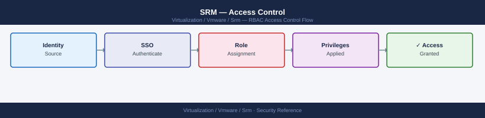

---
tags:
  - security
  - srm
  - vmware
---
# SRM — Access Control


<div class="kb-summary">
Access Control reference covering Least-Privilege Role Assignments, SRA Credential Management, Separation of Duties for Recovery, Network Access Control, Audit Trail.

*Applies to: SRM 8.x / 9.x*
</div>



  SRM RBAC: Recovery Plan Roles → vCenter Permissions


```d2
direction: down

external: External / Untrusted {shape: rectangle}
perimeter_controls: "Perimeter Controls" {shape: rectangle}
identity_access: "Identity & Access" {shape: rectangle}
audit_logging: "Audit & Logging" {shape: rectangle}
core: "Site Recovery Manager Core" {shape: hexagon}

external -> perimeter_controls: traffic in
perimeter_controls -> identity_access
identity_access -> audit_logging
audit_logging -> core: secured path
```

## Before you begin

- **Access:** vCenter Administrator role
- **Change management:** security changes require CAB approval in most environments
- **Rollback plan:** document current state before any security control change
- **Testing:** validate in a non-production environment first where possible

---

## See also

- [SRM — Authentication](authentication/)
- [SRM — Hardening](hardening/)
