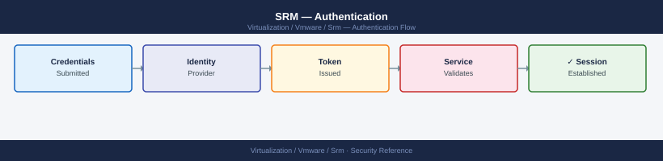

---
tags:
  - security
  - srm
  - vmware
---
# SRM — Authentication

Authentication reference covering Site Pairing Authentication (Certificate-Based), SRA Authentication to Storage Array, REST API Authentication, vSphere Replication Authentication, Break-Glass Access to SRM and 1 more sections.

*Applies to: SRM 8.x / 9.x*

  SRM Authentication Chain

## Before you begin

- **Access:** vCenter Administrator role
- **Change management:** security changes require CAB approval in most environments
- **Rollback plan:** document current state before any security control change
- **Testing:** validate in a non-production environment first where possible

---

## See also

- [SRM — Access Control](access-control/)
- [SRM — Hardening](hardening/)
