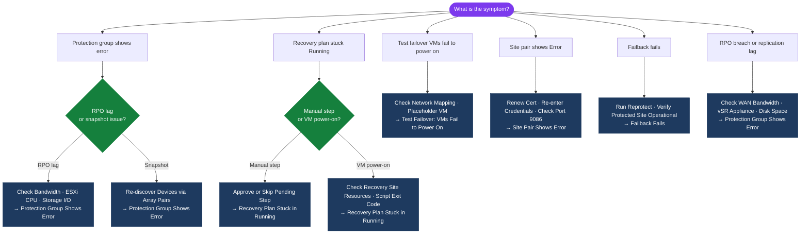
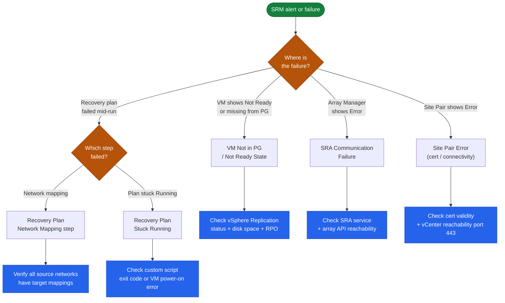

---
tags:
  - srm
  - troubleshooting
  - vmware
search:
  boost: 1.5
---
# VMware SRM — Common Issues

```text
┌───────────────────────────────────── VMware SRM — Common Issues ──────────────────────────────────────┐
│                                                                                                       │
│  Common SRM issues: site pair disconnected, replication lag exceeded RPO, plan test                   │
│  failure, IP customisation not applied, and cleanup stuck after test.                                 │
│                                                                                                       │
│   ┌──────────────────────────────────────────────┐  ┌─────────────────────────────────────────────┐   │
│   │               Site Pair Issues               │  │              Replication Issues             │   │
│   │         Pair disconnected: check net         │  │           Lag > RPO: check WAN BW           │   │
│   │            Cert expired: re-pair             │  │          vSR error: check vRAM host         │   │
│   │          vCenter unreachable: check          │  │          ABR error: check SRA logs          │   │
│   │          Port 9086: check firewall           │  │          Disk full: clear vSR logs          │   │
│   └──────────────────────────────────────────────┘  └─────────────────────────────────────────────┘   │
│                                                                                                       │
│  Cert expiry is the most common site pair disconnection cause; monitor 30+ days ahead.                │
│                                                                                                       │
│                          ▼                                                 ▼                          │
│                                                                                                       │
│   ┌──────────────────────────────────────────────┐  ┌─────────────────────────────────────────────┐   │
│   │              Plan Test Failures              │  │               Post-Test Issues              │   │
│   │         VM fail to power on: vSphere         │  │             Cleanup stuck: force            │   │
│   │          IP script error: check log          │  │             Test VMs not deleted            │   │
│   │          Network mapping wrong: fix          │  │           Snapshots remain: purge           │   │
│   │           Script timeout: increase           │  │           Re-run cleanup in SRM UI          │   │
│   └──────────────────────────────────────────────┘  └─────────────────────────────────────────────┘   │
│                                                                                                       │
│  Physical Infrastructure (the hardware everything above runs on):                                     │
│  Most issues: WAN bandwidth (lag), network mapping (IP/VLAN), cert expiry (pair),                     │
│  or vCenter connectivity; check all four before deep investigation.                                   │
│                                                                                                       │
│  Key terms:                                                                                           │
│                                                                                                       │
│  Site pair disconnected= SRM Servers lost TCP connectivity                                            │
│  Port 9086     = SRM inter-site communication; must be open in FW                                     │
│  Cert expired  = site pair uses TLS certs; expiry breaks connection                                   │
│  Re-pair       = re-establish site trust after cert or config change                                  │
│  vSR host      = vSphere Replication Server appliance; check logs                                     │
│  SRA logs      = Storage Replication Adapter log; array errors here                                   │
│  IP script     = customisation script; failure blocks VM connectivity                                 │
│  Network mapping= maps protected-site portgroup to recovery portgroup                                 │
│  Cleanup stuck = SRM cleanup task hung; force via SRM UI                                              │
│  Force cleanup = right-click plan > Cleanup in SRM UI                                                 │
│  WAN BW        = insufficient bandwidth causes replication lag                                        │
│  Snapshot purge= manual delete of orphan snapshots after stuck cleanup                                │
│                                                                                                       │
└───────────────────────────────────────────────────────────────────────────────────────────────────────┘
```
```python
   Site Recovery → Storage → Array Pairs → [pair] → Configure Adapter
   Test credentials against array directly:
   curl -sk -H "x-auth-token: <api-token>" https://<flasharray-ip>/api/2.0/array
   # Should return 200 OK
   ```

3. **Network connectivity from SRM Server to array management IP**:
```powershell
   Test-NetConnection <flasharray-ip> -Port 443
   ```

---

## Diagnostic Flow



---

## Before you begin

- **Access:** SSH to vCenter Shell and ESXi hosts; vSphere Client read access
- **Gather first:** recent error message text, event timestamps, and affected object names
- **Scope:** confirm whether the issue affects a single object, host, cluster, or site
- **Escalation:** open a vendor support ticket before running any destructive step
- **Logging:** document each command and output — required if escalation is needed

---

## Recovery Plan Stuck in "Running"

**Symptoms:** Recovery Plan is running but no progress for >10 minutes; one step shows in-progress indefinitely

1. **Manual step timeout**: Recovery Plan has a manual approval step that no one has approved
   ```text
   Site Recovery → Recovery Plans → [plan] → [current run] → Steps
   Find the step waiting for input → click to complete/skip
   ```

2. **VM power-on timeout**: VM at recovery site taking too long to power on (resource contention)
   ```text
   vCenter (Recovery) → Recent Tasks → look for power-on task on the stuck VM
   Check ESXi host resources at recovery site
   ```

3. **Force cancel if stuck >30 minutes**:
   ```text
   Site Recovery → Recovery Plans → [plan] → Cancel
   Note: cancellation may leave partial state — check VMs manually
   ```

---

## Protection Group Shows Error

**Symptoms:** Protection Group status is "Error" or "Warning"

1. **RPO lag exceeds configured RPO**: Replication is not keeping up
```text
   Site Recovery → Replication → vSphere Replication
   Find the VMs in the PG → check "Lag" column
   Investigate: network bandwidth, ESXi CPU on source host, source datastore I/O
   ```

2. **VM snapshot inconsistency** (for ABR protection groups):
```text
   Check storage array — verify snapshot exists for the replication group
   SRA may need to re-discover: Site Recovery → Storage → Array Pairs → Discover Devices
   ```

3. **vSphere Replication appliance unreachable**:
   ```bash
   nc -vz vra-protected.example.local 31031
   nc -vz vra-protected.example.local 44046
   # Both should be open
   ```

---

## Test Failover: VMs Fail to Power On

**Symptoms:** Test recovery starts but VMs in isolated network fail to power on or get wrong IP

1. **Network mapping missing**: The test network not mapped to an isolated portgroup
   ```text
   Site Recovery → Recovery Plans → [plan] → Test Networks
   Map each protected network to an isolated portgroup at recovery site
   ```

2. **Placeholder VM stale**: Placeholder VM at recovery site has incorrect config
```sql
   # Delete placeholder VM from recovery site vCenter
   # Site Recovery → Protection → [PG] → Configure → adds placeholder VMs back automatically
   ```

3. **Resource pool or datastore insufficient at recovery site**:
```text
   Check recovery site CPU/RAM/storage capacity before running test
   Verify resource mappings in Site Recovery → Site Pair → Inventory Mappings
   ```

---

## Failback Fails

**Symptoms:** After recovery, re-protect or planned migration back fails

1. **VM not re-protected**: Must run "Reprotect" after DR before failback
   ```text
   Site Recovery → Protection → [PG] → Reprotect
   Wait for initial sync to complete (status: OK)
   Then run Planned Migration back to protected site
   ```

2. **Protected site not fully restored**: Protected site vCenter or SRM not running
```bash
   Verify: vCenter at protected site is operational
   Verify: SRM service running at protected site
   Verify: site pairing is Connected
   ```

## Triage Decision Tree

Use this flowchart to quickly route to the correct troubleshooting section.


```text
┌───────────────────────────────────────── SRM — Common Issues ─────────────────────────────────────────┐
│                                                                                                       │
│   │     Symptom      │   Likely Cause   │    First Check    │       Fix        │      Verify      │   │
│   │    Plan fails    │   SRA timeout    │ check array repli │re-run or fix SRA │  srm-cli histor  │   │
│   │     VM no IP     │customization err │ check IP customiz │ fix NIC mapping  │    vmware.log    │   │
│   │    Test stuck    │snapshot not rele │    srm cleanup    │  force cleanup   │  srm-cli cleanu  │   │
│   │   Pair broken    │  cert mismatch   │ check SRM pairing │  re-pair sites   │  srm-cli site i  │   │
│   └───────────────────────────────────────────────────────────────────────────────────────────────┘   │
│                                                                                                       │
│   ┌───────────────────────────────────────────────────────────────────────────────────────────────┐   │
│   │                                     General Triage Pattern                                    │   │
│   │          Is the issue new or recurring? New = recent change; Recurring = config problem       │   │
│   │             Is it isolated to one source or all? Isolated = agent; All = server/repo          │   │
│   │                               Check logs first: srm-cli plan test                             │   │
│   │                    If unresolved in 2h: open vendor case with full log bundle                 │   │
│   └───────────────────────────────────────────────────────────────────────────────────────────────┘   │
│                                                                                                       │
│  Physical Infrastructure:                                                                             │
│  Two vCenter instances (protected + recovery) · SRA on SRM server · Array replication link            │
│  Key terms:                                                                                           │
│                                                                                                       │
│  SRM           = Site Recovery Manager; VMware product for DR orchestration and testing               │
│  SRA           = Storage Replication Adapter; plugin linking SRM to specific array replication        │
│  Protection Group= logical grouping of VMs covered by a single replication consistency group          │
│  Recovery Plan = automated DR runbook: power-off order, datastore failover, IP customization          │
│  IP Customization= per-VM network settings applied at recovery site (different subnet/gateway)        │
│  Test Failover = non-disruptive plan validation using snapshot; production unaffected                 │
│  Planned Migration= graceful workload movement; VMs shutdown at protected, started at recovery        │
│  Emergency Failover= disaster scenario; VMs powered on from latest available replica                  │
│  Failback      = after recovery, re-protect VMs and migrate back to production site                   │
│  Re-protect    = reverses replication direction; DR site becomes new protected site                   │
│  Recovery Point= specific replication snapshot used for VM recovery; RPO = interval                   │
│  vCenter Pair  = SRM connection between two vCenter instances enables cross-site orchestration        │
│  Startup Priority= ordering within recovery plan; lower number = powers on first                      │
│  Site Pair     = trust relationship between protected and recovery SRM servers                        │
│                                                                                                       │
└───────────────────────────────────────────────────────────────────────────────────────────────────────┘
```

1. SRM → Configure → Array Managers → check status
2. Verify SRA service is running:
   ```powershell
   Get-Service vmware-sra-*   # Windows SRM
   ```
3. Re-test array credentials: Array Manager → Edit → Test Connection
4. Check SRA log for specific error (Dell SRA logs: see above path)
5. Verify Unisphere/FlashArray/ONTAP API is accessible from SRM server:
   ```powershell
   Invoke-WebRequest -Uri "https://<array-ip>/univmax/restapi/system/version" -SkipCertificateCheck
   ```


## Recovery Plan Stuck `Running`

```text
Cause: Custom script step timed out, or a VM failed to power on
```

1. SRM → Recovery Plans → running plan → Steps tab — identify which step is stuck
2. If a custom script step: check the script exit code in task details; a non-zero exit causes indefinite wait
3. If a VM power-on step: check vCenter tasks for that VM — may have a configuration issue (missing network, snapshot)
4. As a last resort (during actual DR): manually advance the plan past the stuck step using "Force Next Step"


## Site Pair Shows `Error`

```text
Cause: Certificate mismatch, vCenter connectivity, or credential expiry
```

1. From SRM server, verify vCenter is reachable:
   ```powershell
   Test-NetConnection -ComputerName <vcenter-fqdn> -Port 443
   ```
2. Check certificate validity:
   ```powershell
   $cert = [Net.ServicePointManager]::ServerCertificateValidationCallback
   Invoke-WebRequest "https://<vcenter-fqdn>" -UseBasicParsing
   ```
3. Re-enter site pair credentials: SRM → Sites → Edit Credentials

---

## See also

- [SRM — Diagnostics](diagnostics/)
- [SRM — Escalation](escalation/)
- [SRM — Health Checks](../operations/health-checks/)

## Verify resolution

- **Alarms cleared:** Home → Alarms — the triggering alarm is no longer active
- **Event log:** confirm no new related error events in the last 5 minutes
- **Functional test:** perform the action that was failing (connect, vMotion, storage I/O) — confirm it succeeds
- **Monitor:** leave the vSphere Client open for 10 minutes and confirm the issue does not recur
