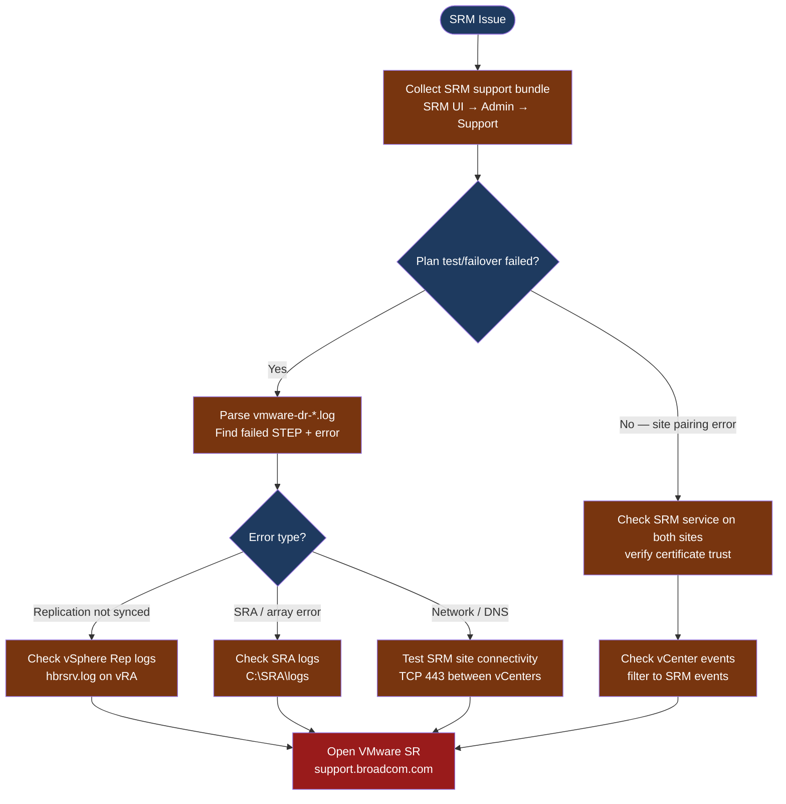

---
tags:
  - srm
  - troubleshooting
  - vmware
search:
  boost: 1.5
---
# SRM — Diagnostics

<div class="kb-summary">
SRM diagnostic commands: collect the SRM support bundle, parse vmware-dr-*.log for plan execution errors, check vSphere Replication appliance logs, verify site pairing and SRA connectivity, and trace recovery plan failures step by step.

*Applies to: VMware Site Recovery Manager 8.x / 9.x*
</div>

```text
┌────────────────────────────────────── VMware SRM — Diagnostics ───────────────────────────────────────┐
│                                                                                                       │
│   ┌───────────────────────────────────────────────────────────────────────────────────────────────┐   │
│   │   Start here: SRM support bundle → vmware-dr-*.log → SRA log → vSphere Rep log               │    │
│   │   Plan failed: check vmware-dr-*.log for the STEP that failed and its error message           │   │
│   │   Site pairing issue: check certificate trust; verify SRM service running on both sites       │   │
│   └───────────────────────────────────────────────────────────────────────────────────────────────┘   │
│                                                                                                       │
│   ┌──────────────────────────────────────────────┐  ┌─────────────────────────────────────────────┐   │
│   │               SRM Server Logs                │  │               vSphere Rep Logs              │   │
│   │   C:\ProgramData\VMware\VMware vCenter SRM   │  │       vSphere Rep appliance: /var/log       │   │
│   │          vmware-dr-*.log: main log           │  │           hbrsrv.log: replication           │   │
│   │            vmware-srmserver-*.log            │  │           hbrfilter.log: I/O path           │   │
│   │            Support bundle: SRM UI            │  │           vR appliance: VM on ESXi          │   │
│   └──────────────────────────────────────────────┘  └─────────────────────────────────────────────┘   │
│                                                                                                       │
│   ┌──────────────────────────────────────────────┐  ┌─────────────────────────────────────────────┐   │
│   │               SRA Diagnostics                │  │                vCenter Events               │   │
│   │          SRA: vendor-specific tool           │  │              Filter: SRM events             │   │
│   │            Dell: SRDF/Metro diag             │  │          Tasks: SRM plan run tasks          │   │
│   │           NetApp: snapmirror show            │  │          Events: site pair connect          │   │
│   │             SRA log: C:\SRA\logs             │  │          Alarms: replication error          │   │
│   └──────────────────────────────────────────────┘  └─────────────────────────────────────────────┘   │
│                                                                                                       │
│  Physical Infrastructure:                                                                             │
│  SRM Server on Windows VM · vSphere Replication appliance VM · Storage array SRA adapter (optional)   │
│                                                                                                       │
│  Key terms:                                                                                           │
│  vmware-dr-*.log = main SRM log; contains plan execution steps, errors, and timing                    │
│  vmware-srmserver= SRM application service log; service-level errors                                  │
│  hbrsrv.log     = vSphere Replication server log; replication relationship state                      │
│  hbrfilter.log  = I/O filter log; per-VM replication I/O path health                                  │
│  SRA            = Storage Replication Adapter; vendor plugin handling array-based failover            │
│  ProgramData    = Windows hidden folder where SRM writes logs (C:\ProgramData\VMware\...)             │
│  Site pairing   = the trust relationship between the protected and recovery site vCenter/SRM          │
│                                                                                                       │
└───────────────────────────────────────────────────────────────────────────────────────────────────────┘
```



## Before you begin

- **Access:** SRM Administrator role in vSphere Client (SRM plugin); RDP or local access to the SRM Server Windows VM
- **Gather first:** the recovery plan name, which step failed (shown in SRM UI), the exact error message, and whether this is a test run or an actual failover
- **Scope:** confirm whether the issue affects a single protection group, all protection groups, or the site pairing itself
- **Do not re-run a failed failover:** if an actual failover (not test) failed mid-plan, do not re-run without first understanding what step failed and confirming the state is consistent
- **Logging:** the `vmware-dr-*.log` file contains the complete step-by-step execution trace — always collect it before troubleshooting or calling VMware support

---

## Step 1 — Collect the SRM support bundle

```text
Method 1: SRM vSphere Client Plugin (recommended)
  1. Open vSphere Client → Site Recovery → Administration
  2. Select your SRM site → click "Export Support Bundle"
  3. The wizard creates a ZIP containing:
     - vmware-dr-*.log (main log — all plan execution detail)
     - vmware-srmserver-*.log (service-level log)
     - SRA adapter logs
     - SRM configuration and extension data
  4. Download and save: srm-bundle-<site>-<date>.zip

Method 2: Directly from SRM Server file system
  (Use this if the SRM UI is inaccessible)
  - RDP to the SRM Windows Server
  - Log directory: C:\ProgramData\VMware\VMware vCenter SRM\Logs\
  - Copy the entire Logs\ folder to retrieve all log files
```

---

## Step 2 — Parse the SRM main log for plan failures

```powershell
# On the SRM Windows Server (RDP)
$logDir = "C:\ProgramData\VMware\VMware vCenter SRM\Logs"

# Show the most recently modified logs
Get-ChildItem $logDir -Filter "*.log" | Sort-Object LastWriteTime -Descending | Select-Object -First 5

# Search for errors in the main DR log (replace * with actual filename timestamp)
Select-String -Path "$logDir\vmware-dr-*.log" `
  -Pattern "error|fail|exception|timeout" -CaseSensitive:$false |
  Select-Object -Last 100

# Find the specific plan step that failed
Select-String -Path "$logDir\vmware-dr-*.log" `
  -Pattern "STEP|Step|ExecuteStep|Failed|Error" |
  Select-Object -Last 50

# Extract lines around a specific error (e.g., "replicated disks are not ready")
Select-String -Path "$logDir\vmware-dr-*.log" `
  -Pattern "replicated disks" -Context 5, 5

# Check service-level log for SRM application errors
Select-String -Path "$logDir\vmware-srmserver-*.log" `
  -Pattern "error|exception" -CaseSensitive:$false | Select-Object -Last 50
```

**Common log patterns and their meaning:**
- `"Waiting for replicated disks"` followed by timeout → vSphere Replication has not synced the VM within the timeout; check `hbrsrv.log`
- `"SRA error: array not found"` → SRA cannot discover the array at the recovery site; check SRA logs and array credentials
- `"Cannot connect to peer site"` → site pairing connectivity issue; check TCP 443 between vCenters
- `"Certificate validation failed"` → site pairing certificate is expired or untrusted; re-configure site pairing

---

## Step 3 — Check vSphere Replication appliance logs

```bash
# SSH to the vSphere Replication appliance
ssh admin@<vr-appliance-ip>

# Check vSphere Replication server log
tail -200 /var/log/vmware/hbrsrv.log | grep -i "error\|fail\|warn"
# Expected healthy: "Replication state: running" entries; no timeout/error patterns

# Check I/O filter log (per-VM replication filter)
tail -200 /var/log/vmware/hbrfilter.log | grep -i "error\|fail"

# Check overall vRA service status
systemctl status vmware-hbrsrv
# Expected: active (running)

# List all replication configurations seen by the VR appliance
cat /var/log/vmware/hbrsrv.log | grep "ReplicationConfig\|vmId\|rpoSla" | tail -50
```

**If hbrsrv.log shows replication is behind:**
1. Check network bandwidth between production and recovery site (VR uses HTTPS/TCP 443 and TCP 31031)
2. Check ESXi host disk I/O on the production side — heavy I/O increases data to replicate
3. Verify the vRA appliance has adequate resources (vCPU, RAM, network interface)

---

## Step 4 — Check SRA and array-side replication

```bash
# SRA log location (on the SRM Windows Server)
# C:\ProgramData\VMware\VMware vCenter SRM\Logs\SRA\
# Log file name depends on the array vendor adapter

# Dell SRDF SRA
$sraLog = "C:\ProgramData\VMware\VMware vCenter SRM\Logs\SRA\srdf-*.log"
Select-String -Path $sraLog -Pattern "error|fail" | Select-Object -Last 50

# NetApp SRA
$sraLog = "C:\ProgramData\VMware\VMware vCenter SRM\Logs\SRA\netapp-*.log"
Select-String -Path $sraLog -Pattern "error|fail" | Select-Object -Last 50

# Check SRA command output (SRM calls SRA commands; each call is logged)
# Look for: discoverArrays, discoverDevices, testFailoverStart errors
```

**SRA error patterns:**
- `"discoverArrays failed"` → SRA cannot authenticate to the array; verify SRA credentials in SRM UI
- `"testFailoverStart timeout"` → array is not responding to the SRA failover command; check array replication state
- `"Inconsistent state"` → array reports replication is not ready; check array-side replication health

---

## Step 5 — Verify site pairing and service health

```powershell
# Check SRM service on the SRM Windows Server
Get-Service "VMware Site Recovery Manager Server" | Select-Object Name, Status, StartType

# Test network connectivity to the remote site vCenter (TCP 443)
Test-NetConnection -ComputerName <remote-vcenter-fqdn> -Port 443
# Expected: TcpTestSucceeded = True

# Test SRM extension port between sites (TCP 8095 — SRM API)
Test-NetConnection -ComputerName <remote-srm-server-fqdn> -Port 8095

# View vCenter events related to SRM (from the local vCenter)
# vSphere Client → Monitor → Events → filter by: Component = Site Recovery Manager
# Look for: "Site pairing connection failed", "Certificate error"
```

**Re-pairing sites if certificate trust is broken:**
1. SRM vSphere Client plugin → Administration → Sites → select the paired site
2. Click "Reconfigure" → re-enter the remote site credentials
3. Accept any certificate thumbprint prompts — if the certificate changed (vCenter re-install), the thumbprint will differ

---

## Log locations

| Component | Path | Key file |
|---|---|---|
| SRM main log | `C:\ProgramData\VMware\VMware vCenter SRM\Logs\` | `vmware-dr-*.log` |
| SRM service log | `C:\ProgramData\VMware\VMware vCenter SRM\Logs\` | `vmware-srmserver-*.log` |
| vSphere Rep server | SSH to vRA: `/var/log/vmware/` | `hbrsrv.log` |
| vSphere Rep I/O filter | SSH to vRA: `/var/log/vmware/` | `hbrfilter.log` |
| SRA adapter | `C:\ProgramData\VMware\VMware vCenter SRM\Logs\SRA\` | Vendor-specific log |
| Windows Event log | Application log on SRM Server | Source: VMware Site Recovery Manager |

---

## See also

- [SRM — Common Issues](common-issues/)
- [SRM — Escalation](escalation/)

## Verify resolution

- Recovery plan test completes successfully with `Test Status = Success` in SRM UI
- `vmware-dr-*.log` shows no errors in the most recent plan execution
- All protection groups show `Status = OK` in SRM → Protection Groups
- vSphere Replication shows all configured VMs in `Replicating` state with lag within RPO
- Site pairing status shows `Connected` in SRM → Sites
