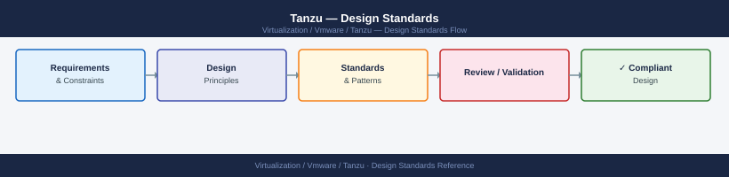

---
tags:
  - architecture
  - tanzu
  - vmware
---
# Tanzu — Design Standards

<div class="kb-summary">
Design Standards reference covering Supervisor Cluster Sizing, TKG Workload Cluster Sizing, Namespace Design, Network CIDR Planning, Storage Policy Mapping and 4 more sections.

*Applies to: Tanzu 2.x*
</div>


## Supervisor Cluster Sizing

The Supervisor control plane consists of exactly 3 VMs — this is fixed and cannot be changed post-deployment. vSphere selects the VM sizing based on the `size_hint` set during Workload Management enablement.

| Size Hint | vCPU | RAM | Disk | Max ESXi Hosts | Max Namespaces |
|---|---|---|---|---|---|
| Tiny | 2 | 8 GB | 30 GB | 10 | 10 |
| Small | 4 | 16 GB | 30 GB | 50 | 50 |
| Medium | 8 | 16 GB | 30 GB | 200 | 100 |
| Large | 16 | 32 GB | 30 GB | 500 | 100 |

**Decision guideline:**
- Lab/PoC: Tiny or Small
- Production < 50 nodes: Small or Medium
- Production enterprise: Medium (recommended default) or Large if exceeding 200 ESXi hosts

The Supervisor control plane VMs are placed by vSphere anti-affinity rules across 3 different ESXi hosts automatically.

---

## TKG Workload Cluster Sizing

### Node Sizing Reference Table

| Cluster Tier | Control Plane | Workers | vCPU/node | RAM/node | Storage | Total vCPU | Total RAM |
|---|---|---|---|---|---|---|---|
| Micro (dev) | 1 | 2 | 2 / 4 | 4 GB / 8 GB | 20 GB | 10 vCPU | 20 GB |
| Small | 3 | 3 | 4 | 8 GB | 40 GB | 24 vCPU | 48 GB |
| Medium | 3 | 5 | 8 | 16 GB | 60 GB | 64 vCPU | 128 GB |
| Large | 3 | 10 | 16 | 32 GB | 80 GB | 208 vCPU | 416 GB |
| XL | 3 | 20 | 16 | 64 GB | 120 GB | 368 vCPU | 1.3 TB |

### VM Classes (vSphere with Tanzu)

| VM Class | vCPU | Memory | Type |
|---|---|---|---|
| best-effort-xsmall | 2 | 2 GB | Best-effort |
| best-effort-small | 2 | 4 GB | Best-effort |
| best-effort-medium | 2 | 8 GB | Best-effort |
| best-effort-large | 4 | 12 GB | Best-effort |
| best-effort-xlarge | 4 | 16 GB | Best-effort |
| best-effort-2xlarge | 8 | 32 GB | Best-effort |
| best-effort-4xlarge | 16 | 64 GB | Best-effort |
| best-effort-8xlarge | 32 | 128 GB | Best-effort |
| guaranteed-xsmall | 2 | 2 GB | Guaranteed (reserved) |
| guaranteed-small | 2 | 4 GB | Guaranteed (reserved) |
| guaranteed-medium | 2 | 8 GB | Guaranteed (reserved) |
| guaranteed-large | 4 | 12 GB | Guaranteed (reserved) |
| guaranteed-xlarge | 4 | 16 GB | Guaranteed (reserved) |

**Guidance:** Use `best-effort-*` for dev/test and `guaranteed-*` for production databases or latency-sensitive workloads. Guaranteed classes reserve CPU/RAM on the host — plan ESXi capacity accordingly.

### Sizing by Workload Type

| Workload Type | Recommended Worker Class | Workers | Notes |
|---|---|---|---|
| Microservices (Java/Node) | best-effort-large | 5–10 | Scale out over up |
| Batch/ML training | best-effort-4xlarge | 3–5 | High CPU bursts |
| Databases (PostgreSQL) | guaranteed-xlarge | 3+ | Memory-bound, predictable |
| CI pipelines (Tekton) | best-effort-2xlarge | 3–5 | Ephemeral burst demand |
| TAP iterate (dev) | best-effort-medium | 2 | Minimal; scale per team |
| TAP run (prod) | best-effort-large | 5+ | Knative revision scaling |

---

## Namespace Design

### Namespace Isolation Models

| Model | Structure | Tradeoffs |
|---|---|---|
| One namespace per team | Each team has own vSphere Namespace + TKC | Strong isolation, dedicated quotas, independent lifecycle — more admin overhead |
| One namespace per application | Each app has own namespace and cluster | Maximum isolation, complex to manage at scale |
| Shared namespace, separate K8s namespaces | Multiple teams share one vSphere Namespace, separate K8s namespaces within TKC | Simple administration, weaker isolation — namespace quotas shared |
| Environment-based (dev/staging/prod) | Separate vSphere Namespaces per environment | SDLC promotion clarity — recommended for most orgs |

**Recommended standard:**
- Create one vSphere Namespace per environment per team: `team-a-dev`, `team-a-prod`
- One TanzuKubernetesCluster per environment
- K8s namespace isolation within the TKC for individual applications

### vSphere Namespace Resource Quota Example

```yaml
# Applied to vSphere Namespace via vCenter API or UI
# vCenter UI → Workload Management → Namespaces → Edit Resource Limits
resourceQuota:
  cpu_limit: 32000       # millicores
  memory_limit: 65536    # MB
  storage_limit: 500     # GB (across all storage policies)
  persistent_volume_claim_count: 50
  pod_count: 500
  service_count: 100
```

---

## Network CIDR Planning

CIDR ranges must not overlap with physical network ranges, vCenter/ESXi management ranges, or other cluster CIDRs in the environment.

### Required CIDR Ranges per Supervisor

| Range | Example | Min Size | Purpose |
|---|---|---|---|
| Supervisor Management Network | 10.10.10.20–10.10.10.25/24 | /27 | Control plane VM IPs + VIP |
| Pod CIDR (Supervisor) | 100.64.0.0/16 | /16 | vSphere Pods / TKG internal pod IPs |
| Service CIDR | 10.96.0.0/16 | /16 | ClusterIP services in Supervisor |
| Ingress CIDR | 10.50.0.0/24 | /24 | VIPs for LoadBalancer Services |
| Egress CIDR | 10.51.0.0/24 | /24 | SNAT pool for pod egress |

### TKG Standalone Cluster CIDR Planning

Each workload cluster needs its own non-overlapping ranges:

| Range | Example | Notes |
|---|---|---|
| Pod CIDR | 192.168.0.0/16 | Per cluster — must not overlap between clusters |
| Service CIDR | 10.32.0.0/16 | Per cluster — must not overlap between clusters |
| Node network | 10.20.x.0/24 | VMs' management IPs — routable VLAN |

```bash
# TKG cluster config CIDR settings
CLUSTER_CIDR: 100.96.0.0/11
SERVICE_CIDR: 100.64.0.0/13
# Note: TKG defaults use 100.x ranges — change if they conflict with existing RFC1918
```


```text title="Expected output"
(no output — command completes silently)
```

!!! warning "Common errors"
    **`CLUSTER_CIDR: command not found`** — Remove the colon and use proper bash variable assignment syntax: `CLUSTER_CIDR=100.96.0.0/11` without spaces around the equals sign.
    **`Error: CIDR block 100.96.0.0/11 overlaps with existing network`** — Verify your network topology and select non-overlapping CIDR ranges, or update existing infrastructure to use different subnets before deploying the TKG cluster.
**Overlap check before deployment:**

```bash
# Check for IP overlap with existing routes
ip route show
# Or verify on NSX-T: check T0 BGP advertised routes and ensure pod/service CIDRs are not announced
```


```text title="Expected output"
default via 192.168.1.1 dev ens33 proto dhcp metric 100
192.168.1.0/24 dev ens33 proto kernel scope link src 192.168.1.50 metric 100
10.0.0.0/8 via 192.168.1.254 dev ens33 proto static metric 100
172.16.0.0/12 via 192.168.1.254 dev ens33 proto static metric 100
10.244.0.0/16 dev vxlan0 proto kernel scope link src 10.244.1.1 metric 0
10.96.0.0/12 dev cni0 proto kernel scope link src 10.96.0.1 metric 0
```

!!! warning "Common errors"
    **`RTNETLINK answers: Operation not permitted`** — Run the command with `sudo` or as root to view kernel routing table.
    **`Device "vxlan0" does not exist.`** — Verify that the overlay network interface is properly initialized; check `ip link show` and confirm NSX-T or CNI plugin has created the virtual interface.
---

## Storage Policy Mapping

### Standard Storage Classes

Define one StorageClass per vSAN storage policy. Keep names consistent across all clusters:

```yaml
# vsan-default — general purpose RAID-1
apiVersion: storage.k8s.io/v1
kind: StorageClass
metadata:
  name: vsan-default
  annotations:
    storageclass.kubernetes.io/is-default-class: "true"
provisioner: csi.vsphere.vmware.com
parameters:
  storagepolicyname: "vSAN Default Storage Policy"
reclaimPolicy: Delete
volumeBindingMode: WaitForFirstConsumer
allowVolumeExpansion: true
---
# vsan-retain — for databases (manual PV cleanup)
apiVersion: storage.k8s.io/v1
kind: StorageClass
metadata:
  name: vsan-retain
provisioner: csi.vsphere.vmware.com
parameters:
  storagepolicyname: "vSAN Default Storage Policy"
reclaimPolicy: Retain
volumeBindingMode: WaitForFirstConsumer
allowVolumeExpansion: true
---
# vsan-encrypted — for regulated data
apiVersion: storage.k8s.io/v1
kind: StorageClass
metadata:
  name: vsan-encrypted
provisioner: csi.vsphere.vmware.com
parameters:
  storagepolicyname: "vSAN Encryption Policy"
reclaimPolicy: Retain
volumeBindingMode: WaitForFirstConsumer
allowVolumeExpansion: true
```

### Storage Policy Selection Matrix

| Workload | StorageClass | Rationale |
|---|---|---|
| Stateless apps (no PVC) | N/A | No storage class needed |
| Log aggregation (Loki, EFK) | vsan-default | Non-critical, large volume |
| Relational DB (PostgreSQL) | vsan-retain | Data retention, prevent accidental delete |
| Redis/Memcached (ephemeral) | vsan-default | Can be recreated |
| Secrets-adjacent data | vsan-encrypted | Regulatory compliance |
| CI artifact caching | vsan-default | Ephemeral OK |

---

## Harbor Sizing

### Harbor OVA Deployment Sizing

| Tier | vCPU | RAM | OS Disk | Image Disk | Registry Load |
|---|---|---|---|---|---|
| Small | 2 | 8 GB | 80 GB | 500 GB | < 20 users, < 50 projects |
| Medium | 4 | 16 GB | 80 GB | 2 TB | 20–100 users, < 200 projects |
| Large | 8 | 32 GB | 80 GB | 10 TB | 100+ users, enterprise-wide |

External database (PostgreSQL) and Redis are strongly recommended for Medium/Large deployments to separate stateful storage from the Harbor VM.

### Harbor HA Architecture

```text
Load Balancer (AVI or NSX-T)
    │
    ├── Harbor Core 1 (VM or pod)
    ├── Harbor Core 2 (VM or pod)
    │
    ├── External PostgreSQL (3-node cluster or managed DB)
    ├── External Redis (Sentinel or Cluster mode)
    └── Shared Image Storage:
          ├── S3 / MinIO (recommended)
          ├── NFS
          └── vSAN (via PVC if K8s-deployed)
```

### Harbor Configuration for Production

```yaml
# harbor.yml (OVA-based deployment) — key production settings
hostname: harbor.example.com
https:
  port: 443
  certificate: /your/certificate/path
  private_key: /your/private/key/path

external_database:
  host: pg.example.com
  port: 5432
  core_database: harbor_core
  notary_signer_database: notary_signer
  notary_server_database: notary_server
  username: harbor
  password: <db-password>
  ssl_mode: require

external_redis:
  host: redis.example.com
  port: 6379
  password: <redis-password>
  registry_db_index: 1
  jobservice_db_index: 2
  trivyscanner_db_index: 5
  clair_db_index: 4
  cache_layer_db_index: 0

storage_service:
  s3:
    region: us-east-1
    bucket: harbor-registry
    access_key: <access-key>
    secret_key: <secret-key>
    secure: true
    chunksize: 10485760
    rootdirectory: /harbor
```

---

## Image Registry Trust Configuration

All TKG clusters must trust the Harbor CA certificate to pull images without `ImagePullBackOff` errors.

### Add Custom CA to TKG Clusters (TKG standalone)

```yaml
# In cluster config YAML — add under TKG_CUSTOM_IMAGE_REPOSITORY_CA_CERTIFICATE
TKG_CUSTOM_IMAGE_REPOSITORY: harbor.example.com
TKG_CUSTOM_IMAGE_REPOSITORY_SKIP_TLS_VERIFY: "false"
TKG_CUSTOM_IMAGE_REPOSITORY_CA_CERTIFICATE: |
  LS0tLS1CRUdJTiB...  # base64-encoded CA cert
```

### Add Custom CA Post-Deployment (via TrustAnchor or machineconfig)

```bash
# For vSphere with Tanzu TKC nodes — use TanzuKubernetesCluster trust field
# Or apply a Secret to vmware-system-tkg namespace:
kubectl create secret generic harbor-ca-cert \
  --from-file=ca.crt=/path/to/harbor-ca.crt \
  -n vmware-system-tkg
```


```text title="Expected output"
secret/harbor-ca-cert created
```

!!! warning "Common errors"
    **`error: open /path/to/harbor-ca.crt: no such file or directory`** — Replace `/path/to/harbor-ca.crt` with the actual absolute path to your Harbor CA certificate file.
    **`error: namespaces "vmware-system-tkg" not found`** — Ensure the TKC cluster is fully provisioned and the vmware-system-tkg namespace exists by running `kubectl get ns vmware-system-tkg`.
For containerd-based nodes, the CA must be placed at `/etc/containerd/certs.d/harbor.example.com/ca.crt` — use a DaemonSet or Bootstrap script to distribute.

---

## Cluster Templates: Dev vs Prod Plan Differences

| Feature | Dev Plan | Prod Plan |
|---|---|---|
| Control Plane nodes | 1 | 3 (HA) |
| etcd | Single instance | Stacked HA (3 instances) |
| Worker nodes | 1 (default) | 3+ (recommended 5) |
| Anti-affinity | Not enforced | MachineDeployment spread across hosts |
| Control plane VM class | best-effort-small | best-effort-medium or guaranteed-medium |
| Upgrade strategy | Recreate | RollingUpdate (maxUnavailable: 0) |
| Auto-healing | Basic | MachineHealthCheck active |
| Recommended cert-manager | Optional | Required |
| Velero backup | Optional | Required |

```yaml
# MachineHealthCheck for prod cluster workers
apiVersion: cluster.x-k8s.io/v1beta1
kind: MachineHealthCheck
metadata:
  name: prod-cluster-worker-health
  namespace: team-a
spec:
  clusterName: prod-cluster
  selector:
    matchLabels:
      cluster.x-k8s.io/deployment-name: prod-cluster-md-0
  unhealthyConditions:
  - type: Ready
    status: Unknown
    timeout: 5m0s
  - type: Ready
    status: "False"
    timeout: 10m0s
  maxUnhealthy: 40%
  nodeStartupTimeout: 10m
```

---

## Taints and Node Pools Design

### Node Pool Strategy

Use separate MachineDeployments (node pools) for different workload types to enable targeted scheduling:

```yaml
# TKG workload cluster with multiple node pools
spec:
  topology:
    nodePools:
    - name: general-workers
      replicas: 5
      vmClass: best-effort-large
      storageClass: vsan-default
      # no taints — general workloads land here
    - name: database-workers
      replicas: 3
      vmClass: guaranteed-xlarge
      storageClass: vsan-retain
      taints:
      - key: workload-type
        value: database
        effect: NoSchedule
    - name: gpu-workers
      replicas: 2
      vmClass: best-effort-8xlarge
      storageClass: vsan-default
      taints:
      - key: nvidia.com/gpu
        value: "true"
        effect: NoSchedule
      labels:
        accelerator: nvidia
```

### Workload Scheduling to Node Pools

```yaml
# StatefulSet targeting database pool
spec:
  template:
    spec:
      tolerations:
      - key: workload-type
        value: database
        effect: NoSchedule
      nodeSelector:
        workload-type: database    # requires label on node pool
      # Or use node affinity for soft preference:
      affinity:
        nodeAffinity:
          requiredDuringSchedulingIgnoredDuringExecution:
            nodeSelectorTerms:
            - matchExpressions:
              - key: workload-type
                operator: In
                values: [database]
```

### Anti-Affinity for Control Plane VMs

vSphere with Tanzu enforces anti-affinity for Supervisor control plane VMs automatically. For TKG standalone, the CAPV provider respects vSphere anti-affinity groups — enable in cluster config:

```yaml
# TKG cluster config
VSPHERE_CONTROL_PLANE_ENDPOINT: 10.10.10.30  # static VIP (via NSX LB or keepalived)
# CAPI KubeadmControlPlane sets MaxSurge=1, MaxUnavailable=0 for prod plan
# CAPV places VMs in a vSphere VM/Host Group per cluster for anti-affinity
```

## See also

- [Tanzu — How It Works](../how-it-works/)
- [Tanzu — Deploy](../../deploy/)
