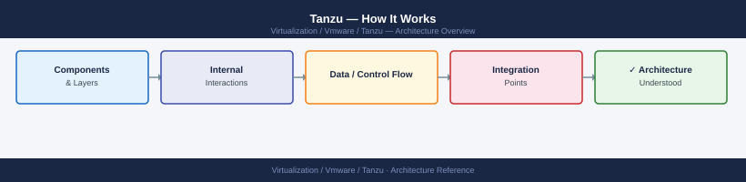

---
tags:
  - architecture
  - tanzu
  - vmware
---
# Tanzu — How It Works


<div class="kb-summary">
How It Works reference covering vSphere with Tanzu Architecture, TKG Standalone — Workload Cluster Lifecycle, Networking Models, Harbor Registry Integration, TAP Supply Chain Concept and 1 more sections.

*Applies to: Tanzu 2.x*
</div>



## vSphere with Tanzu Architecture

vSphere with Tanzu (Workload Management) embeds Kubernetes natively into the ESXi hypervisor layer. The Supervisor cluster runs directly on ESXi hosts via the Spherelet component — a kubelet-equivalent that executes in the ESXi kernel space. Supervisor control plane VMs and workload VMs are scheduled as native vSphere VMs, but managed by Kubernetes APIs exposed through vCenter.

```mermaid
graph TB
    VC["vCenter Server\n(Workload Management enabled)"]:::blue

    subgraph SUP["Supervisor Cluster"]
        direction TB
        CP1["Supervisor Control Plane VM 1\n(K8s API · etcd · scheduler)"]:::blue
        CP2["Supervisor Control Plane VM 2\n(K8s API · etcd · scheduler)"]:::blue
        CP3["Supervisor Control Plane VM 3\n(K8s API · etcd · scheduler)"]:::blue
        ESX1["ESXi Host (Spherelet)\nvSphere Pods host"]:::green
        ESX2["ESXi Host (Spherelet)\nvSphere Pods host"]:::green
    end

    subgraph NS1["Supervisor Namespace 1\n(resource quota enforced)"]
        direction TB
        TKG1CP["TKG Control Plane VMs\n(kubeadm / KCP)"]:::blue
        TKG1W["TKG Worker VMs\n(MachineDeployment)"]:::green
        SEG1["NSX-T Segment\n(isolated per namespace)"]:::amber
        LB1["Load Balancer VIP\n(NSX-T or AVI — TKG API server)"]:::amber
    end

    subgraph NS2["Supervisor Namespace 2\n(resource quota enforced)"]
        direction TB
        TKG2CP["TKG Control Plane VMs\n(kubeadm / KCP)"]:::blue
        TKG2W["TKG Worker VMs\n(MachineDeployment)"]:::green
        SEG2["NSX-T Segment\n(isolated per namespace)"]:::amber
        LB2["Load Balancer VIP\n(NSX-T or AVI — TKG API server)"]:::amber
    end

    HAR["Harbor Registry\n(image supply for TKG nodes)"]:::purple

    VC -->|"workload management\nenables Supervisor"| SUP
    SUP -->|"vSphere Namespace\nprovisioning"| NS1
    SUP -->|"vSphere Namespace\nprovisioning"| NS2
    HAR -->|"OCI images pulled\nby worker nodes"| TKG1W
    HAR -->|"OCI images pulled\nby worker nodes"| TKG2W
    LB1 -->|"exposes K8s API"| TKG1CP
    LB2 -->|"exposes K8s API"| TKG2CP

    classDef blue fill:#2563eb,stroke:#1d4ed8,color:#fff
    classDef green fill:#15803d,stroke:#166534,color:#fff
    classDef amber fill:#b45309,stroke:#92400e,color:#fff
    classDef purple fill:#7c3aed,stroke:#6d28d9,color:#fff
```



### Supervisor Cluster Components

| Component | Location | Role |
|---|---|---|
| Supervisor Control Plane VMs (3x) | ESXi hosts | K8s API server, etcd, controller-manager, scheduler |
| Spherelet | ESXi kernel (each host) | Node agent — registers ESXi host as a K8s node |
| Workload Management Service | vCenter | Orchestrates Supervisor lifecycle, integrates with NSX/AVI |
| NSX-T / AVI LB | External | Load balancer for Supervisor API and workload services |
| vSphere Namespace Controller | Supervisor | Manages vSphere Namespace resources (quotas, storage policies) |
| NCP (NSX Container Plugin) | Supervisor | Syncs K8s network resources to NSX-T |
| vSphere CSI Driver | Supervisor + workload clusters | Provisions FCD-backed PVCs from vSAN/VMFS |

### Spherelet and ESXi-Native Pods

Supervisor hosts can run two pod types:

- **vSphere Pods** — OCI containers running directly on ESXi via CRX (Container Runtime for ESXi). Each pod gets its own lightweight VM-based isolation. No guest OS overhead. Uses same scheduling path as VMs.
- **TKG Service VMs** — Full K8s node VMs provisioned by the TKG Service controller from a `TanzuKubernetesCluster` manifest. These appear as regular vSphere VMs managed by CAPI.

```text
vCenter
  └── Workload Management
        └── Supervisor Cluster (K8s API)
              ├── vSphere Namespace: team-a
              │     ├── TanzuKubernetesCluster: prod-cluster
              │     └── vSphere Pods (if CRX enabled)
              └── vSphere Namespace: team-b
                    └── TanzuKubernetesCluster: dev-cluster
```

### vSphere Namespace Concept

A vSphere Namespace is a Kubernetes namespace on the Supervisor cluster with additional vSphere-specific attributes applied at the platform level:

- **Resource quotas** — CPU, memory, and storage limits enforced by vSphere before K8s scheduling
- **Storage policies** — maps vSphere storage policies to K8s StorageClasses available within the namespace
- **Permissions** — vCenter SSO users/groups assigned Owner/Edit/View roles (propagate to K8s RBAC)
- **VM classes** — defines allowed VM sizes (guaranteed/best-effort) for TKG workload cluster nodes
- **Content library** — OVA/OVF templates for provisioning TKG node VMs

```yaml
# TanzuKubernetesCluster CRD — applied against the Supervisor namespace
apiVersion: run.tanzu.vmware.com/v1alpha3
kind: TanzuKubernetesCluster
metadata:
  name: prod-cluster
  namespace: team-a
spec:
  topology:
    controlPlane:
      replicas: 3
      vmClass: best-effort-medium
      storageClass: vsan-default
      tkr:
        reference:
          name: v1.28.8---vmware.1-tkg.2
    nodePools:
    - name: worker-pool-1
      replicas: 5
      vmClass: best-effort-large
      storageClass: vsan-default
      volumes:
      - name: containerd-storage
        mountPath: /var/lib/containerd
        capacity:
          storage: 50Gi
```

### Storage Policies for PVCs

When a StorageClass references a vSphere storage policy, PVC provisioning triggers the vSphere CSI driver to create a First Class Disk (FCD) on the backing datastore. The FCD is presented as a block device to the pod.

```yaml
apiVersion: storage.k8s.io/v1
kind: StorageClass
metadata:
  name: vsan-default
provisioner: csi.vsphere.vmware.com
parameters:
  storagepolicyname: "vSAN Default Storage Policy"
reclaimPolicy: Delete
volumeBindingMode: WaitForFirstConsumer
allowVolumeExpansion: true
```

```yaml
# PVC that triggers FCD provisioning
apiVersion: v1
kind: PersistentVolumeClaim
metadata:
  name: app-data
spec:
  accessModes:
  - ReadWriteOnce
  storageClassName: vsan-default
  resources:
    requests:
      storage: 20Gi
```

---

## TKG Standalone — Workload Cluster Lifecycle

Tanzu Kubernetes Grid standalone (TKG) uses Cluster API (CAPI) to provision and manage K8s clusters across infrastructure providers (vSphere, AWS, Azure). The management cluster is itself a K8s cluster running CAPI controllers.

### Architecture Layers

```text
tanzu CLI / kubectl
    │
    ▼
Management Cluster (runs CAPI controllers)
    ├── CAPI:  Cluster, Machine, MachineDeployment, MachineSet
    ├── CAPV:  VSphereMachine, VSphereVM, VSphereMachineTemplate
    ├── KCP:   KubeadmControlPlane — bootstraps control plane nodes
    └── CABPK: KubeadmConfig — node cloud-init / ignition
    │
    ▼
Workload Clusters (target K8s clusters)
    ├── Control Plane nodes (1 or 3 — managed by KCP)
    └── Worker nodes (MachineDeployment — scalable independently)
```

### Cluster API Reconciliation Flow

When `tanzu cluster create` runs, it renders CAPI manifests from a cluster config template and applies them to the management cluster:

1. `Cluster` resource created → CAPI core controller creates infrastructure reference
2. CAPV controller provisions VMs in vSphere using OVA from the content library
3. `KubeadmControlPlane` bootstraps control plane VMs with kubeadm init/join
4. `MachineDeployment` manages worker replicas — rolling updates on template change
5. CNI (Antrea or Calico) is deployed via add-on once nodes are ready
6. Cluster reaches Ready state → kubeconfig stored as a Secret in management cluster namespace

### Cluster Plans

| Plan | Control Plane Nodes | Min Workers | etcd | Use Case |
|---|---|---|---|---|
| dev | 1 | 1 | Single | Dev/test — no HA, lower resource cost |
| prod | 3 | 3 | Stacked HA | Production — survives single node failure |
| custom | Any odd number | Any | Stacked or external | ClusterClass-driven, per-org standards |

```bash
# dev plan cluster config
CLUSTER_PLAN: dev
CONTROL_PLANE_MACHINE_COUNT: 1
WORKER_MACHINE_COUNT: 2
CONTROL_PLANE_MACHINE_TYPE: ""        # uses VM class
WORKER_MACHINE_TYPE: ""

# prod plan
CLUSTER_PLAN: prod
CONTROL_PLANE_MACHINE_COUNT: 3
WORKER_MACHINE_COUNT: 5
```

---

## Networking Models

### NSX-T for Supervisor (Recommended)

NSX-T provides overlay networking for both the Supervisor cluster and TKG workload clusters via Geneve encapsulation over standard VLAN uplinks.

```text
Physical Network (uplink VLANs)
    │
T0 Gateway (BGP/static to ToR switches)
    │
T1 Gateway (per-namespace or shared)
    ├── Segment: Supervisor Management (control plane VMs — /27 or larger)
    ├── Segment: Supervisor Workload (pod CIDR — e.g. 100.64.0.0/16)
    └── Segment: TKG Cluster Networks (per cluster — allocated from pool)

NSX Load Balancer (virtual servers):
    ├── Supervisor API VIP (4 LB rules → 3 control plane VMs)
    └── Service type:LoadBalancer VIPs (one per K8s Service)
```

Key NSX-T objects provisioned automatically:
- `LoadBalancerService` per Supervisor namespace (using Small/Medium/Large LB size)
- `VirtualServer` + `Pool` per K8s `Service type: LoadBalancer`
- `Tier-1` gateway and segments per vSphere Namespace (with isolation option)
- Distributed Firewall rules from K8s `NetworkPolicy` objects (via NCP)

### AVI (NSX Advanced Load Balancer) Integration

For environments without NSX-T. Uses vSphere Distributed Switch for pod/node networking, with AVI providing L4 load balancing only.

```text
TKG Cluster (VDS networking)
    └── Service (type: LoadBalancer)
          └── AKO (Avi Kubernetes Operator — pod in kube-system)
                └── AVI Controller API
                      └── AVI Service Engine VMs → VIP on VDS portgroup
```

AKO watches K8s Service and Ingress objects, creates corresponding objects in AVI:
- `Service type: LoadBalancer` → AVI Virtual Service (L4)
- `Ingress` → AVI Virtual Service (L7) with SNI routing

---

## Harbor Registry Integration

Harbor is deployed as either a standalone OVA VM or as Tanzu Packages on a K8s cluster.

### Image Trust — Cosign Signing

```bash
# Generate a key pair
cosign generate-key-pair

# Sign an image after push
cosign sign --key cosign.key harbor.example.com/myproject/myapp:v1.0.0

# Verify signature
cosign verify --key cosign.pub harbor.example.com/myproject/myapp:v1.0.0

# Configure Harbor to enforce content trust (per project):
# Harbor UI → Project → Configuration → Enable Content Trust
# → Only signed images are pullable from this project
```

### Vulnerability Scanning

Harbor integrates with Trivy (default in Harbor 2.x) or Clair for CVE scanning:

```bash
# Trigger scan via Harbor API
curl -u admin:password -X POST \
  "https://harbor.example.com/api/v2.0/projects/myproject/repositories/myapp/artifacts/v1.0.0/scan"

# Check scan results
curl -u admin:password \
  "https://harbor.example.com/api/v2.0/projects/myproject/repositories/myapp/artifacts/v1.0.0/additions/vulnerabilities"
```

Project-level scan policy: Harbor UI → Project → Configuration → Automatically scan images on push.

### RBAC and Project Structure

| Harbor Role | Push | Pull | Manage Members | Manage Configs |
|---|---|---|---|---|
| Project Admin | Yes | Yes | Yes | Yes |
| Maintainer | Yes | Yes | No | No |
| Developer | Yes | Yes | No | No |
| Guest | No | Yes | No | No |
| Limited Guest | No | Yes (no list) | No | No |

---

## TAP Supply Chain Concept

Tanzu Application Platform implements a Cartographer-driven supply chain — a composable, GitOps-aware pipeline from source code to running workload.

### Supply Chain Types

| Supply Chain | Steps | Use Case |
|---|---|---|
| basic-image-to-url | image → deploy | Pre-built images, no source needed |
| source-to-url | source → build → deploy | Source-based, scan-free |
| source-test-scan-to-url | source → test → scan → build → scan → deploy | Production hardened |

### Supply Chain Flow (source-test-scan-to-url)

```text
Developer commits to Git
    │
    ▼
Workload CR applied to K8s
    │
[1] SourceResolver      → FluxCD GitRepository watches branch/tag
    ↓ source revision
[2] Tester              → Tekton Pipeline (unit tests, lint)
    ↓ pass
[3] SourceScanner       → Grype scans source dependencies for CVEs
    ↓ pass (policy)
[4] ImageBuilder        → kpack builds OCI image via CNB buildpacks → pushes to Harbor
    ↓ image digest
[5] ImageScanner        → Grype scans built image for CVEs
    ↓ pass (policy)
[6] ConfigProvider      → Cartographer Convention applies PodSpec patches (resource limits, env)
    ↓ K8s manifests
[7] ConfigWriter        → Writes rendered manifests to Git (GitOps repo)
    ↓ commit
[8] Deployer            → FluxCD Kustomization applies to target namespace
    ↓
Running Knative Service or Deployment
```

### Workload CR

```yaml
apiVersion: carto.run/v1alpha1
kind: Workload
metadata:
  name: my-app
  namespace: dev-team
  labels:
    apps.tanzu.vmware.com/workload-type: web
spec:
  source:
    git:
      url: https://github.com/example/my-app
      ref:
        branch: main
  build:
    env:
    - name: BP_JVM_VERSION
      value: "17"
  params:
  - name: annotations
    value:
      autoscaling.knative.dev/minScale: "2"
  serviceAccountName: default
  resources:
    requests:
      memory: 512Mi
      cpu: 250m
    limits:
      memory: 1Gi
      cpu: 500m
```

### TAP Profiles

| Profile | Installed Components | Typical Cluster |
|---|---|---|
| full | All TAP components | Single-cluster dev/staging |
| iterate | IDE plugins, supply chains, App Live View | Developer inner-loop cluster |
| build | Supply chains, kpack, Tekton, Grype | CI/build cluster |
| run | CNRs (Knative), ingress, App Live View runtime | Production runtime cluster |
| view | TAP GUI (Backstage), Metadata Store | Observability/portal cluster |

---

## Component Relationship Diagram

## See also

- [Tanzu — Design Standards](design-standards/)
- [Tanzu — Deploy](../deploy/)
- [Tanzu — Integrations](integrations/)
