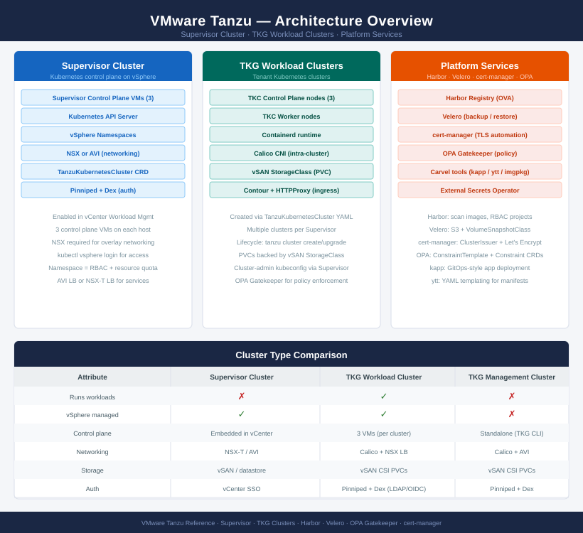

# Tanzu — Architecture

<div class="kb-summary">
VMware Tanzu provides Kubernetes-based application platform capabilities on top of vSphere, including Supervisor clusters, workload clusters, and namespace-based multi-tenancy.
</div>

```
┌───────────────────────────────────── VMware Tanzu — Architecture ─────────────────────────────────────┐
│                                                                                                       │
│   ┌───────────────────────────────────────────────────────────────────────────────────────────────┐   │
│   │  Tanzu portfolio: TKGs (Supervisor Cluster on vSphere) + TKGm (standalone management cluster) │   │
│   │     Supervisor Cluster: vSphere control plane enabling Kubernetes namespaces on ESXi hosts    │   │
│   │      Workload clusters: Tanzu Kubernetes clusters provisioned via Cluster API on vSphere      │   │
│   │       NSX-T or VDS networking: pod networking, load balancing via NSX Advanced LB (Avi)       │   │
│   │    Tanzu Mission Control: multi-cluster governance, policy, and lifecycle management plane    │   │
│   └───────────────────────────────────────────────────────────────────────────────────────────────┘   │
│                                                                                                       │
│    How-it-works defines supervisor and workload clusters · integrations connect NSX and storage · stan│
│                                                                                                       │
│                  ▼                                ▼                                ▼                  │
│                                                                                                       │
│   ┌─────────────────────────────┐  ┌─────────────────────────────┐  ┌─────────────────────────────┐   │
│   │         How It Works        │  │         Integrations        │  │       Design Standards      │   │
│   │      Supervisor cluster     │  │       NSX-T networking      │  │       Namespace sizing      │   │
│   │      Workload clusters      │  │      Avi load balancer      │  │       Cluster profiles      │   │
│   │      vSphere namespaces     │  │         vSAN storage        │  │         Image policy        │   │
│   │         Cluster API         │  │       Harbor registry       │  │        Network config       │   │
│   │        TKG node pools       │  │        TMC governance       │  │       RBAC namespaces       │   │
│   │       Control plane HA      │  │         vCenter auth        │  │        Resource quota       │   │
│   └─────────────────────────────┘  └─────────────────────────────┘  └─────────────────────────────┘   │
│                                                                                                       │
│    How-it-works covers supervisor + workload clusters · integrations connect NSX and Harbor · standard│
│                                                                                                       │
│                  ▼                                ▼                                ▼                  │
│                                                                                                       │
│   ┌───────────────────────────────────────────────────────────────────────────────────────────────┐   │
│   │   How It Works   │   Integrations   │    Design Stds    │    Deployment    │     Key Stds     │   │
│   │Supervisor cluster│  NSX-T network   │  Namespace sizing │  Single cluster  │ Namespace policy │   │
│   │Workload clusters │      Avi LB      │  Cluster profile  │ HA control plane │   Image policy   │   │
│   │vSphere namespace │   vSAN storage   │  RBAC namespaces  │  Multi-cluster   │   Quota policy   │   │
│   │   Cluster API    │ Harbor registry  │   Resource quota  │   TMC governed   │  Network config  │   │
│   └───────────────────────────────────────────────────────────────────────────────────────────────┘   │
│                                                                                                       │
│  Physical Infrastructure (the hardware everything above runs on):                                     │
│  ESXi hosts · RAM DIMMs · Network NICs · vSAN or NFS storage · NSX-T or VDS virtual switch fabric     │
│                                                                                                       │
│  Key terms:                                                                                           │
│                                                                                                       │
│  Supervisor Cluster  = vSphere control plane running Kubernetes API server on ESXi host kernel        │
│  TKGs               = Tanzu Kubernetes Grid Service; provisions workload clusters via Supervisor      │
│  TKGm               = Tanzu Kubernetes Grid multicloud; standalone management cluster on any infra    │
│  vSphere namespace   = Kubernetes namespace mapped to vSphere resource pool, storage policy, and netwo│
│  Workload cluster   = Tanzu Kubernetes cluster provisioned in a namespace via Cluster API             │
│  Cluster API        = Kubernetes-native API for declarative lifecycle management of workload clusters │
│  Node pool          = Group of identically sized worker nodes within a Tanzu Kubernetes cluster       │
│  Control plane HA   = 3 control plane nodes per cluster across ESXi hosts for Kubernetes API HA       │
│  Avi Load Balancer  = NSX Advanced LB (Avi); provides L4/L7 load balancing for Tanzu services         │
│  Harbor             = VMware container registry; private image registry integrated with Tanzu         │
│  Tanzu Mission Ctrl = SaaS management plane for multi-cluster policy, RBAC, and lifecycle governance  │
│  Resource quota     = vSphere namespace CPU, memory, storage limits enforced across all cluster worklo│
│                                                                                                       │
└───────────────────────────────────────────────────────────────────────────────────────────────────────┘
```



<div class="kb-grid kb-grid-3">
<a class="kb-card" href="how-it-works/"><strong>How It Works</strong><span>Architecture overview, topology, and how it fits in the stack.</span></a>
<a class="kb-card" href="integrations/"><strong>Integrations</strong><span>Integration with other platforms and services.</span></a>
<a class="kb-card" href="design-standards/"><strong>Design Standards</strong><span>Naming conventions, design rules, and configuration baselines.</span></a>
</div>
