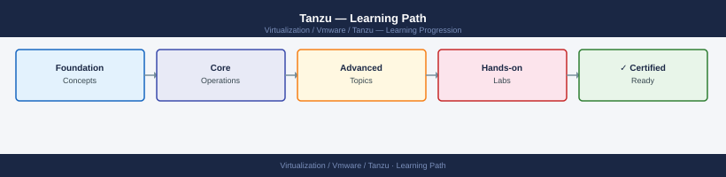

---
tags:
  - learning-path
  - tanzu
  - vmware
---
# Tanzu — Learning Path

Recommended reading order for VMware Tanzu (Kubernetes on vSphere). Follow these stages in order to build a complete mental model before working with it in production.

*Applies to: Tanzu 2.x*

## Stage 1 — Architecture
**Goal**: Understand how vSphere with Tanzu layers Kubernetes onto the vSphere control plane via the Supervisor cluster and workload namespaces.
**Read in this order**:
- [How It Works](../architecture/how-it-works/) — Supervisor cluster (control plane VMs on vSAN), vSphere Namespaces, TKG workload cluster lifecycle, and the CSI/CNS integration for persistent storage
- [Design Standards](../architecture/design-standards/) — Supervisor cluster sizing, vSphere Namespace resource limits, TKG cluster topology (single vs. multi-node control plane), and Harbor registry placement
- [Integrations](../architecture/integrations/) — NSX-T for Supervisor cluster networking (or VDS with NSX ALB), vSAN CNS for persistent volumes, Harbor for private registry, Contour for ingress, and Velero for backup

**Why first**: Tanzu's architecture couples Kubernetes lifecycle to vSphere constructs (namespaces, storage policies, NSX segments); understanding this mapping prevents resource quota and networking misconfigurations in workload clusters.

---

## Stage 2 — Deployment
**Goal**: Enable the Supervisor cluster on a vSphere cluster, create vSphere Namespaces, and provision a TKG workload cluster.
**Read**:
- [Deploy](../deploy/) — Supervisor enablement prerequisites (NSX or VDS+ALB), Supervisor cluster activation wizard, vSphere Namespace creation, and TKG workload cluster deployment via Tanzu CLI
- [Install & Upgrade](../operations/install-upgrade/) — Supervisor upgrade sequence, TKG cluster upgrade (control plane then workers), Harbor upgrade, and Velero version compatibility matrix

**Why second**: Supervisor enablement is a one-time, cluster-wide operation that requires NSX segments and vSAN storage policies to be pre-configured; retrofitting these after enablement is disruptive.

---

## Stage 3 — Operations
**Goal**: Manage TKG cluster lifecycle, persistent storage, registry operations, and workload backup as routine tasks.
**Read in this order**:
- [Health Checks](../operations/health-checks/) — run the routine first on every shift
- [CLI Reference](../operations/cli-reference/) — kubectl, tanzu CLI, and govc commands for Supervisor status, TKG cluster management, namespace quota queries, and CNS volume inspection
- [Procedures](../operations/procedures/) — TKG cluster scale-out, node machine image update, Harbor project and robot account management, Contour ingress configuration, and Velero backup schedule setup
- [Backup & Restore](../operations/backup-restore/) — Velero backup scope (namespaces, PVs via CSI snapshots), restore workflow, and Supervisor etcd backup procedure
- [Scripts](../operations/scripts/) — Tanzu CLI and kubectl scripts for cluster health aggregation, PV usage reporting, and image vulnerability scan automation via Harbor API

**Why third**: TKG cluster operations depend on a healthy Supervisor and correctly configured vSphere Namespace resource limits; operating without understanding those boundaries causes unpredictable scheduling failures.

---

## Stage 4 — Security
**Goal**: Enforce namespace-scoped RBAC, secure the Harbor registry, and protect cluster API endpoints from unauthorised access.
**Read**:
- [Access Control](../security/access-control/) — vSphere Namespace permissions mapped to Kubernetes RBAC, Harbor project membership and robot account scoping, and Tanzu Mission Control integration for policy enforcement
- [Authentication](../security/authentication/) — vCenter SSO as Kubernetes identity provider, kubeconfig token lifecycle, and Harbor LDAP/OIDC integration
- [Encryption](../security/encryption/) — vSAN encryption for persistent volumes, TLS for Harbor and Contour ingress, and etcd encryption at rest on Supervisor
- [Hardening](../security/hardening/) — Pod Security Admission policies, network policy enforcement via NSX-T, Harbor content trust and image signing, and disabling direct SSH to Supervisor control plane VMs

**Why fourth**: Namespace RBAC and network policies must be validated in a non-production TKG cluster before workloads are onboarded; misconfigurations silently allow lateral movement between namespaces.

---

## Stage 5 — Troubleshooting
**Goal**: Diagnose TKG cluster provisioning failures, CSI volume attach errors, and Supervisor control plane degradation.
**Read**:
- [Common Issues](../troubleshooting/common-issues/) — TKG cluster stuck in provisioning, PV mount failures (CNS/CSI), Harbor push/pull errors, Contour 503s, and Supervisor API server unreachable
- [Diagnostics](../troubleshooting/diagnostics/) — Supervisor control plane VM SSH diagnostics, TKG cluster machine event inspection, CNS volume query via govc, and Harbor log bundle collection
- [Escalation](../troubleshooting/escalation/) — GSS data requirements for Tanzu SRs, log bundle collection procedure (vc-support, TKG diagnostics), and SR classification for control plane failures

**Why last**: Troubleshooting makes most sense once you know the normal operating state.

---

## See also

- [Tanzu — Deploy](../deploy/)
- [Tanzu — Procedures](../operations/procedures/)
- [Tanzu — Common Issues](../troubleshooting/common-issues/)
