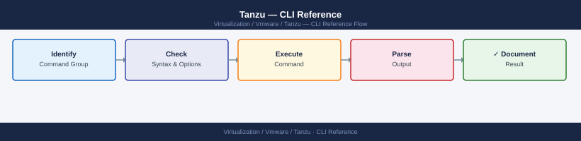

---
tags:
  - operations
  - tanzu
  - vmware
---
# Tanzu — CLI Reference

<div class="kb-summary">
CLI Reference reference covering tanzu CLI, Tanzu Cluster Operations, kubectl for Supervisor (vSphere with Tanzu), kubectl Workload Cluster Operations, Carvel Tools (used by Tanzu) and 2 more sections.

*Applies to: Tanzu 3.x*
</div>


---

## Before you begin

- **Access:** vCenter read-only minimum; Administrator role for remediation steps
- **Timing:** safe to run during business hours unless a step is marked ⚠ (causes interruption)
- **Dependencies:** no active upgrades or migrations on the same infrastructure
- **Logging:** capture command output — paste into the change record on completion

---

## tanzu CLI

```bash
# Install tanzu CLI (Linux)
curl -sL https://github.com/vmware-tanzu/tanzu-framework/releases/download/v<version>/tanzu-linux-amd64.tar.gz | tar xz
sudo install tanzu /usr/local/bin/tanzu

# Install required plugins
tanzu plugin sync

# Check version
tanzu version
tanzu plugin list
```


```text title="Expected output"
tanzu version v1.6.1
buildDate: 2024-01-15
sha: a1b2c3d4e5f6g7h8i9j0k1l2m3n4o5p6
gitCommit: abc123def456ghi789jkl012mno345pqr

Checking for required plugins...
Installing plugin 'cluster' (v1.6.1)...
Installing plugin 'management-cluster' (v1.6.1)...
Installing plugin 'package' (v1.6.1)...
Installing plugin 'secret' (v1.6.1)...
Plugins synced successfully

NAME                    DESCRIPTION                             SCOPE       DISCOVERY  STATUS
cluster                 Kubernetes cluster operations            Standalone  default    installed
management-cluster      Manage Tanzu management clusters         Standalone  default    installed
package                 Tanzu package management                 Standalone  default    installed
secret                  Manage secrets for Tanzu                 Standalone  default    installed
```

!!! warning "Common errors"
    **`curl: (22) HTTP error 404 Not Found`** — Verify the correct version number exists on the GitHub releases page and update the URL accordingly.
    **`sudo: install: command not found`** — Install coreutils package with `sudo apt-get install coreutils` (Debian/Ubuntu) or `sudo yum install coreutils` (RHEL/CentOS).
    **`Error: failed to sync plugins: unable to connect to discovery source`** — Ensure internet connectivity and that GitHub is accessible, or configure an offline plugin repository if air-gapped.
---

## Tanzu Cluster Operations

```bash
# List management clusters
tanzu management-cluster get

# Create a workload cluster (from cluster config YAML)
tanzu cluster create my-workload-cluster --file cluster-config.yaml

# List workload clusters
tanzu cluster list --include-management-cluster

# Get cluster details
tanzu cluster get my-workload-cluster

# Get kubeconfig for a workload cluster
tanzu cluster kubeconfig get my-workload-cluster --admin
# Writes kubeconfig to ~/.kube/config (or merge with KUBECONFIG env var)

# Scale worker nodes
tanzu cluster scale my-workload-cluster --worker-machine-count 5

# Upgrade a workload cluster
tanzu cluster upgrade my-workload-cluster

# Delete a workload cluster
tanzu cluster delete my-workload-cluster --yes
```


```text title="Expected output"
NAME                    STATUS   ROLES                  KUBERNETES VERSION
tkg-mgmt-cluster-prod   running  control-plane,worker   v1.27.5

Validating configuration...
Creating workload cluster 'my-workload-cluster'...
Waiting for cluster to be ready (this may take 10-15 minutes)...
Cluster created successfully with UUID: a7f3c2e1-9b4d-47e2-8c1a-5d6f9e2b3c4a

NAME                      STATUS   ROLES                  KUBERNETES VERSION
my-workload-cluster       running  control-plane,worker   v1.27.5
tkg-mgmt-cluster-prod     running  control-plane,worker   v1.27.5

NAME                    NAMESPACE      STATUS   KUBERNETES VERSION   ROLES
my-workload-cluster     tkg-system     running  v1.27.5              control-plane,worker

Retrieving kubeconfig for cluster 'my-workload-cluster'...
Kubeconfig written to /home/admin/.kube/config

Scaling worker nodes to 5...
Cluster 'my-workload-cluster' scaled successfully.
Current worker node count: 5

Checking for available upgrades...
Upgrading cluster to v1.27.6...
Upgrade in progress. This may take 15-20 minutes...
Cluster upgraded successfully.

Deleting cluster 'my-workload-cluster'...
Cluster deletion initiated. UUID: a7f3c2e1-9b4d-47e2-8c1a-5d6f9e2b3c4a
```

!!! warning "Common errors"
    **`Error: cluster-config.yaml: no such file or directory`** — Verify the YAML file path is correct and exists in the current working directory before running `tanzu cluster create`.
    **`Error: cluster 'my-workload-cluster' not found`** — Ensure the cluster name matches exactly (case-sensitive) and the cluster has finished provisioning by checking `tanzu cluster list` first.
    **`Error: unable to write kubeconfig: permission denied`** — Run `mkdir -p ~/.kube` and ensure write permissions on the ~/.kube directory, or set KUBECONFIG to a writable path.
---

## kubectl for Supervisor (vSphere with Tanzu)

```bash
# Login to Supervisor cluster
kubectl vsphere login \
  --server https://supervisor.example.local \
  --username administrator@vsphere.local \
  --vsphere-username administrator@vsphere.local \
  --insecure-skip-tls-verify

# List Supervisor namespaces (vSphere Namespaces)
kubectl get namespaces

# Switch context to a Supervisor namespace
kubectl config use-context <namespace>

# List TanzuKubernetesCluster objects in a Supervisor namespace
kubectl get tanzukubernetescluster -n <namespace>

# Deploy a TKG cluster via CRD
kubectl apply -f tkc-cluster.yaml
```


```text title="Expected output"
Logged in successfully to https://supervisor.example.local
You have access to the following contexts:
   supervisor.example.local
   supervisor.example.local/administrator@vsphere.local

The current context is now "supervisor.example.local"

NAME                     STATUS   AGE
default                  Active   45d
tkc-prod                 Active   32d
tkc-staging              Active   28d
tkc-dev                  Active   15d

Switched to context "supervisor.example.local/tkc-prod"

NAME                     STATUS   READY   AGE   VERSION
tkg-cluster-prod-01      Ready    3/3     42d   v1.27.5
tkg-cluster-prod-02      Ready    3/3     38d   v1.27.5
tkg-cluster-staging-01   Updating 2/3     8d    v1.28.1

tanzukubernetescluster.run.tanzu.vmware.com/tkg-prod-03 created
```

!!! warning "Common errors"
    **`error: You must be logged in to the cluster (Unauthorized)`** — Run `kubectl vsphere login` with correct `--server` URL and valid vSphere credentials.
    **`error: Unable to connect to the server: dial tcp: lookup supervisor.example.local on [IP]: no such host`** — Verify the Supervisor cluster FQDN is resolvable and accessible from your network; check DNS or add an entry to `/etc/hosts`.
    **`error: the server has asked for the client to provide credentials`** — Add `--insecure-skip-tls-verify` flag or ensure your vCenter's SSL certificate is trusted by your system's certificate store.
---

## kubectl Workload Cluster Operations

```bash
# Switch context to a workload cluster
kubectl config use-context <workload-cluster-context>

# Get cluster nodes and status
kubectl get nodes -o wide

# Get all pods across all namespaces
kubectl get pods -A

# Check node resource usage (requires metrics-server)
kubectl top nodes
kubectl top pods -A

# Get events sorted by timestamp (useful for debugging)
kubectl get events -A --sort-by='.lastTimestamp'

# Drain a node for maintenance
kubectl drain <node-name> --ignore-daemonsets --delete-emptydir-data

# Uncordon after maintenance
kubectl uncordon <node-name>
```


```text title="Expected output"
Switched to context "wdc-prod-01".
NAME                           STATUS   ROLES           AGE     VERSION            INTERNAL-IP      EXTERNAL-IP   OS-IMAGE
wdc-prod-01-control-plane-1    Ready    control-plane   45d     v1.27.8+vmware.1   10.20.15.42      <none>        VMware Photon OS/Linux
wdc-prod-01-worker-node-1      Ready    <none>          45d     v1.27.8+vmware.1   10.20.15.43      <none>        VMware Photon OS/Linux
wdc-prod-01-worker-node-2      Ready    <none>          44d     v1.27.8+vmware.1   10.20.15.44      <none>        VMware Photon OS/Linux
wdc-prod-01-worker-node-3      Ready    <none>          42d     v1.27.8+vmware.1   10.20.15.45      <none>        VMware Photon OS/Linux

NAMESPACE            NAME                                    READY   STATUS    RESTARTS   AGE
kube-system          coredns-558bd4d5db-2kxvf               1/1     Running   2          45d
kube-system          etcd-wdc-prod-01-control-plane-1       1/1     Running   1          45d
kube-system          kube-apiserver-wdc-prod-01-cp-1        1/1     Running   3          45d
tanzu-system-auth   dex-5f7c8b9d2-lmn4p                     1/1     Running   0          12d
tanzu-system-auth   pinniped-post-deploy-job-abc123         0/1     Completed 0          12d
...

NAME                           CPU(m)   MEMORY(Mi)
wdc-prod-01-control-plane-1    487      2156
wdc-prod-01-worker-node-1      234      1842
wdc-prod-01-worker-node-2      156      1623
wdc-prod-01-worker-node-3      89       1401

NAME                                    CPU(m)   MEMORY(Mi)   NODE
coredns-558bd4d5db-2kxvf               12       45           wdc-prod-01-control-plane-1
kube-apiserver-wdc-prod-01-cp-1        156      512          wdc-prod-01-control-plane-1
etcd-wdc-prod-01-control-plane-1       78       234          wdc-prod-01-control-plane-1
...

NAMESPACE     LAST SEEN   TYPE      REASON                  OBJECT
kube-system   2m          Normal    NodeHasSufficientDisk   node/wdc-prod-01-worker-node-2
kube-system   5m          Warning   MemoryPressure          node/wdc-prod-01-worker-node-1
kube-system   8m          Normal    NodeReady               node/wdc-prod-01-worker-node-3

node/wdc-prod-01-worker-node-1 cordoned
evicting pod kube-system/calico
```
---

## Carvel Tools (used by Tanzu)

```bash
# kapp — deploy and track application resources
kapp deploy -a my-app -f ./manifests/ --yes
kapp list
kapp delete -a my-app --yes

# ytt — YAML templating
ytt -f values.yaml -f config/ > rendered.yaml

# imgpkg — package and relocate container images
imgpkg push -b harbor.example.local/tanzu/my-bundle:v1.0 -f ./bundle/
imgpkg pull -b harbor.example.local/tanzu/my-bundle:v1.0 -o ./output/

# vendir — sync external content
vendir sync
```


```text title="Expected output"
Target cluster 'https://10.20.30.40:6443' (ns: default)
Changes
Create ServiceAccount/my-app
Create Deployment/my-app
Create Service/my-app
Create ConfigMap/my-app-config
5 resources added, 0 resources updated, 0 resources deleted

Apps in namespace 'default':
Name     Namespaces  Statuses       Ages  
my-app   default     Reconcile ok   2s   

Target cluster 'https://10.20.30.40:6443' (ns: default)
Changes
Delete ServiceAccount/my-app
Delete Deployment/my-app
Delete Service/my-app
Delete ConfigMap/my-app-config
5 resources deleted

Rendering ytt templates...
  config/values.yaml
  config/deployment.yaml
  config/service.yaml
Rendered 3 files to rendered.yaml

Pushing bundle 'harbor.example.local/tanzu/my-bundle:v1.0'...
Pushed 12 image layers (847.3 MB total)
Pushed bundle successfully

Pulling bundle 'harbor.example.local/tanzu/my-bundle:v1.0'...
Pulled 12 image layers (847.3 MB total)
Extracted to ./output/

Syncing vendir directories...
  config/upstream/ (git)
  vendor/charts/ (helm)
Synced 2 directories successfully
```

!!! warning "Common errors"
    **`Error: kapp: Error: Unauthorized (401). Unauthorized`** — Verify kubeconfig is set correctly with `export KUBECONFIG=/path/to/config` and cluster credentials are valid.
    **`Error: imgpkg: Error: Pushing image layer: UNAUTHORIZED: authentication required`** — Authenticate to the container registry with `docker login harbor.example.local` before pushing.
    **`Error: vendir: Error: Syncing 'config/upstream': git clone failed: repository not found`** — Verify the git repository URL in `vendir.yml` is correct and accessible from the cluster network.
---

## Harbor CLI

```bash
# Push an image to Harbor
docker login harbor.example.local -u admin -p <password>
docker tag myapp:v1.0 harbor.example.local/myproject/myapp:v1.0
docker push harbor.example.local/myproject/myapp:v1.0

# Pull an image
docker pull harbor.example.local/myproject/myapp:v1.0

# Harbor API — list projects
curl -sk -u admin:<password> \
  "https://harbor.example.local/api/v2.0/projects" | python3 -m json.tool

# Harbor API — list repositories in a project
curl -sk -u admin:<password> \
  "https://harbor.example.local/api/v2.0/projects/myproject/repositories" | python3 -m json.tool
```


```text title="Expected output"
Login Succeeded
v1.0: digest: sha256:a1b2c3d4e5f6g7h8i9j0k1l2m3n4o5p6q7r8s9t0 size: 2048
The push refers to repository [harbor.example.local/myproject/myapp]
v1.0: digest: sha256:a1b2c3d4e5f6g7h8i9j0k1l2m3n4o5p6q7r8s9t0 size: 2048
Pulling from myproject/myapp
Digest: sha256:a1b2c3d4e5f6g7h8i9j0k1l2m3n4o5p6q7r8s9t0
Status: Downloaded newer image for harbor.example.local/myproject/myapp:v1.0
[
  {
    "project_id": 1,
    "name": "myproject",
    "registry_id": 0,
    "creation_time": "2024-01-15T10:23:45.123456Z",
    "update_time": "2024-01-15T10:23:45.123456Z"
  },
  {
    "project_id": 2,
    "name": "library",
    "registry_id": 0,
    "creation_time": "2024-01-10T08:12:30.654321Z",
    "update_time": "2024-01-10T08:12:30.654321Z"
  }
]
[
  {
    "id": 5,
    "project_id": 1,
    "name": "myapp",
    "description": "",
    "artifact_count": 3,
    "creation_time": "2024-01-15T10:24:12.789012Z",
    "update_time": "2024-01-15T10:24:12.789012Z"
  }
]
```

!!! warning "Common errors"
    **`Error response from daemon: Get "https://harbor.example.local/v2/": x509: certificate signed by unknown authority`** — Add `--insecure-registry harbor.example.local` to Docker daemon config or use a valid CA-signed certificate for Harbor.
    **`401 Unauthorized`** — Verify the admin password is correct and the user has API access permissions in Harbor.
    **`Error response from daemon: pull access denied for harbor.example.local/myproject/myapp, repository does not exist or may require 'docker login'`** — Ensure the image was successfully pushed and the project/repository name matches exactly (case-sensitive).
---

## Velero CLI (Backup)

```bash
# List backups
velero backup get

# Create on-demand backup
velero backup create my-backup --include-namespaces production

# List restores
velero restore get

# Restore from backup
velero restore create --from-backup my-backup

# Check Velero status
velero version
kubectl get pods -n velero
```


```text title="Expected output"
NAME        STATUS      ERRORS   WARNINGS   CREATED                         EXPIRES   STORAGE LOCATION   SELECTOR
my-backup   Completed   0        0          2024-01-15T10:23:45Z            29d       default            <none>
daily-jan14 Completed   0        0          2024-01-14T02:00:12Z            28d       default            <none>
weekly-jan08 Completed   0        2          2024-01-08T23:15:33Z            22d       default            <none>

Backup request "my-backup" submitted successfully.
Watch progress by running `velero backup logs my-backup -f`

NAME                                    BACKUP      STATUS      STARTED                         COMPLETED   ERRORS   WARNINGS
my-backup-20240115-102345              my-backup   Completed   2024-01-15T10:23:50Z            2024-01-15T10:28:12Z   0        0

Restore request "my-backup-20240115-102345" submitted successfully.
Watch progress by running `velero restore logs my-backup-20240115-102345 -f`

Client:
	Version: v1.12.1
	Git commit: a1b2c3d4e5f6g7h8
Server:
	Version: v1.12.1
	Git commit: a1b2c3d4e5f6g7h8

NAME                                    READY   STATUS    RESTARTS   AGE
velero-7d4f8c9b2e1a6-9k8xm              1/1     Running   0          42d
velero-restic-4m2n9p-8l5kj              1/1     Running   0          42d
velero-restic-7x3q2r-9m6lk              1/1     Running   0          42d
```

!!! warning "Common errors"
    **`Error: backup storage location is not available`** — Verify the S3/storage backend is accessible and credentials are configured with `velero backup-location get`.
    **`Error: namespace "production" not found`** — Ensure the namespace exists on the cluster before creating the backup, or remove the `--include-namespaces` flag to back up all namespaces.
    **`error: the server doesn't have a resource type "backups"`** — Install or reinstall Velero CRDs with `velero install` or `kubectl apply -f velero-crds.yaml`.
---

## See also

- [Tanzu — Procedures](../procedures/)
- [Tanzu — Scripts](../scripts/)
- [Tanzu — Health Checks](../health-checks/)

## Verify

- **Alarms:** vSphere Client → Home → Alarms — no new critical alarms after the operation
- **Events:** monitor the vCenter Events view for the affected object for 5 minutes
- **Health check:** run the morning health-check sequence for the affected product tier
