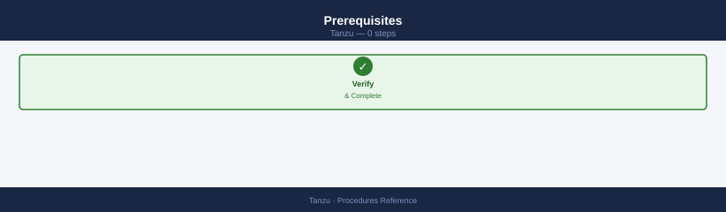
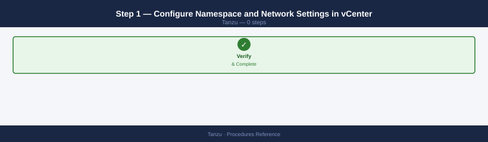
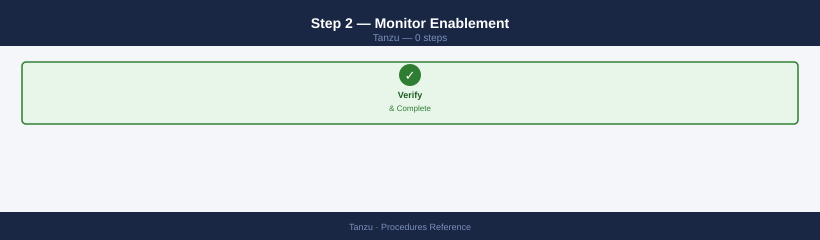
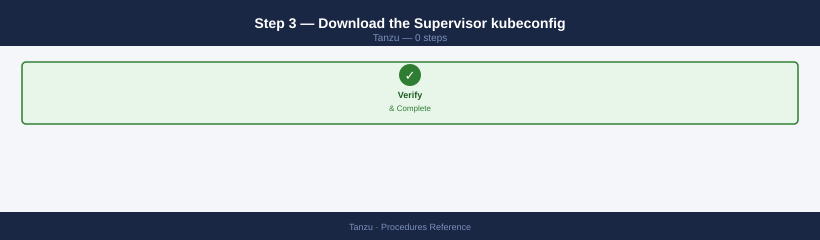
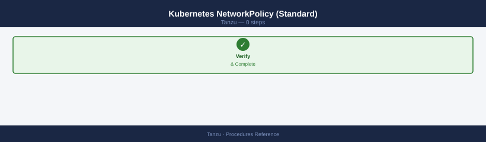
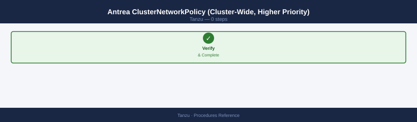
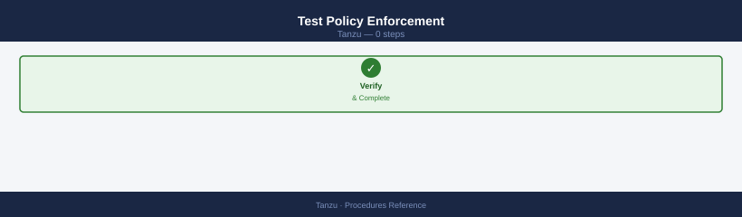
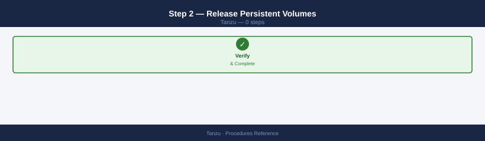
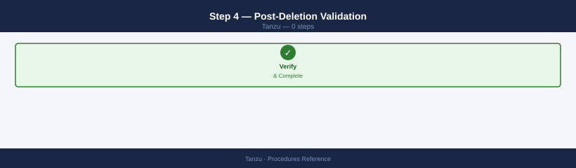

---
tags:
  - operations
  - tanzu
  - vmware
---
# Tanzu — Procedures


<div class="kb-summary">
TKG and Tanzu operations — namespace and workload cluster lifecycle, RBAC, Harbor project configuration, Helm deployments, Ingress setup, node scaling, cluster upgrade, Velero backup/restore, and persistent storage via vSAN CNS.

*Applies to: Tanzu 3.x*
</div>


---

```d2
direction: right

hub: "Tanzu\nOperations" {shape: hexagon}
create_a_vsphere_namespace: "Create a vSphere Namespace" {shape: rectangle}
deploy_a_tkg_workload_cluster_in_a_n: "Deploy a TKG Workload Cluster in a Namespace" {shape: rectangle}
grant_namespace_access_to_a_team: "Grant Namespace Access to a Team" {shape: rectangle}
configure_harbor_project_with_vulner: "Configure Harbor Project with Vulnerability Scanning" {shape: rectangle}
configure_pullthrough_cache_in_harbo: "Configure Pull-Through Cache in Harbor" {shape: rectangle}
deploy_application_via_helm: "Deploy Application via Helm" {shape: rectangle}

hub -> create_a_vsphere_namespace
hub -> deploy_a_tkg_workload_cluster_in_a_n
hub -> grant_namespace_access_to_a_team
hub -> configure_harbor_project_with_vulner
hub -> configure_pullthrough_cache_in_harbo
hub -> deploy_application_via_helm
```

## Before you begin

- **Access:** vCenter read-only minimum; Administrator role for remediation steps
- **Timing:** safe to run during business hours unless a step is marked ⚠ (causes interruption)
- **Dependencies:** no active upgrades or migrations on the same infrastructure
- **Logging:** capture command output — paste into the change record on completion

---

## Create a vSphere Namespace

```yaml
vCenter → Workload Management → Namespaces → Create Namespace
  Cluster: select Supervisor cluster
  Name: team-alpha
  Description: Application namespace for Team Alpha

OR via kubectl:
```

```bash
kubectl vsphere login --server https://supervisor.example.local \
  --username administrator@vsphere.local --insecure-skip-tls-verify

# Create namespace (vSphere Namespace via YAML on Supervisor)
kubectl apply -f - <<EOF
apiVersion: v1
kind: Namespace
metadata:
  name: team-alpha
EOF
```

Configure namespace in vCenter UI:
- Storage: assign storage policy
- VM Class: assign allowed VM classes for TKG clusters
- Resource Limits: CPU, memory, storage quotas

---

## Deploy a TKG Workload Cluster in a Namespace

```bash
# Switch to Supervisor namespace context
kubectl config use-context team-alpha

# Apply TanzuKubernetesCluster manifest
kubectl apply -f - <<EOF
apiVersion: run.tanzu.vmware.com/v1alpha3
kind: TanzuKubernetesCluster
metadata:
  name: team-alpha-cluster
  namespace: team-alpha
spec:
  topology:
    controlPlane:
      replicas: 3
      vmClass: best-effort-medium
      storageClass: vsan-default
    nodePools:
    - name: worker-pool
      replicas: 3
      vmClass: best-effort-large
      storageClass: vsan-default
  distribution:
    version: v1.26.5
EOF

# Watch cluster provisioning
kubectl get tanzukubernetescluster -n team-alpha -w
```

---

## Grant Namespace Access to a Team

```bash
# Get kubeconfig for the workload cluster
kubectl vsphere login --server https://supervisor.example.local \
  --username administrator@vsphere.local \
  --tanzu-kubernetes-cluster-name team-alpha-cluster \
  --tanzu-kubernetes-cluster-namespace team-alpha

# Switch to workload cluster context
kubectl config use-context team-alpha-cluster

# Create RBAC for team
kubectl apply -f - <<EOF
apiVersion: rbac.authorization.k8s.io/v1
kind: RoleBinding
metadata:
  name: team-alpha-developers
  namespace: default
roleRef:
  apiGroup: rbac.authorization.k8s.io
  kind: ClusterRole
  name: edit
subjects:
- kind: Group
  name: team-alpha-devs  # OIDC group from Pinniped
  apiGroup: rbac.authorization.k8s.io
EOF
```

---

## Configure Harbor Project with Vulnerability Scanning

```bash
# Create project via Harbor API
curl -sk -X POST "https://harbor.example.local/api/v2.0/projects" \
  -u admin:<password> \
  -H "Content-Type: application/json" \
  -d '{
    "project_name": "team-alpha",
    "public": false,
    "metadata": {
      "auto_scan": "true",
      "prevent_vul": "true",
      "severity": "high"
    }
  }'

# Create user membership in project
curl -sk -X POST "https://harbor.example.local/api/v2.0/projects/team-alpha/members" \
  -u admin:<password> \
  -H "Content-Type: application/json" \
  -d '{
    "role_id": 2,
    "member_group": {"group_name": "team-alpha-devs", "group_type": 1}
  }'
```

---

## Configure Pull-Through Cache in Harbor

```yaml
Harbor UI → Administration → Registries → New Endpoint
  Provider: Docker Hub
  Name: docker-hub-proxy
  URL: https://hub.docker.com
  Verify SSL: Yes

Projects → New Project
  Name: dockerhub-cache
  Access Level: Public (or Private if restricting)
  Enable: Pull-through cache → Docker Hub endpoint
```

Configure nodes to pull from Harbor instead of Docker Hub directly by setting imagePullPolicy and image names to use `harbor.example.local/dockerhub-cache/` prefix.

---

## Deploy Application via Helm

```bash
kubectl config use-context team-alpha-cluster

# Add Helm repo
helm repo add bitnami https://charts.bitnami.com/bitnami
helm repo update

# Deploy with values override
helm install my-postgres bitnami/postgresql \
  --namespace production \
  --create-namespace \
  --set auth.postgresPassword=<password> \
  --set primary.persistence.storageClass=vsan-default \
  --set primary.persistence.size=50Gi

# Verify
helm list -n production
kubectl get pods -n production
```

---

## Configure Ingress (Contour / HTTPProxy)

```bash
# Create HTTPProxy for an application
kubectl apply -f - <<EOF
apiVersion: projectcontour.io/v1
kind: HTTPProxy
metadata:
  name: myapp
  namespace: production
spec:
  virtualhost:
    fqdn: myapp.example.local
    tls:
      secretName: myapp-tls  # cert-manager managed TLS secret
  routes:
  - services:
    - name: myapp-svc
      port: 80
EOF
```

---

## Scale Worker Nodes

```bash
# For vSphere with Tanzu (TanzuKubernetesCluster):
kubectl edit tanzukubernetescluster team-alpha-cluster -n team-alpha
# Change: spec.topology.nodePools[0].replicas: 5 → 7

# For standalone TKG:
tanzu cluster scale team-alpha-cluster --worker-machine-count 7
```

---

## Rotate Cluster Kubeconfig

```bash
# Get fresh kubeconfig for a TKG cluster
tanzu cluster kubeconfig get my-cluster --admin

# Or for Supervisor-managed cluster:
kubectl vsphere login --server https://supervisor.example.local \
  --username user@corp.local \
  --tanzu-kubernetes-cluster-name my-cluster \
  --tanzu-kubernetes-cluster-namespace my-namespace
```

Kubeconfigs embed a token with a limited TTL — users need to re-login after expiry.

## Upgrade a TKG Workload Cluster

Upgrading a TKG cluster updates the Kubernetes version on control plane and worker nodes.

```bash
# 1. List available Kubernetes versions in the Supervisor
kubectl get tanzukubernetesrelease

# 2. Check current cluster version
kubectl get tkc my-cluster -n my-namespace -o jsonpath='{.spec.distribution.version}'

# 3. Edit the TKC to the new version
kubectl edit tkc my-cluster -n my-namespace
# Change: spec.distribution.version: v1.27.x+vmware.y-tkg.z

# 4. Monitor the upgrade — control plane upgrades first, then workers
kubectl get tkc my-cluster -n my-namespace -w
# Phase progresses: updating → running

# 5. Verify all nodes are upgraded and Ready
kubectl --kubeconfig <cluster-kubeconfig> get nodes -o wide
# All nodes should show the new Kubernetes version

# 6. Verify system workloads are healthy
kubectl --kubeconfig <cluster-kubeconfig> get pods -n kube-system
kubectl --kubeconfig <cluster-kubeconfig> get pods -n vmware-system-csi
```

!!! warning "Do not skip Kubernetes minor versions"
    TKG upgrade validation enforces sequential minor version upgrades. Skipping a version (e.g., 1.26 → 1.28) is unsupported and will leave the cluster in a broken state that requires VMware GSS to recover. If you are multiple versions behind, plan multiple sequential upgrade windows.

One minor version at a time — do not skip versions (e.g., 1.26 → 1.27, not 1.26 → 1.28).

## Delete a TKG Workload Cluster

!!! danger "Irreversible — all cluster VMs and workloads are permanently destroyed"
    Deleting the TanzuKubernetesCluster object triggers the Supervisor to remove all control plane and worker VMs from vCenter inventory. Any workloads still running in the cluster will be terminated. Any PVCs bound to CNS volumes will be deleted. If PVs were created with `reclaimPolicy: Delete`, the underlying vSAN volumes are also deleted. Confirm all workloads are migrated and all data is backed up before proceeding.

```bash
# 1. Drain workloads off the cluster first — notify application teams
# 2. Delete the TanzuKubernetesCluster object
kubectl delete tkc my-cluster -n my-namespace

# 3. Monitor deletion — Supervisor removes VMs from vCenter
kubectl get tkc -n my-namespace -w
# Cluster moves to Deleting phase; VMs removed from vCenter inventory

# 4. Confirm namespace storage claims are released
kubectl get pvc -n my-namespace
# All PVCs should be gone; verify no orphaned volumes in vSAN

# 5. Clean up namespace if no longer needed
kubectl delete namespace my-namespace
```

Deletion is irreversible — confirm data backup and workload migration before deleting.

## Configure Resource Quotas on a Namespace

vSphere Namespaces support CPU, memory, and storage quotas enforced by the Supervisor.

```bash
# Set resource quotas via kubectl (requires Supervisor admin)
kubectl edit namespace my-namespace
# Or apply a patch:
kubectl patch namespace my-namespace --type merge -p '{
  "spec": {
    "resourceQuotas": [
      {
        "requests": {"memory": "64Gi", "cpu": "16"},
        "limits": {"memory": "128Gi", "cpu": "32"}
      }
    ],
    "storagePolicies": [
      {"policy": "vSAN Default Storage Policy", "limit": "2Ti"}
    ]
  }
}'

# View current quota usage
kubectl describe namespace my-namespace
# ResourceQuotaStatus shows used vs hard limits

# Grant namespace-scoped storage quota override (vSphere UI)
# Workload Management → Namespaces → [namespace] → Storage → Edit Limits
```

## Backup and Restore a TKG Cluster with Velero

Velero backs up Kubernetes resources and persistent volumes to object storage.

```bash
# 1. Install Velero with vSphere plugin (run once per cluster)
velero install \
  --provider aws \
  --plugins velero/velero-plugin-for-aws:v1.8.0,vspheresaas/velero-plugin-for-vsphere:v1.5.0 \
  --bucket velero-backups \
  --secret-file ./credentials-velero \
  --backup-location-config region=minio,s3ForcePathStyle=true,s3Url=http://minio.example.local:9000 \
  --use-volume-snapshots=true \
  --features=EnableCSIVolumeSnapshots

# 2. Create a backup
velero backup create my-cluster-backup \
  --include-namespaces app-namespace \
  --wait

# 3. Verify backup status
velero backup describe my-cluster-backup
velero backup logs my-cluster-backup

# 4. Restore to same or new cluster
velero restore create --from-backup my-cluster-backup \
  --include-namespaces app-namespace \
  --wait

# 5. Verify restore
velero restore describe <restore-name>
kubectl get pods -n app-namespace
kubectl get pvc -n app-namespace
```

## Troubleshoot Node NotReady

```bash
# 1. Identify NotReady node
kubectl get nodes
kubectl describe node <node-name>
# Look for: conditions, events, kubelet status

# 2. SSH to the node (via jumpbox or kubectl debug)
kubectl debug node/<node-name> -it --image=busybox

# On node:
# Check kubelet service
systemctl status kubelet
journalctl -u kubelet -n 100 --no-pager

# Check container runtime
systemctl status containerd
crictl ps

# Check disk pressure (common cause)
df -h
# If disk pressure: remove unused images
crictl rmi --prune

# 3. Check vSphere — confirm VM is powered on and has network
# Supervisor: kubectl get virtualmachine -n my-namespace
```

!!! warning "--delete-emptydir-data causes data loss for pods using emptyDir volumes"
    The `--delete-emptydir-data` flag silently deletes any data stored in emptyDir volumes on this node — including caches, temporary files, or any workload that incorrectly uses emptyDir for persistent state. Confirm no running pods rely on emptyDir before draining. This flag is only safe to use when you have confirmed all pods are stateless or all stateful pods have been rescheduled.

```bash
# 4. Force node drain and delete if unrecoverable
kubectl drain <node-name> --ignore-daemonsets --delete-emptydir-data --force
kubectl delete node <node-name>
# TKC controller will provision a replacement node automatically
```

## Configure Persistent Storage (vSAN CNS/CSI)

TKG uses the vSphere CSI driver to provision persistent volumes backed by vSAN datastores.

```bash
# 1. Verify CSI driver is running
kubectl get pods -n vmware-system-csi
# All pods should be Running

# 2. List available storage classes
kubectl get storageclass
# vSAN storage classes are provisioned by Supervisor automatically

# 3. Create a PVC using a vSAN storage class
cat <<EOF | kubectl apply -f -
apiVersion: v1
kind: PersistentVolumeClaim
metadata:
  name: app-data
  namespace: app-namespace
spec:
  accessModes: [ReadWriteOnce]
  resources:
    requests:
      storage: 50Gi
  storageClassName: wcpglobal-storage-profile
EOF

# 4. Verify PVC is bound
kubectl get pvc app-data -n app-namespace
# STATUS should be Bound; VOLUME shows the CNS volume ID

# 5. Check volume in vSAN (vCenter UI)
# vSAN → Container Volumes → confirm CNS volume listed with correct size and policy
```

---

## Enable vSphere with Tanzu on a Cluster (Supervisor)

This procedure activates the Tanzu Supervisor on a vSphere cluster, enabling it to host vSphere Namespaces and TKG workload clusters. This is the initial setup step — run once per cluster.

### Prerequisites



- vSphere 7.x+ or 8.x with Enterprise Plus license
- vSAN or an external NFS/iSCSI datastore for persistent storage
- NSX-T or VDS-based networking (NSX-T required for pod networking; VDS supported for basic workloads)
- DNS record for the Supervisor Control Plane: `supervisor.example.local → <supervisor-vip>`
- IP ranges reserved for: Supervisor Control Plane VMs (3 IPs), Ingress/Egress, Pods

### Step 1 — Configure Namespace and Network Settings in vCenter



1. vCenter → **Workload Management → Enable**
2. Select the target cluster → **Enable Workload Management**
3. In the wizard:
   - **Networking**: choose NSX-T or VDS-based networking
   - **Storage**: assign a storage policy (vSAN Default or custom) for Supervisor VMs and PVCs
   - **Load Balancer**: specify NSX ALB or HA Proxy VIP range for ingress
   - **Workload Network**: define the pod CIDR, service CIDR, and egress CIDRs (must not overlap with physical network)
   - **Control Plane Size**: Tiny/Small/Medium/Large — match to expected workload scale

4. Set the **API Server endpoint** DNS name — must resolve to the VIP from all Kubernetes clients
5. Click **Finish** — vCenter provisions three Supervisor Control Plane VMs and configures the cluster

### Step 2 — Monitor Enablement



```bash
# Monitor from vCenter → Workload Management → Supervisor
# Status progresses: Configuring → Running (typically 10–20 min)

# Or check via kubectl after the supervisor IP is reachable
kubectl get svc -n kube-system --kubeconfig <supervisor-kubeconfig>
```

### Step 3 — Download the Supervisor kubeconfig



1. vCenter → **Workload Management → Supervisors → select the supervisor → Configure → Namespace → Download kubeconfig**
2. Save as `supervisor.kubeconfig`

```bash
kubectl --kubeconfig=supervisor.kubeconfig get nodes
# Expect 3 Supervisor Control Plane nodes in Ready state
```

### Step 4 — Post-Enablement Validation


- [ ] Supervisor shows **Running** in vCenter → Workload Management
- [ ] Three Supervisor Control Plane VMs visible in vCenter (prefixed `SupervisorControlPlaneVM`)
- [ ] `kubectl get nodes` returns 3 Ready nodes
- [ ] `kubectl get ns` shows `kube-system`, `vmware-system-*` namespaces

---

## Configure Antrea Network Policy (Pod Security)

Antrea is the default CNI plugin for Tanzu workload clusters. Antrea Network Policies restrict traffic between pods and namespaces, implementing micro-segmentation at the Kubernetes layer.

### Kubernetes NetworkPolicy (Standard)



Kubernetes NetworkPolicy objects are namespace-scoped and select pods by label. They define allowed ingress and egress:

```yaml
# Allow only pods with app=backend to receive traffic from app=frontend on port 8080
apiVersion: networking.k8s.io/v1
kind: NetworkPolicy
metadata:
  name: allow-frontend-to-backend
  namespace: prod
spec:
  podSelector:
    matchLabels:
      app: backend
  ingress:
  - from:
    - podSelector:
        matchLabels:
          app: frontend
    ports:
    - protocol: TCP
      port: 8080
  policyTypes:
  - Ingress
```

```bash
kubectl apply -f network-policy.yaml
kubectl get networkpolicy -n prod
```

### Antrea ClusterNetworkPolicy (Cluster-Wide, Higher Priority)



Antrea ClusterNetworkPolicy (ACNP) applies cluster-wide and takes priority over namespace-scoped NetworkPolicy. Use for enforcing baseline security rules that namespace owners cannot override:

```yaml
# Deny all east-west traffic between namespaces unless explicitly allowed
apiVersion: crd.antrea.io/v1alpha1
kind: ClusterNetworkPolicy
metadata:
  name: deny-cross-namespace-default
spec:
  priority: 5
  appliedTo:
  - namespaceSelector: {}
  ingress:
  - action: Drop
    from:
    - namespaceSelector:
        matchExpressions:
        - key: kubernetes.io/metadata.name
          operator: NotIn
          values: ["kube-system", "vmware-system-csi"]
    # All cross-namespace traffic denied unless a lower-priority NetworkPolicy allows it
```

```bash
kubectl apply -f cluster-network-policy.yaml
kubectl get clusternetworkpolicy
```

### Test Policy Enforcement



```bash
# Verify policy is enforced: exec into the frontend pod and test connectivity
kubectl exec -n prod -it <frontend-pod> -- curl http://backend-svc:8080   # should succeed
kubectl exec -n prod -it <frontend-pod> -- curl http://database-svc:5432  # should fail if not allowed

# Antrea provides a traceflow tool for debugging policy drops
kubectl antctl traceflow -S frontend-pod -D backend-pod -n prod
```

---

## Decommission a vSphere Namespace

Decommissioning a namespace removes all TKG clusters, PVCs, and Kubernetes objects within it. This is the correct method to fully clean up a namespace and release its IP/storage allocations.

!!! danger "Deleting a namespace is permanent and removes all workloads and data within it"
    All TKG workload clusters, running pods, persistent volumes, and configuration in the namespace are deleted. There is no undo. Ensure all workloads have been migrated or decommissioned and all data backed up before proceeding.

### Step 1 — Delete TKG Workload Clusters First


Before deleting the namespace, explicitly delete all TKG clusters it contains:

```bash
# List clusters in the namespace
kubectl get tanzukubernetescluster -n <namespace>

# Delete each cluster
kubectl delete tanzukubernetescluster <cluster-name> -n <namespace>

# Wait for cluster deletion to complete (control plane VMs are deleted from vCenter)
kubectl get tanzukubernetescluster -n <namespace>
# When the namespace returns empty, clusters are gone
```

### Step 2 — Release Persistent Volumes



```bash
# List PVCs in the namespace
kubectl get pvc -n <namespace>

# Delete PVCs — this triggers vSAN CNS volume deletion
kubectl delete pvc --all -n <namespace>
```

### Step 3 — Delete the Namespace via vCenter


1. vCenter → **Workload Management → Namespaces** → select the namespace → **Delete**
2. vCenter deregisters the namespace from the Supervisor, removes network and storage allocations
3. The namespace disappears from the Supervisor's namespace list

```bash
# Or via kubectl against the Supervisor
kubectl --kubeconfig=supervisor.kubeconfig delete namespace <namespace>
```

### Step 4 — Post-Deletion Validation



- [ ] Namespace no longer appears in vCenter → Workload Management → Namespaces
- [ ] `kubectl get ns` on the Supervisor no longer lists the namespace
- [ ] vSAN datastore freed: confirm PVC backing volumes are deleted in vCenter → Storage
- [ ] DNS records for TKG cluster API endpoints removed (if manually created)
- [ ] IP addresses for the namespace's ingress and load balancer VIPs released in IPAM

---

## See also

- [Tanzu — Health Checks](health-checks/)
- [Virtualization Vmware Tanzu — Common Issues](../troubleshooting/common-issues/)
- [Tanzu — CLI Reference](cli-reference/)

## Verify

- **Alarms:** vSphere Client → Home → Alarms — no new critical alarms after the operation
- **Events:** monitor the vCenter Events view for the affected object for 5 minutes
- **Health check:** run the morning health-check sequence for the affected product tier
