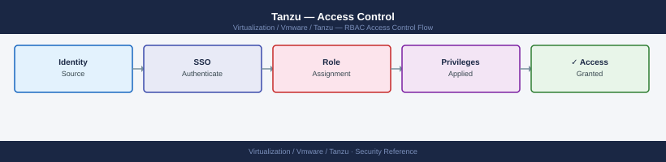

---
tags:
  - security
  - tanzu
  - vmware
---
# Tanzu — Access Control

<div class="kb-summary">
Access Control reference covering Supervisor / vSphere Namespace RBAC, Kubernetes RBAC (Workload Clusters), Harbor RBAC, Network Policy (Namespace Isolation), Pod Security Admission and 1 more sections.

*Applies to: Tanzu 3.x*
</div>


---

## Before you begin

- **Access:** vCenter Administrator role
- **Change management:** security changes require CAB approval in most environments
- **Rollback plan:** document current state before any security control change
- **Testing:** validate in a non-production environment first where possible

---

## Supervisor / vSphere Namespace RBAC

vSphere Namespaces have three access levels, assigned in vCenter:

| Permission | Capabilities |
|---|---|
| Owner | Full control — deploy/delete TKG clusters, manage all resources |
| Edit | Deploy workloads, create PVCs — cannot delete clusters |
| View | Read-only — inspect resources only |

```text
vCenter → Workload Management → Namespaces → [namespace] → Permissions → Add
  User/Group: CORP\team-alpha-owners → Owner
  User/Group: CORP\team-alpha-devs → Edit
```

---

## Kubernetes RBAC (Workload Clusters)

```yaml
# ClusterRole for ops team — full cluster access
apiVersion: rbac.authorization.k8s.io/v1
kind: ClusterRoleBinding
metadata:
  name: ops-cluster-admin
roleRef:
  apiGroup: rbac.authorization.k8s.io
  kind: ClusterRole
  name: cluster-admin
subjects:
- kind: Group
  name: cluster-ops  # OIDC group name from Pinniped
  apiGroup: rbac.authorization.k8s.io
```

```yaml
# RoleBinding for dev team — namespace-scoped edit
apiVersion: rbac.authorization.k8s.io/v1
kind: RoleBinding
metadata:
  name: dev-edit
  namespace: production
roleRef:
  apiGroup: rbac.authorization.k8s.io
  kind: ClusterRole
  name: edit
subjects:
- kind: Group
  name: team-alpha-devs
  apiGroup: rbac.authorization.k8s.io
```

```yaml
# Read-only ClusterRole for monitoring/audit teams
apiVersion: rbac.authorization.k8s.io/v1
kind: ClusterRoleBinding
metadata:
  name: readonly-audit
roleRef:
  apiGroup: rbac.authorization.k8s.io
  kind: ClusterRole
  name: view
subjects:
- kind: Group
  name: audit-team
  apiGroup: rbac.authorization.k8s.io
```

---

## Harbor RBAC

Harbor project roles:

| Role | Capabilities |
|---|---|
| Project Admin | Full project control — delete repos, manage members, edit config |
| Maintainer | Push/pull, manage tags, delete images |
| Developer | Push and pull images |
| Guest | Pull images only |
| Limited Guest | Pull images — no project visibility |

```bash
# Add LDAP group to Harbor project
curl -sk -X POST "https://harbor.example.local/api/v2.0/projects/team-alpha/members" \
  -u admin:<password> \
  -H "Content-Type: application/json" \
  -d '{
    "role_id": 2,
    "member_group": {
      "group_name": "team-alpha-devs",
      "group_type": 1
    }
  }'
# role_id: 1=Project Admin, 2=Developer, 3=Guest, 4=Maintainer
```


```text title="Expected output"
{"member_id":42,"role_id":2,"entity_name":"team-alpha-devs","entity_type":"g","entity_id":"cn=team-alpha-devs,ou=groups,dc=example,dc=com"}
```

!!! warning "Common errors"
    **`{"errors":[{"code":"UNAUTHORIZED","message":"user does not have permission to the project"}]}`** — Verify the admin account has project admin privileges or use an account with explicit project membership.
    **`{"errors":[{"code":"NOT_FOUND","message":"project team-alpha not found"}]}`** — Confirm the project name is correct and exists in Harbor; check for typos or use `curl -sk https://harbor.example.local/api/v2.0/projects -u admin:<password>` to list available projects.
    **`curl: (60) SSL certificate problem: self signed certificate`** — Add the `-k` flag to skip certificate verification (already present) or import the Harbor CA certificate into your system's trust store.
---

## Network Policy (Namespace Isolation)

Apply a default-deny policy to every namespace and explicitly allow required traffic:

```yaml
# Default deny all ingress and egress in a namespace
apiVersion: networking.k8s.io/v1
kind: NetworkPolicy
metadata:
  name: default-deny-all
  namespace: production
spec:
  podSelector: {}
  policyTypes:
  - Ingress
  - Egress
```

```yaml
# Allow ingress from ingress controller only
apiVersion: networking.k8s.io/v1
kind: NetworkPolicy
metadata:
  name: allow-ingress-controller
  namespace: production
spec:
  podSelector: {}
  ingress:
  - from:
    - namespaceSelector:
        matchLabels:
          kubernetes.io/metadata.name: projectcontour
```

---

## Pod Security Admission

Label namespaces to enforce Pod Security Standards:

```bash
# Enforce restricted mode (no privileged containers, no hostPath, etc.)
kubectl label namespace production \
  pod-security.kubernetes.io/enforce=restricted \
  pod-security.kubernetes.io/warn=restricted \
  pod-security.kubernetes.io/audit=restricted

# Baseline for less-strict namespaces
kubectl label namespace logging \
  pod-security.kubernetes.io/enforce=baseline
```


```text title="Expected output"
namespace/production labeled
namespace/logging labeled
```

!!! warning "Common errors"
    **`error: namespaces "production" does not exist`** — Verify the namespace exists with `kubectl get namespaces` and create it if needed using `kubectl create namespace production`.
    **`Error from server (Forbidden): namespaces "production" is forbidden: User "system:serviceaccount:default:deployer" cannot patch resource "namespaces" in API group "" in the namespace "production"`** — Ensure your current user or service account has RBAC permissions to patch namespaces by binding the `edit` or `admin` ClusterRole.
---

## OPA Gatekeeper Policies

```yaml
# Require resource limits on all containers
apiVersion: templates.gatekeeper.sh/v1
kind: ConstraintTemplate
metadata:
  name: requiredresourcelimits
spec:
  crd:
    spec:
      names:
        kind: RequiredResourceLimits
  targets:
  - target: admission.k8s.gatekeeper.sh
    rego: |
      package requiredresourcelimits
      violation[{"msg": msg}] {
        container := input.review.object.spec.containers[_]
        not container.resources.limits
        msg := sprintf("Container '%v' must have resource limits", [container.name])
      }
---
apiVersion: constraints.gatekeeper.sh/v1beta1
kind: RequiredResourceLimits
metadata:
  name: require-limits-all-namespaces
spec:
  match:
    kinds:
    - apiGroups: [""]
      kinds: ["Pod"]
```

## See also

- [Tanzu — Authentication](../authentication/)
- [Tanzu — Hardening](../hardening/)
