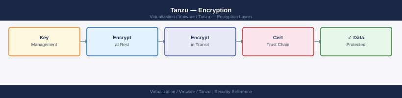

---
tags:
  - security
  - tanzu
  - vmware
---
# Tanzu — Encryption

<div class="kb-summary">
Encryption reference covering Kubernetes Secrets Encryption at Rest, TLS for All Kubernetes API Communication, vSAN Encryption for Persistent Volumes, Image Content Trust (Cosign), External Secrets (Vault Integration) and 1 more sections.

*Applies to: Tanzu 3.x*
</div>


---

## Before you begin

- **Access:** vCenter Administrator role
- **Change management:** security changes require CAB approval in most environments
- **Rollback plan:** document current state before any security control change
- **Testing:** validate in a non-production environment first where possible

---

## Kubernetes Secrets Encryption at Rest

By default, Kubernetes Secrets are stored in etcd as base64-encoded (not encrypted). Enable encryption:

```yaml
# On TKG management cluster — enable via cluster config:
ENCRYPT_CLUSTER_DATA: true

# For manual configuration, edit kube-apiserver flags:
# --encryption-provider-config=/etc/kubernetes/encryption-config.yaml

# encryption-config.yaml:
apiVersion: apiserver.config.k8s.io/v1
kind: EncryptionConfiguration
resources:
- resources:
  - secrets
  providers:
  - aescbc:
      keys:
      - name: key1
        secret: <base64-encoded-32-byte-key>
  - identity: {}
```

---

## TLS for All Kubernetes API Communication

All K8s API communication uses mTLS by default. For application-level TLS, use cert-manager:

```bash
# Install cert-manager
kubectl apply -f https://github.com/cert-manager/cert-manager/releases/download/v1.13.0/cert-manager.yaml

# Create a ClusterIssuer using a CA stored in a Secret
kubectl apply -f - <<EOF
apiVersion: cert-manager.io/v1
kind: ClusterIssuer
metadata:
  name: corp-ca-issuer
spec:
  ca:
    secretName: corp-ca-secret
EOF

# Request a certificate for an application
kubectl apply -f - <<EOF
apiVersion: cert-manager.io/v1
kind: Certificate
metadata:
  name: myapp-tls
  namespace: production
spec:
  secretName: myapp-tls
  duration: 2160h  # 90 days
  renewBefore: 360h  # 15 days
  issuerRef:
    name: corp-ca-issuer
    kind: ClusterIssuer
  dnsNames:
  - myapp.example.local
EOF
```


```text title="Expected output"
namespace/cert-manager created
serviceaccount/cert-manager created
serviceaccount/cert-manager-webhook created
serviceaccount/cert-manager-cainjector created
clusterrole.rbac.authorization.k8s.io/cert-manager created
clusterrole.rbac.authorization.k8s.io/cert-manager-webhook:dynamic-webhook-config created
clusterrolebinding.rbac.authorization.k8s.io/cert-manager created
clusterrolebinding.rbac.authorization.k8s.io/cert-manager-webhook:dynamic-webhook-config created
...
deployment.apps/cert-manager created
deployment.apps/cert-manager-webhook created
deployment.apps/cert-manager-cainjector created
clustersslissuer.cert-manager.io/corp-ca-issuer created
certificate.cert-manager.io/myapp-tls created
```

!!! warning "Common errors"
    **`error: resource mapping not found for name: "corp-ca-issuer" namespace: "" from "STDIN": no matches for kind "ClusterIssuer" in version "cert-manager.io/v1"`** — Wait 30 seconds for cert-manager CRDs to register after installation, then retry the ClusterIssuer creation.
    **`Error from server (NotFound): secrets "corp-ca-secret" not found`** — Create the CA secret first with `kubectl create secret tls corp-ca-secret --cert=ca.crt --key=ca.key -n cert-manager` before applying the ClusterIssuer.
    **`error: namespace "production" not found`** — Create the production namespace with `kubectl create namespace production` before applying the Certificate resource.
---

## vSAN Encryption for Persistent Volumes

Apply an encrypted storage policy to protect PV data at rest:

```text
vCenter → Policies and Profiles → VM Storage Policies → Create
  Policy Name: vsan-encrypted
  Component: Encryption → Enable Encryption
  (requires KMS configured in vCenter)

Create StorageClass using this policy:
```

```yaml
apiVersion: storage.k8s.io/v1
kind: StorageClass
metadata:
  name: vsan-encrypted
provisioner: csi.vsphere.volume
parameters:
  storagepolicyname: "vsan-encrypted"
```

---

## Image Content Trust (Cosign)

Sign container images in Harbor using Cosign:

```bash
# Sign an image
cosign sign --key cosign.key harbor.example.local/team-alpha/myapp:v1.0

# Verify a signature
cosign verify --key cosign.pub harbor.example.local/team-alpha/myapp:v1.0

# Policy: require signed images (OPA Gatekeeper or Kyverno)
```

```yaml
# Kyverno policy — require Cosign-signed images
apiVersion: kyverno.io/v1
kind: ClusterPolicy
metadata:
  name: require-signed-images
spec:
  validationFailureAction: Enforce
  rules:
  - name: check-image-signature
    match:
      resources:
        kinds: [Pod]
    verifyImages:
    - imageReferences: ["harbor.example.local/*"]
      attestors:
      - entries:
        - keys:
            publicKeys: |-
              -----BEGIN PUBLIC KEY-----
              <cosign-public-key>
              -----END PUBLIC KEY-----
```

---

## External Secrets (Vault Integration)

Avoid storing sensitive values in K8s Secrets — use External Secrets Operator to fetch from HashiCorp Vault:

```yaml
apiVersion: external-secrets.io/v1beta1
kind: ExternalSecret
metadata:
  name: database-credentials
  namespace: production
spec:
  refreshInterval: 1h
  secretStoreRef:
    name: vault-backend
    kind: ClusterSecretStore
  target:
    name: database-credentials
  data:
  - secretKey: password
    remoteRef:
      key: secret/production/database
      property: password
```

---

## RBAC to Restrict Secret Access

```bash
# Audit who can read secrets in a namespace
kubectl auth can-i get secrets --namespace production --as user@corp.local
kubectl auth can-i list secrets --namespace production --as user@corp.local

# Remove secret access from developer role (create custom ClusterRole)
# Do NOT give developers 'edit' ClusterRole if it includes secret access
# Use custom role excluding secrets:
kubectl create clusterrole dev-no-secrets \
  --verb=get,list,watch,create,update,patch,delete \
  --resource=deployments,services,configmaps,pods \
  --dry-run=client -o yaml
```


```text title="Expected output"
yes
no
apiVersion: rbac.authorization.k8s.io/v1
kind: ClusterRole
metadata:
  creationTimestamp: null
  name: dev-no-secrets
rules:
- apiGroups:
  - ""
  resources:
  - deployments
  - services
  - configmaps
  - pods
  verbs:
  - get
  - list
  - watch
  - create
  - update
  - patch
  - delete
```

!!! warning "Common errors"
    **`error: the server doesn't have a resource type "deployments" in group ""`** — Add `--resource-names` or use correct API group; deployments are in `apps` group, not core API.
    **`Error from server (Forbidden): clusterroles.rbac.authorization.k8s.io is forbidden: User "user@corp.local" cannot create resource "clusterroles"`** — Ensure the user running kubectl has cluster-admin or rbac.authorization.k8s.io create permissions.
## See also

- [Tanzu — Hardening](../hardening/)
- [Tanzu — Health Checks](../../operations/health-checks/)
