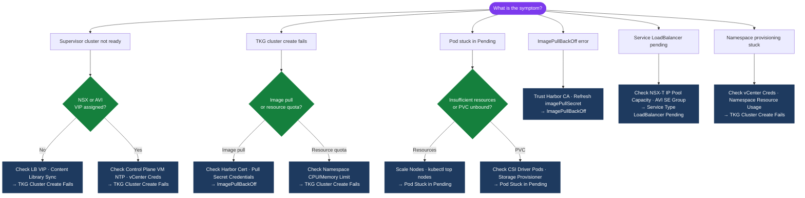

---
tags:
  - tanzu
  - troubleshooting
  - vmware
search:
  boost: 1.5
---
# Virtualization Vmware Tanzu — Common Issues

```text
┌───────────────────────────── Virtualization Vmware Tanzu — Common Issues ─────────────────────────────┐
│                                                                                                       │
│   ┌───────────────────────────────────────────────────────────────────────────────────────────────┐   │
│   │           Vmware common issues: quick-reference for frequently encountered problems           │   │
│   │         Issues: path failures, connectivity errors, capacity alerts, and auth failures        │   │
│   │         For each issue: symptoms, root cause, diagnostic steps, and resolution actions        │   │
│   │           Escalate to vendor support if the issue persists after standard procedures          │   │
│   └───────────────────────────────────────────────────────────────────────────────────────────────┘   │
│                                                                                                       │
│    Identify symptom → check logs → diagnose root cause → resolve → verify                             │
│                                                                                                       │
│                  ▼                                ▼                                ▼                  │
│                                                                                                       │
│   ┌─────────────────────────────┐  ┌─────────────────────────────┐  ┌─────────────────────────────┐   │
│   │            Layer            │  │          Component          │  │            Notes            │   │
│   │             Core            │  │       Primary service       │  │        Main function        │   │
│   │          Management         │  │        Control plane        │  │         Admin access        │   │
│   │          Monitoring         │  │         Health/perf         │  │      Alerts/dashboards      │   │
│   │           Security          │  │         Auth/encrypt        │  │        Access control       │   │
│   │         Integration         │  │        APIs/plug-ins        │  │         Third-party         │   │
│   └─────────────────────────────┘  └─────────────────────────────┘  └─────────────────────────────┘   │
│                                                                                                       │
│                          ▼                                                 ▼                          │
│                                                                                                       │
│   ┌───────────────────────────────────────────────────────────────────────────────────────────────┐   │
│   │      Layer       │    Component     │      Function     │      Notes       │       Auth       │   │
│   │       Core       │ Primary service  │   Main function   │     See docs     │       RBAC       │   │
│   │    Management    │  Control plane   │    Admin access   │     See docs     │       RBAC       │   │
│   │    Monitoring    │   Health/perf    │  Alerts/dashboard │     See docs     │       RBAC       │   │
│   │     Security     │   Auth/encrypt   │   Access control  │     See docs     │       RBAC       │   │
│   └───────────────────────────────────────────────────────────────────────────────────────────────┘   │
│                                                                                                       │
│    Physical: Virtualization Vmware Tanzu infrastructure · management network · monitoring             │
│                                                                                                       │
│    Key terms:                                                                                         │
│                                                                                                       │
│    Vmware             = Virtualization Vmware Tanzu platform overview and core concepts               │
│    Management         = management console and command-line interface for administration              │
│    Monitoring         = health and performance monitoring dashboards and alerting                     │
│    Automation         = REST API, scripting, and pipeline integration capabilities                    │
│    Security           = access control, authentication, and encryption configuration                  │
│    Backup             = backup and recovery procedures and schedule configuration                     │
│    Upgrade            = software version upgrades and firmware patching procedures                    │
│    Troubleshooting    = diagnostic procedures and common issue resolution steps                       │
│    Escalation         = vendor support escalation path and severity triage process                    │
│    Documentation      = vendor knowledge base and official product documentation                      │
│    Change management  = change ticket requirements for production modifications                       │
│    Audit log          = admin action logging for compliance and security review                       │
│                                                                                                       │
└───────────────────────────────────────────────────────────────────────────────────────────────────────┘
```
```text
   vCenter → Workload Management → Supervisor → Control Plane VMs
   SSH to a control plane VM → check timedatectl
   ```

3. **NSX-T or AVI misconfiguration**: Load balancer not assigning VIP to Supervisor
```text
   NSX-T → Load Balancing → Virtual Servers → check if VIP created for Supervisor
   ```

4. **Content Library unreachable**: TKG OVA images cannot be downloaded
   ```text
   vCenter → Content Libraries → [Tanzu library] → Sync → check sync status
   ```

---

## Diagnostic Flow



---

## Before you begin

- **Access:** SSH to vCenter Shell and ESXi hosts; vSphere Client read access
- **Gather first:** recent error message text, event timestamps, and affected object names
- **Scope:** confirm whether the issue affects a single object, host, cluster, or site
- **Escalation:** open a vendor support ticket before running any destructive step
- **Logging:** document each command and output — required if escalation is needed

---

## TKG Cluster Create Fails

**Symptoms:** `tanzu cluster create` returns error or cluster is stuck in "creating" state

1. **Image pull failure** (cannot reach Harbor or content library):
   ```bash
   tanzu cluster get my-cluster -n my-namespace
   # Shows machine status — check Machine objects:
   kubectl get machines -A
   kubectl describe machine <stuck-machine> -n <namespace>
   # Look for: image pull error, bootstrap failure
   ```

2. **vSphere credentials wrong**:
   ```bash
   # Check cluster config credentials by testing vCenter API:
   curl -sk -u "svc-tanzu@corp.local:<password>" \
     "https://vcenter.example.local/rest/com/vmware/cis/session" -X POST
   ```

3. **Insufficient resource quota in Supervisor namespace**:
   ```text
   vCenter → Workload Management → Namespaces → [namespace] → Resource Usage
   Verify: CPU/Memory not at limit
   ```

---

## Pod Stuck in Pending

**Symptoms:** Pod stays in Pending state, no events indicating scheduling

1. **Insufficient node resources**:
   ```bash
   kubectl describe pod <pod-name> -n <namespace>
   # Look for: "Insufficient cpu" or "Insufficient memory" in Events section
   kubectl top nodes
   # Add more workers or scale up node resources
   ```

2. **PVC not bound** (pod waiting for PVC to be provisioned):
   ```bash
   kubectl get pvc -n <namespace>
   # If PVC is Pending — check storage provisioner:
   kubectl describe pvc <pvc-name> -n <namespace>
   kubectl get pods -n vmware-system-csi  # CSI driver pods must be Running
   ```

3. **No nodes match pod's nodeSelector or taints**:
   ```bash
   kubectl describe pod <pod-name> -n <namespace>
   # "0/3 nodes are available: 3 node(s) had untolerated taint"
   kubectl describe nodes | grep -A5 Taints
   ```

---

## ImagePullBackOff

**Symptoms:** Pod events show `ImagePullBackOff` or `ErrImagePull`

1. **Harbor certificate not trusted**:
   ```bash
   # On node: check if harbor cert is in system trust store
   kubectl debug node/<node-name> -it --image=busybox
   # From node shell:
   curl https://harbor.example.local/v2/ -v  # Check TLS error
   ```
   Fix: add Harbor CA cert to cluster trust (cluster config: `TKG_CUSTOM_IMAGE_REPOSITORY_CA_CERTIFICATE`)

2. **Wrong imagePullSecret or credentials expired**:
   ```bash
   kubectl get secret harbor-pull-secret -n production -o yaml | base64 -d
   # Verify credentials are current
   docker login harbor.example.local -u <user> -p <password>  # Test credentials
   ```

---

## Service Type LoadBalancer Pending

**Symptoms:** Service shows `EXTERNAL-IP: <pending>` for >2 minutes

```bash
kubectl describe svc <service-name> -n <namespace>
# Events section will show: "no IPs available in NSX IP pool" or similar

# Check NSX-T load balancer IP pool capacity:
# NSX-T → Networking → Load Balancing → Virtual Servers → check IP usage
# AVI: AVI Controller → Cloud → SE Group → check IP pool capacity
```
```bash
# Check Contour pods are running:
kubectl get pods -n projectcontour

# Check HTTPProxy status:
kubectl get httpproxy -n production
kubectl describe httpproxy myapp -n production
# Look for: Conditions - Valid

# Check envoy DaemonSet (the data plane):
kubectl get pods -n projectcontour -l app=envoy

# Test: curl the Envoy service directly
kubectl get svc -n projectcontour
curl -k https://<envoy-LB-IP>/ -H "Host: myapp.example.local"
```

---

## Verify resolution

- **Alarms cleared:** Home → Alarms — the triggering alarm is no longer active
- **Event log:** confirm no new related error events in the last 5 minutes
- **Functional test:** perform the action that was failing (connect, vMotion, storage I/O) — confirm it succeeds
- **Monitor:** leave the vSphere Client open for 10 minutes and confirm the issue does not recur
