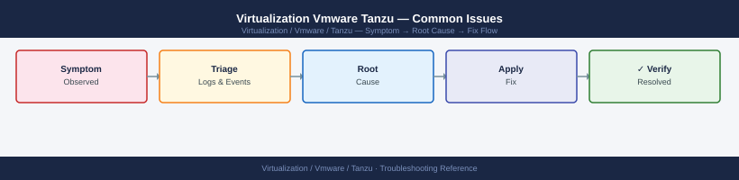

---
tags:
  - tanzu
  - troubleshooting
  - vmware
search:
  boost: 1.5
---
# Virtualization Vmware Tanzu — Common Issues

*Applies to: VMware Tanzu*


```text
   vCenter → Workload Management → Supervisor → Control Plane VMs
   SSH to a control plane VM → check timedatectl
   ```

3. **NSX-T or AVI misconfiguration**: Load balancer not assigning VIP to Supervisor
```text
   NSX-T → Load Balancing → Virtual Servers → check if VIP created for Supervisor
   ```

4. **Content Library unreachable**: TKG OVA images cannot be downloaded
   ```text
   vCenter → Content Libraries → [Tanzu library] → Sync → check sync status
   ```

---

```d2
direction: down

symptom: Identify Symptom {shape: diamond}
diagnostic_flow: "Diagnostic Flow" {shape: rectangle}
tkg_cluster_create_fails: "TKG Cluster Create Fails" {shape: rectangle}
pod_stuck_in_pending: "Pod Stuck in Pending" {shape: rectangle}
imagepullbackoff: "ImagePullBackOff" {shape: rectangle}
service_type_loadbalancer_pending: "Service Type LoadBalancer Pending" {shape: rectangle}
verify_resolution: "Verify resolution" {shape: rectangle}
resolution: Resolve or Escalate {shape: oval}

symptom -> diagnostic_flow: investigate
symptom -> tkg_cluster_create_fails: investigate
symptom -> pod_stuck_in_pending: investigate
symptom -> imagepullbackoff: investigate
symptom -> service_type_loadbalancer_pending: investigate
symptom -> verify_resolution: investigate
diagnostic_flow -> resolution
tkg_cluster_create_fails -> resolution
pod_stuck_in_pending -> resolution
imagepullbackoff -> resolution
service_type_loadbalancer_pending -> resolution
verify_resolution -> resolution
```

## Diagnostic Flow

```d2
direction: right

S: "What is the symptom?" {shape: rectangle}
B1: "Supervisor cluster not ready" {shape: rectangle}
B2: "TKG cluster create fails" {shape: rectangle}
B3: "Pod stuck in Pending" {shape: rectangle}
B4: "ImagePullBackOff error" {shape: rectangle}
B5: "Service LoadBalancer pending" {shape: rectangle}
B6: "Namespace provisioning stuck" {shape: rectangle}
D1: "D1" {shape: rectangle}
R1: "Check LB VIP · Content Library Sync\n→ TKG Cluster Create Fails" {shape: rectangle}
R2: "Check Control Plane VM NTP · vCenter Creds\n→ TKG Cluster Create Fails" {shape: rectangle}
D2: "D2" {shape: rectangle}
R3: "Check Harbor Cert · Pull Secret Credentials\n→ ImagePullBackOff" {shape: rectangle}
R4: "Check Namespace CPU/Memory Limit\n→ TKG Cluster Create Fails" {shape: rectangle}
D3: "D3" {shape: rectangle}
R5: "Scale Nodes · kubectl top nodes\n→ Pod Stuck in Pending" {shape: rectangle}
R6: "Check CSI Driver Pods · Storage Provisioner\n→ Pod Stuck in Pending" {shape: rectangle}
R7: "Trust Harbor CA · Refresh imagePullSecret\n→ ImagePullBackOff" {shape: rectangle}
R8: "Check NSX-T IP Pool Capacity · AVI SE Group\n→ Service Type LoadBalancer Pending" {shape: rectangle}
R9: "Check vCenter Creds · Namespace Resource Usage\n→ TKG Cluster Create Fails" {shape: rectangle}

S -> B1
S -> B2
S -> B3
S -> B4
S -> B5
S -> B6
D1 -> R1
D1 -> R2
D2 -> R3
D2 -> R4
D3 -> R5
D3 -> R6
B4 -> R7
B5 -> R8
B6 -> R9
```

---

## Before you begin

- **Access:** SSH to vCenter Shell and ESXi hosts; vSphere Client read access
- **Gather first:** recent error message text, event timestamps, and affected object names
- **Scope:** confirm whether the issue affects a single object, host, cluster, or site
- **Escalation:** open a vendor support ticket before running any destructive step
- **Logging:** document each command and output — required if escalation is needed

---

## TKG Cluster Create Fails

**Symptoms:** `tanzu cluster create` returns error or cluster is stuck in "creating" state

1. **Image pull failure** (cannot reach Harbor or content library):
   ```bash
   tanzu cluster get my-cluster -n my-namespace
   # Shows machine status — check Machine objects:
   kubectl get machines -A
   kubectl describe machine <stuck-machine> -n <namespace>
   # Look for: image pull error, bootstrap failure
   ```

2. **vSphere credentials wrong**:
   ```bash
   # Check cluster config credentials by testing vCenter API:
   curl -sk -u "svc-tanzu@corp.local:<password>" \
     "https://vcenter.example.local/rest/com/vmware/cis/session" -X POST
   ```

3. **Insufficient resource quota in Supervisor namespace**:
   ```text
   vCenter → Workload Management → Namespaces → [namespace] → Resource Usage
   Verify: CPU/Memory not at limit
   ```

---

## Pod Stuck in Pending

**Symptoms:** Pod stays in Pending state, no events indicating scheduling

1. **Insufficient node resources**:
   ```bash
   kubectl describe pod <pod-name> -n <namespace>
   # Look for: "Insufficient cpu" or "Insufficient memory" in Events section
   kubectl top nodes
   # Add more workers or scale up node resources
   ```

2. **PVC not bound** (pod waiting for PVC to be provisioned):
   ```bash
   kubectl get pvc -n <namespace>
   # If PVC is Pending — check storage provisioner:
   kubectl describe pvc <pvc-name> -n <namespace>
   kubectl get pods -n vmware-system-csi  # CSI driver pods must be Running
   ```

3. **No nodes match pod's nodeSelector or taints**:
   ```bash
   kubectl describe pod <pod-name> -n <namespace>
   # "0/3 nodes are available: 3 node(s) had untolerated taint"
   kubectl describe nodes | grep -A5 Taints
   ```

---

## ImagePullBackOff

**Symptoms:** Pod events show `ImagePullBackOff` or `ErrImagePull`

1. **Harbor certificate not trusted**:
   ```bash
   # On node: check if harbor cert is in system trust store
   kubectl debug node/<node-name> -it --image=busybox
   # From node shell:
   curl https://harbor.example.local/v2/ -v  # Check TLS error
   ```
   Fix: add Harbor CA cert to cluster trust (cluster config: `TKG_CUSTOM_IMAGE_REPOSITORY_CA_CERTIFICATE`)

2. **Wrong imagePullSecret or credentials expired**:
   ```bash
   kubectl get secret harbor-pull-secret -n production -o yaml | base64 -d
   # Verify credentials are current
   docker login harbor.example.local -u <user> -p <password>  # Test credentials
   ```

---

## Service Type LoadBalancer Pending

**Symptoms:** Service shows `EXTERNAL-IP: <pending>` for >2 minutes

```bash
kubectl describe svc <service-name> -n <namespace>
# Events section will show: "no IPs available in NSX IP pool" or similar

# Check NSX-T load balancer IP pool capacity:
# NSX-T → Networking → Load Balancing → Virtual Servers → check IP usage
# AVI: AVI Controller → Cloud → SE Group → check IP pool capacity
```

```text title="Expected output"
Name:                     my-app-service
Namespace:                tanzu-system
Labels:                   app=my-app
Annotations:              <none>
Selector:                 app=my-app
Type:                     LoadBalancer
IP:                       10.0.1.50
LoadBalancer Ingress:     pending
Port:                     http  80/TCP
TargetPort:               8080/TCP
NodePort:                 31245/TCP
Endpoints:                10.20.1.10:8080,10.20.1.11:8080
Session Affinity:         None
External Traffic Policy:  Cluster
Events:
  Type     Reason                 Age    From                Message
  ----     ------                 ----   ----                -------
  Warning  SyncLoadBalancerFailed 2m15s  service-controller  Error syncing load balancer: failed to ensure load balancer: no IPs available in NSX IP pool 'TKG-LB-Pool'
  Warning  UnAvailableLoadBalancer 1m30s service-controller  There are no available nodes for LoadBalancer
```

!!! warning "Common errors"
    **`Error syncing load balancer: failed to ensure load balancer: no IPs available in NSX IP pool`** — Expand the NSX-T IP pool size or release unused LoadBalancer service IPs by deleting idle services.
    **`There are no available nodes for LoadBalancer`** — Verify worker nodes are in Ready state with `kubectl get nodes` and check NSX segment connectivity to those nodes.
```bash
# Check Contour pods are running:
kubectl get pods -n projectcontour

# Check HTTPProxy status:
kubectl get httpproxy -n production
kubectl describe httpproxy myapp -n production
# Look for: Conditions - Valid

# Check envoy DaemonSet (the data plane):
kubectl get pods -n projectcontour -l app=envoy

# Test: curl the Envoy service directly
kubectl get svc -n projectcontour
curl -k https://<envoy-LB-IP>/ -H "Host: myapp.example.local"
```


```text title="Expected output"
NAME                      READY   STATUS    RESTARTS   AGE
contour-5d8f4c9b7-2kx9m   1/1     Running   0          3d
contour-5d8f4c9b7-7pqrs   1/1     Running   0          3d
envoy-ds-9m4k2            1/1     Running   0          2d
envoy-ds-b7x3n            1/1     Running   0          2d
envoy-ds-c5k8p            1/1     Running   0          2d

NAME                    FQDN                      TLS SECRET      STATUS     STATUS DESCRIPTION
myapp                   myapp.example.local       myapp-tls       valid      
another-app             api.example.local         api-tls         valid      

Name:         myapp
Namespace:    production
Status:       valid
Conditions:
  Type    Status  Reason
  ----    ------  ------
  Valid   True    ValidHTTPProxyFound

NAME                      READY   STATUS    RESTARTS   AGE
envoy-ds-9m4k2            1/1     Running   0          2d
envoy-ds-b7x3n            1/1     Running   0          2d
envoy-ds-c5k8p            1/1     Running   0          2d

NAME                TYPE           CLUSTER-IP      EXTERNAL-IP     PORT(S)
contour             ClusterIP      10.96.45.123    <none>          8001/TCP
envoy               LoadBalancer   10.96.78.234    203.0.113.45    80:31234/TCP,443:31567/TCP

curl: (60) SSL certificate problem: self signed certificate
subject: CN=myapp.example.local
issuer: CN=myapp.example.local
```

!!! warning "Common errors"
    **`error: the server doesn't have a resource type "httpproxy"`** — Install Contour CRDs with `kubectl apply -f https://projectcontour.io/quickstart/contour.yaml` or verify the APIGroup is registered via `kubectl api-resources | grep httpproxy`.
    **`curl: (7) Failed to connect to 203.0.113.45 port 443: Connection refused`** — Verify the Envoy LoadBalancer service has an EXTERNAL-IP assigned and is listening on port 443 with `kubectl get svc -n projectcontour envoy -o wide`.
---

## See also

- [Tanzu — Diagnostics](../diagnostics/)
- [Tanzu — Escalation](../escalation/)
- [Tanzu — Health Checks](../../operations/health-checks/)

## Verify resolution

- **Alarms cleared:** Home → Alarms — the triggering alarm is no longer active
- **Event log:** confirm no new related error events in the last 5 minutes
- **Functional test:** perform the action that was failing (connect, vMotion, storage I/O) — confirm it succeeds
- **Monitor:** leave the vSphere Client open for 10 minutes and confirm the issue does not recur
