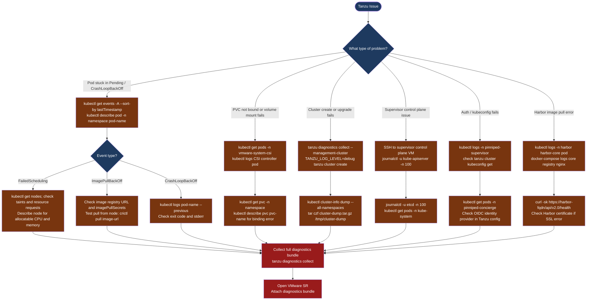

---
tags:
  - tanzu
  - troubleshooting
  - vmware
search:
  boost: 1.5
---
# Tanzu — Diagnostics

<div class="kb-summary">
VMware Tanzu diagnostic commands: collect the tanzu diagnostics bundle, access Supervisor control plane VMs via SSH, inspect TKG cluster events and pod describe output, check CSI driver logs for PVC failures, diagnose Pinniped authentication errors, check Harbor registry logs, and enable verbose tanzu CLI logging.

*Applies to: VMware Tanzu Kubernetes Grid 2.x / vSphere with Tanzu 8.x*
</div>




```d2
direction: down

symptom: Identify Symptom {shape: diamond}
step_1_check_cluster_events_and_pod_: "Step 1 — Check cluster events and pod state" {shape: rectangle}
step_2_diagnose_supervisor_control_p: "Step 2 — Diagnose Supervisor control plane issues" {shape: rectangle}
step_3_collect_the_diagnostics_bundl: "Step 3 — Collect the diagnostics bundle" {shape: rectangle}
step_4_diagnose_csi_driver_and_pvc_i: "Step 4 — Diagnose CSI driver and PVC issues" {shape: rectangle}
step_5_diagnose_pinniped_authenticat: "Step 5 — Diagnose Pinniped authentication failures" {shape: rectangle}
step_6_check_harbor_registry_logs: "Step 6 — Check Harbor registry logs" {shape: rectangle}
resolution: Resolve or Escalate {shape: oval}

symptom -> step_1_check_cluster_events_and_pod_: investigate
symptom -> step_2_diagnose_supervisor_control_p: investigate
symptom -> step_3_collect_the_diagnostics_bundl: investigate
symptom -> step_4_diagnose_csi_driver_and_pvc_i: investigate
symptom -> step_5_diagnose_pinniped_authenticat: investigate
symptom -> step_6_check_harbor_registry_logs: investigate
step_1_check_cluster_events_and_pod_ -> resolution
step_2_diagnose_supervisor_control_p -> resolution
step_3_collect_the_diagnostics_bundl -> resolution
step_4_diagnose_csi_driver_and_pvc_i -> resolution
step_5_diagnose_pinniped_authenticat -> resolution
step_6_check_harbor_registry_logs -> resolution
```

## Before you begin

- **Access:** kubeconfig for the management cluster and affected workload cluster; SSH access to the Supervisor control plane VMs (SSH key from vCenter → Workload Management → Supervisor); Harbor admin credentials
- **Gather first:** the specific symptom (pod stuck, image pull error, PVC not bound, cluster create failed), the namespace and pod or cluster name, and the time the issue started
- **Scope:** confirm whether the issue affects one pod, one namespace, one workload cluster, or the Supervisor itself

---

## Step 1 — Check cluster events and pod state

```bash
# Set the kubeconfig to the affected workload cluster
tanzu cluster kubeconfig get <cluster-name> --admin
kubectl config use-context <cluster-context>

# All events across all namespaces, sorted by most recent last
kubectl get events -A --sort-by='.lastTimestamp' | tail -50
# Look for: Warning events; FailedScheduling, BackOff, FailedMount, OOMKilled

# Events for a specific namespace
kubectl get events -n production --sort-by='.lastTimestamp'

# All non-Running pods (find the stuck ones)
kubectl get pods -A --field-selector=status.phase!=Running,status.phase!=Succeeded

# Describe a specific failing pod
kubectl describe pod <pod-name> -n <namespace>
# Look for: Events section at the bottom — shows exactly what failed and why

# Container logs (current run)
kubectl logs <pod-name> -n <namespace> --tail=100

# Previous container logs (if pod restarted — crash loop)
kubectl logs <pod-name> -n <namespace> --previous --tail=100

# Multi-container pod: specify container name
kubectl logs <pod-name> -n <namespace> -c <container-name> --tail=100
```

---

## Step 2 — Diagnose Supervisor control plane issues

The Supervisor runs as 3 VMs on ESXi. Access requires the SSH key stored in vCenter.

```bash
# Get Supervisor control plane VM IPs
# vCenter → Workload Management → Supervisor → Control Plane VMs → note all 3 IPs

# SSH to a Supervisor control plane VM
# SSH key location: vCenter → Workload Management → Supervisor → SSH Key → Download
ssh -i ~/.ssh/supervisor_key root@<supervisor-control-plane-ip>

# Check the API server log
journalctl -u kube-apiserver -n 200 --no-pager | grep -i "error\|fail\|panic"

# Check etcd health
journalctl -u etcd -n 100 --no-pager | grep -i "error\|fail"

# Check system pod state from the Supervisor context
export KUBECONFIG=/root/.kube/config
kubectl get pods -n kube-system | grep -v Running
kubectl get pods -n vmware-system-tkg | grep -v Running
kubectl get pods -n vmware-system-csi | grep -v Running

# Check TKG machine and cluster state
kubectl get clusters -A
kubectl get machines -A
kubectl get tanzukubernetesclusters -A
```

---

## Step 3 — Collect the diagnostics bundle

```bash
# Collect full diagnostics from the management cluster
tanzu diagnostics collect --management-cluster
# Output: tanzu-diagnostics-<timestamp>.tar.gz in current directory
# Includes: management cluster logs, plugin state, kubeconfig

# Full Kubernetes cluster state dump (works with any kubeconfig)
kubectl cluster-info dump \
  --output-directory=/tmp/cluster-dump \
  --all-namespaces
tar czf cluster-dump-$(date +%Y%m%d).tar.gz /tmp/cluster-dump/

# Include in bundle: events from the failing cluster
kubectl get events -A --sort-by='.lastTimestamp' -o yaml > /tmp/cluster-events.yaml

# Enable verbose tanzu CLI logging for a failing operation
TANZU_LOG_LEVEL=debug tanzu cluster create my-cluster \
  --file cluster.yaml 2>&1 | tee tanzu-debug-$(date +%Y%m%d).log

# High-verbosity kubectl output
tanzu cluster list -v 9
```

---

## Step 4 — Diagnose CSI driver and PVC issues

PVCs that stay in Pending state indicate a problem with the vSphere CSI driver.

```bash
# Check PVC status in the affected namespace
kubectl get pvc -n <namespace>
# Expected: STATUS = Bound
# Problem: STATUS = Pending (volume not provisioned)

# Describe the PVC for the binding error
kubectl describe pvc <pvc-name> -n <namespace>
# Events section shows: ProvisioningFailed, WaitForFirstConsumer, etc.

# Check CSI controller pod
kubectl get pods -n vmware-system-csi
# Expected: all pods Running

# CSI controller logs (provisioning decisions)
CSI_CTRL=$(kubectl get pods -n vmware-system-csi \
  -l app=vsphere-csi-controller \
  -o jsonpath='{.items[0].metadata.name}')
kubectl logs -n vmware-system-csi $CSI_CTRL \
  -c vsphere-csi-controller --tail=100 | grep -i "error\|fail\|provision"

# CSI node DaemonSet logs (mount issues on specific nodes)
kubectl logs -n vmware-system-csi \
  -l app=vsphere-csi-node \
  -c vsphere-csi-node --tail=50 | grep -i "error\|fail\|mount"

# Check StorageClass exists and is correct
kubectl get storageclass
kubectl describe storageclass <storage-class-name>
```

---

## Step 5 — Diagnose Pinniped authentication failures

Pinniped federates vSphere SSO to Kubernetes RBAC. Auth failures prevent kubectl from working.

```bash
# Check Pinniped supervisor pods (management cluster)
kubectl get pods -n pinniped-supervisor
# Expected: all Running

# Check Pinniped supervisor logs (OIDC broker)
PINNIPED_POD=$(kubectl get pods -n pinniped-supervisor \
  -l app=pinniped-supervisor \
  -o jsonpath='{.items[0].metadata.name}')
kubectl logs -n pinniped-supervisor $PINNIPED_POD --tail=100 | \
  grep -i "error\|fail\|warn"

# Check Pinniped concierge (per workload cluster)
kubectl get pods -n pinniped-concierge
kubectl logs -n pinniped-concierge \
  $(kubectl get pods -n pinniped-concierge -o jsonpath='{.items[0].metadata.name}') \
  --tail=50 | grep -i "error"

# Test kubeconfig for a specific workload cluster
tanzu cluster kubeconfig get <cluster-name>
kubectl get pods -n default
# If this fails with Unauthorized: check Pinniped logs for identity provider error

# Check Pinniped JWTAuthenticator or WebhookAuthenticator configuration
kubectl get jwtauthenticator -A
kubectl describe jwtauthenticator -n pinniped-concierge
```

---

## Step 6 — Check Harbor registry logs

```bash
# If Harbor is deployed as an OVA (VM-based):
ssh admin@harbor.example.local

# Core (API server)
docker-compose -f /opt/docker-compose.yml logs --tail=100 core | \
  grep -i "error\|fail\|warn"

# Registry (blob store)
docker-compose -f /opt/docker-compose.yml logs --tail=100 registry | \
  grep -i "error"

# Nginx (request logs)
docker-compose -f /opt/docker-compose.yml logs --tail=100 nginx

# If Harbor is deployed on Kubernetes:
kubectl get pods -n harbor

# Core component
HARBOR_CORE=$(kubectl get pods -n harbor -l component=core \
  -o jsonpath='{.items[0].metadata.name}')
kubectl logs -n harbor $HARBOR_CORE --tail=100 | grep -i "error\|warn"

# Registry component
HARBOR_REG=$(kubectl get pods -n harbor -l component=registry \
  -o jsonpath='{.items[0].metadata.name}')
kubectl logs -n harbor $HARBOR_REG --tail=100 | grep -i "error"

# Harbor API health check
curl -sk "https://<harbor-fqdn>/api/v2.0/health" | python3 -m json.tool
# Expected: all components "status": "healthy"
```

---

## Step 7 — Enable verbose CLI logging for escalation

```bash
# Maximum verbose output for tanzu CLI operations
TANZU_LOG_LEVEL=debug tanzu cluster create my-cluster \
  --file cluster.yaml 2>&1 | tee tanzu-debug-$(date +%Y%m%d-%H%M).log

# Verbose kubectl output
kubectl get nodes -v 9 2>&1 | tee kubectl-debug.log

# Full namespace dump for a stuck workload cluster
kubectl get all -n <namespace> -o yaml > /tmp/namespace-dump.yaml

# Collect all cluster-scoped resources
kubectl get clusterrole,clusterrolebinding,storageclass,pv -o yaml \
  > /tmp/cluster-scoped.yaml

# What to include in VMware SR:
# - tanzu diagnostics collect output (tar.gz)
# - kubectl cluster-info dump output (tar.gz)
# - TANZU_LOG_LEVEL=debug output for the failing tanzu command
# - Supervisor control plane SSH log excerpts (kube-apiserver, etcd)
# - Tanzu and vSphere versions: tanzu version; kubectl version
```

---

## Log locations

| Component | Path / Command | What to look for |
|---|---|---|
| Cluster events | `kubectl get events -A --sort-by=.lastTimestamp` | Pod scheduling, image pull, volume failures |
| Supervisor API server | `journalctl -u kube-apiserver` (on Supervisor VM) | Control plane API errors |
| Supervisor etcd | `journalctl -u etcd` (on Supervisor VM) | etcd leader election, disk errors |
| CSI controller | `kubectl logs -n vmware-system-csi csi-controller` | PV provisioning failures |
| Pinniped supervisor | `kubectl logs -n pinniped-supervisor` | OIDC identity provider errors |
| Harbor core | `docker-compose logs core` or `kubectl logs -n harbor` | Image push/pull API errors |

---

## See also

- [Tanzu — Common Issues](../common-issues/)
- [Tanzu — Escalation](../escalation/)

## Verify resolution

- `kubectl get pods -A --field-selector=status.phase!=Running,status.phase!=Succeeded` returns no pods
- `kubectl get pvc -n <namespace>` shows all PVCs with STATUS = Bound
- `kubectl get events -A --sort-by=.lastTimestamp | tail -10` shows no new Warning events
- `curl -sk https://<harbor-fqdn>/api/v2.0/health` returns all components healthy
- Image pull from Harbor succeeds and the affected pod reaches Running state
