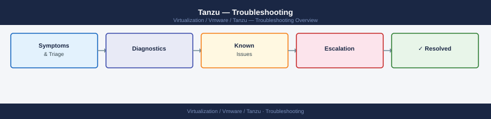

---
tags:
  - tanzu
  - troubleshooting
  - vmware
search:
  boost: 1.5
---
# Tanzu — Troubleshooting

Diagnosing Tanzu cluster failures, pod scheduling issues, ingress errors, and control plane health problems.

*Applies to: Tanzu 3.x*

<a class="kb-card" href="common-issues/">
  <strong>Common Issues</strong>
  Frequently seen problems and resolution steps.
</a>

<a class="kb-card" href="diagnostics/">
  <strong>Diagnostics</strong>
  Log locations, diagnostic commands, and data collection.
</a>

<a class="kb-card" href="escalation/">
  <strong>Escalation</strong>
  When and how to escalate to VMware support.
</a>

