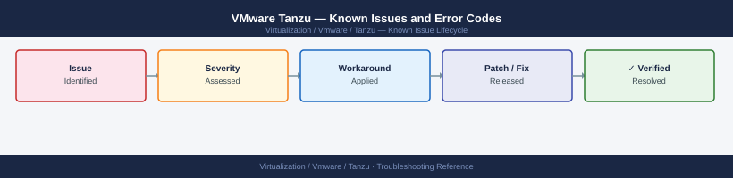

---
tags:
  - troubleshooting
  - tanzu
  - vmware
  - known-issues
---
# VMware Tanzu — Known Issues and Error Codes

<div class="kb-summary">
Catalog of known Tanzu Kubernetes Grid (TKG) and Supervisor cluster bugs, error codes, and workarounds.

*Applies to: Tanzu Kubernetes Grid 2.x / vSphere 7.x–8.x with Tanzu*
</div>



```d2
direction: down

symptom: Identify Symptom {shape: diamond}
supervisor_cluster: "Supervisor Cluster" {shape: rectangle}
tkg_workload_clusters: "TKG Workload Clusters" {shape: rectangle}
storage: "Storage" {shape: rectangle}
resolution: Resolve or Escalate {shape: oval}

symptom -> supervisor_cluster: investigate
symptom -> tkg_workload_clusters: investigate
symptom -> storage: investigate
supervisor_cluster -> resolution
tkg_workload_clusters -> resolution
storage -> resolution
```

## Before you begin

- Supervisor control plane logs: `kubectl logs -n vmware-system-tkg <pod>` from the Supervisor context.
- TKG guest cluster logs: switch to workload cluster context and inspect `kube-apiserver` pods.
- Most Tanzu issues relate to NSX networking, storage policy assignment, or Content Library sync.

## Supervisor Cluster

| Error / Symptom | Affected Versions | Cause | Workaround / Fix | Fixed In |
|---|---|---|---|---|
| Supervisor API server unreachable on port 6443 | TKG 2.x | NSX load balancer VIP not allocated or NSX edge unreachable | Check NSX load balancer pool for Supervisor API VIP; verify NSX Edge connectivity | N/A |
| `Namespace quota exceeded` when creating TKG cluster | TKG 2.x | vSphere Namespace resource quota too restrictive | Increase vCPU/memory quota on vSphere Namespace in vSphere Client | N/A |
| Supervisor control plane node CrashLoopBackOff | TKG 2.x | etcd volume full (default thin-provision fills up) | Expand etcd PV on vSAN datastore; or clean up etcd compaction backlog | N/A |

## TKG Workload Clusters

| Error / Symptom | Affected Versions | Cause | Workaround / Fix | Fixed In |
|---|---|---|---|---|
| `TanzuKubernetesCluster stuck in Deleting` | TKG 2.x | Finalizer not removed due to CSI PV cleanup timeout | Manually remove finalizers: `kubectl edit tkc <name>` → remove `deletionFinalizers` | N/A |
| Worker nodes `NotReady` after cluster creation | TKG 2.x | CNI (Antrea) not initialized; Geneve UDP 6081 blocked | Verify UDP 6081 open between all worker nodes and Supervisor | N/A |
| Image pull fails: `Content Library item not found` | TKG 2.x | TKG OVA not subscribed in Content Library | Subscribe Content Library to VMware TKG OVA catalog; sync | N/A |

## Storage

| Error / Symptom | Affected Versions | Cause | Workaround / Fix | Fixed In |
|---|---|---|---|---|
| PVC stuck in `Pending` — `no storageclass found` | TKG 2.x | Default StorageClass not set on TKG cluster | Annotate storage class as default: `kubectl annotate sc <name> storageclass.kubernetes.io/is-default-class=true` | N/A |
| vSAN CSI driver not binding PVC | TKG 2.x | Storage policy assigned to Namespace doesn't match cluster host's vSAN policy | Verify vSAN storage policy assigned to Namespace exists on all hosts in cluster | N/A |

## See also

- [VMware Tanzu — Common Issues](common-issues/)
- [VMware NSX — Known Issues](../../nsx/troubleshooting/known-issues.md)
- [VMware vCenter — Known Issues](../../vcenter/troubleshooting/known-issues.md)
